# MoniGarr Engineering Standards — Architecture Handbook

**Document:** `Architecture/ARCHITECTURE.md`  
**Suite:** MoniGarr Engineering Standards (MES)  
**Version:** 1.1.0  
**Status:** Active — Company-wide constitution handbook  
**Owner:** MoniGarr Engineering / MoniGarr.com LLC  
**Applies To:** All MoniGarr products, services, repositories, and AI coding agents  
**Last Updated:** 2026-07-12  
**Classification:** Internal engineering constitution  

---

## Foundation

> MoniGarr Engineering exists to create durable software systems that compound in value over time. We measure success by customer outcomes, engineering quality, and the ability of future humans and AI agents to understand, extend, and confidently operate every system we build.

**Factory maxim:** AI accelerates. Deterministic systems prove. Humans remain accountable. Systems remain governable.

This handbook is **product-agnostic**. Where CareerPilot appears, it is labeled **Example (CareerPilot)** and is illustrative only.

**Standing companions:** [`../SYSTEM_CONTEXT.md`](../SYSTEM_CONTEXT.md) · [`../Governance/MOM.md`](../Governance/MOM.md) · [`../Governance/MILE.md`](../Governance/MILE.md) · [`../AI/`](../AI/) · [`../Engineering/`](../Engineering/) · [`C4/`](C4/)

**Normative language:** *shall* / *must* = mandatory; *should* = strong default (ADR to deviate); *may* = optional.

---

## Regulated readiness

When an inheriting project processes PHI/ePHI, CUI, sovereign/community-protected data, or accessibility-normative UI requirements, it **shall** adopt matching overlays via [`../AI/REGULATED_PROFILES.md`](../AI/REGULATED_PROFILES.md), map external authorities via [`../REFERENCES.md`](../REFERENCES.md), and follow the Regulated Operations Overlay in [`../Governance/MOM.md`](../Governance/MOM.md). MES documentation readiness is **not** certification, ATO, FedRAMP authorization, or HIPAA compliance evidence.

## Table of Contents

| Part | Title |
|------|-------|
| I | Engineering Philosophy |
| II | System Architecture |
| III | AI Architecture |
| IV | Enterprise RAG |
| V | Enterprise Knowledge Graph |
| VI | AI Agent Platform |
| VII | Sub-Agent Architecture |
| VIII | Loop Engineering |
| IX | Harness Engineering |
| X | Golden Evaluation Sets |
| XI | Continuous Evaluation |
| XII | Prompt Engineering |
| XIII | Tool Engineering |
| XIV | Engineering Standards |
| XV | Testing |
| XVI | DevOps |
| XVII | Security |
| XVIII | Documentation |
| XIX | Engineering KPIs |
| XX | M.O.M. + M.I.L.E. |

---

## Part I — Engineering Philosophy

**Canonical owner:** Architecture (`Architecture/ARCHITECTURE.md` Part I)  
**Related procedures:** [`../SYSTEM_CONTEXT.md`](../SYSTEM_CONTEXT.md) · [`../Governance/MOM.md`](../Governance/MOM.md) · [`../Governance/MILE.md`](../Governance/MILE.md) · [`../Engineering/ENGINEERING_STANDARDS.md`](../Engineering/ENGINEERING_STANDARDS.md)

### Foundation

> MoniGarr Engineering exists to create durable software systems that compound in value over time. We measure success by customer outcomes, engineering quality, and the ability of future humans and AI agents to understand, extend, and confidently operate every system we build.

**Factory maxim:** AI accelerates. Deterministic systems prove. Humans remain accountable. Systems remain governable.

This Part establishes the philosophical and normative foundation for MoniGarr Engineering Standards (MES) v1.1. It is company-wide and product-agnostic. Product names appear only as labeled illustrations (`Example (CareerPilot)`). Normative language follows [`SYSTEM_CONTEXT.md`](../SYSTEM_CONTEXT.md): **shall / must** = mandatory; **should** = strong default requiring ADR for deviation; **may** = optional.

Cross-references: [`Governance/MOM.md`](../Governance/MOM.md) · [`Governance/MILE.md`](../Governance/MILE.md) · [`Engineering/ENGINEERING_STANDARDS.md`](../Engineering/ENGINEERING_STANDARDS.md)

---

## Regulated readiness

When an inheriting project processes PHI/ePHI, CUI, sovereign/community-protected data, or accessibility-normative UI requirements, it **shall** adopt matching overlays via [`../AI/REGULATED_PROFILES.md`](../AI/REGULATED_PROFILES.md), map external authorities via [`../REFERENCES.md`](../REFERENCES.md), and follow the Regulated Operations Overlay in [`../Governance/MOM.md`](../Governance/MOM.md). MES documentation readiness is **not** certification, ATO, FedRAMP authorization, or HIPAA compliance evidence.

### 1.1 Vision

MoniGarr Engineering shall design, build, evaluate, deploy, and operate software systems that:

1. **Compound in value** — each release reduces future complexity and increases reusable capability.
2. **Remain handoff-ready** — any qualified human engineer or AI coding agent can understand, run, test, and safely change the system from repository artifacts alone.
3. **Govern probabilistic intelligence with deterministic systems** — AI accelerates delivery; proofs, gates, and humans decide what ships.
4. **Serve customer outcomes first** — feature count is never a success metric.
5. **Stay auditable and transferable** — ownership, decisions, evidence, and runbooks remain explicit.

Vision is not aspirational copy. Projects claiming MES conformance shall demonstrate vision alignment through architecture, evaluation evidence, documentation, and operational posture—not slogans.

---

### 1.2 Engineering Principles

Every MoniGarr system shall uphold the following principles. Deviations shall be recorded as Architecture Decision Records (ADRs) per [`Governance/ADR_GUIDE.md`](../Governance/ADR_GUIDE.md).

| # | Principle | Normative meaning |
|---|-----------|-------------------|
| 1 | **Value Before Velocity** | Shipping quickly is useful only when the software creates measurable customer, business, and engineering value. Teams shall not optimize for feature count. |
| 2 | **Architecture Before Implementation** | Coding shall begin only after PRD, architecture, domain model, data model, user stories, and acceptance criteria exist and have passed architectural review. |
| 3 | **Documentation Is Product** | Documentation shall remain synchronized with production behavior. Every repository shall be self-documenting for humans and AI agents. |
| 4 | **AI Augments Engineers** | AI accelerates engineering. AI shall not replace engineering judgment. Humans remain accountable for correctness, ethics, architecture, and production approval. |
| 5 | **Production Quality Is the Default** | There are no “temporary” production solutions. Every merge should improve the system. |
| 6 | **Evidence Over Assertion** | Claims of readiness shall be backed by artifacts: tests, evals, scans, traces, approvals, and runbooks. |
| 7 | **Handoff-Ready Engineering** | Any qualified engineer or AI agent shall be able to understand, run, test, and safely change the system from repository artifacts alone. |
| 8 | **Deterministic Proof Over Probabilistic Confidence** | Where correctness matters, deterministic validation owns proof. Probabilistic components shall be gated by evaluation thresholds. |
| 9 | **Retrieval Before Generation** | When facts matter, systems shall ground generation in retrieval, graphs, or verified tools before inventing. |
| 10 | **Governability Over Autonomy** | Autonomy is a privilege earned through evaluation, observability, and escalation design—not a default. |

#### Decision order

When multiple solutions exist, teams shall choose the option that maximizes, in order:

1. Simplicity  
2. Maintainability  
3. Reliability  
4. Observability  
5. Security  
6. Extensibility  
7. Business value  

Never optimize prematurely. Record significant choices as ADRs.

#### Build vs buy

Prefer, in order:

1. Open standards  
2. Open source (license-reviewed)  
3. Commercial APIs (contract + data posture reviewed)  
4. Custom development  

Proprietary components shall be built only when they create durable competitive advantage and can be operated to MES quality.

---

### 1.3 M.O.M. Framework Summary

**M.O.M.** — MoniGarr Operating Model — defines how MoniGarr designs, builds, evaluates, deploys, operates, and continuously improves software systems. Full standard: [`Governance/MOM.md`](../Governance/MOM.md).

M.O.M. is enforceable operating discipline for systems that remain:

- human-accountable  
- maintainable  
- auditable  
- transferable  
- governable  

#### Lifecycle (normative)

```text
Discover → Design → Validate → Implement → Evaluate → Review → Deploy → Observe → Improve
```

Skipping **Evaluate** or **Review** before **Deploy** is non-conformant for production systems.

Summary (stage detail lives in the standing standard):

- Every stage produces auditable artifacts (problem framing through observe/improve evidence).
- Design precedes implementation; Evaluate and Review precede Deploy.
- Observe and Improve feed change-controlled updates—never silent drift.
- Human approval binds material risk at Review/Deploy.

**Canonical detail:** [`Governance/MOM.md`](../Governance/MOM.md).

#### Quality gates (minimum)

Every feature must satisfy: Functional · Tested · Documented · Observable · Secure · Performant · Accessible · Maintainable · Evaluated (when AI or probabilistic components are involved).

Production deployment additionally requires:

- Explicit human approval for material risk  
- Passing continuous evaluation thresholds  
- SBOM / dependency scan evidence  
- Rollback plan  

#### Rituals

| Ritual | Cadence | Purpose |
|--------|---------|---------|
| Architecture review | Before first implementation and on material change | Confirm boundaries, trust, AI limits |
| ADR review | Per significant decision | Record context, options, consequences |
| Eval gate review | Every AI-affecting release | Confirm golden sets and thresholds |
| Security review | Every externally exposed or data-sensitive change | Controls + evidence |
| Documentation sync | Every merge that changes behavior | Keep docs as product |
| Post-incident review | After Sev-1/Sev-2 | MTTR learning, runbook updates |
| Standards sync | Quarterly | Align repo practices to MES version |

Projects claiming MES conformance shall link to M.O.M., follow lifecycle and quality gates, map architecture to MES Parts I–XX, and maintain ADRs for significant deviations.

---

### 1.4 M.I.L.E. Methodology Summary

**M.I.L.E.** — MoniGarr Intelligence Led Engineering — defines how MoniGarr engineers AI-native software systems. Full standard: [`Governance/MILE.md`](../Governance/MILE.md).

Core claim: **Software is deterministic. AI is probabilistic. Enterprise engineering requires deterministic systems governing probabilistic intelligence.**

#### AI development lifecycle

```text
Understand → Model → Retrieve → Reason → Generate → Evaluate → Improve → Deploy → Observe → Learn
```

Summary (stage detail lives in the standing standard):

- Ground facts (Retrieve / Graph) before Generate when outcomes are consequential.
- Evaluate with golden sets and thresholds before confidence claims.
- Improve via measured loops; Deploy only with AI quality gates and HITL per risk class.
- Observe tokens, cost, quality, and business KPIs; Learn only under change control.

**Canonical detail:** [`Governance/MILE.md`](../Governance/MILE.md).

#### Intelligence stack

```text
Layer 1  Product
Layer 2  Business Logic
Layer 3  AI Orchestration
Layer 4  Agents
Layer 5  Tools
Layer 6  Knowledge (RAG + Graph + Memory)
Layer 7  Models
```

Every layer shall be independently testable and observable. Normative platform components are defined in Part III.

#### AI architecture principles (normative defaults)

| Principle | Meaning |
|-----------|---------|
| AI First | Design for intelligence-assisted workflows from day one |
| Human Approved | Material outputs and production changes require HITL where risk warrants |
| Evaluation Driven | No ship without measurable eval |
| Retrieval Before Generation | Ground before inventing |
| Graphs Before Guessing | Prefer explicit relationships over prompt speculation |
| Memory Before Repetition | Persist useful context with lifecycle rules |
| Evidence Before Confidence | Cite provenance; refuse when ungrounded |
| Measurement Before Opinion | Tokens, cost, quality scores beat anecdotes |

---

### 1.5 AI-First Development Lifecycle

AI-first does **not** mean “call an LLM everywhere.” It means the product and platform are designed so intelligence-assisted workflows are first-class, governed, and measurable from day one.


#### Normative requirements

1. Teams **shall** identify which workflows are deterministic, which are AI-assisted, and which are forbidden for AI before implementation.
2. Teams **shall** define evaluation criteria before prompt or agent implementation for any AI-affecting capability.
3. Teams **shall** version prompts, tools, models, and retrieval configs as release artifacts.
4. Teams **should** prefer retrieval + tools + graphs over unconstrained generation for factual or consequential outputs.
5. Teams **shall not** promote silent prompt or model drift into production without eval evidence.

Detail: [`AI/AI_GUIDELINES.md`](../AI/AI_GUIDELINES.md) · [`AI/LOOP_ENGINEERING.md`](../AI/LOOP_ENGINEERING.md) · [`AI/HARNESS_ENGINEERING.md`](../AI/HARNESS_ENGINEERING.md)

---

### 1.6 Human-in-the-Loop Governance

Humans remain responsible for architecture, ethics, safety, governance, approval, and customer trust. AI assists. Humans decide.

#### Risk classes (minimum)

Aligned with [`AI/AI_GUIDELINES.md`](../AI/AI_GUIDELINES.md). Glossary: [`GLOSSARY.md` — Risk Class](../GLOSSARY.md#risk-class).

| Risk class | Examples | HITL requirement |
|------------|----------|------------------|
| **R0 — Advisory** | Draft summaries, local lint suggestions, non-binding brainstorming | Optional review |
| **R1 — Internal draft** | PR description drafts, internal docs, eval report drafts | Should review before merge/publish |
| **R2 — Customer-visible draft** | Emails, resume text, support replies, marketing copy | Must human-approve before send/publish |
| **R3 — Production change** | Deployments, schema migrations, prompt promotions, model swaps | Must human-approve with evidence pack |
| **R4 — Irreversible / regulated** | Data deletion, legal commitments, financial transfers, privilege grants, production secret rotation affecting many tenants | Must dual-control or designated approver; ADR if automated |

#### Governance rules

1. Every agent and workflow **shall** declare its risk class (R0–R4), escalation path, and human owner.
2. Material production changes (R3) and irreversible/regulated actions (R4) **shall** require human approval appropriate to risk class; R2+ externalization **shall** require HITL before send/publish.
3. Escalation **shall** be deterministic (rules + thresholds), not vibes.
4. Audit logs **shall** record who approved what, when, and under which policy version.
5. “AI said so” is never sufficient justification for production action.

See also: [`AI/AI_GUIDELINES.md`](../AI/AI_GUIDELINES.md) · [`AI/AGENTS.md`](../AI/AGENTS.md) · [`Engineering/SECURITY.md`](../Engineering/SECURITY.md) · [`Engineering/RELEASE_PROCESS.md`](../Engineering/RELEASE_PROCESS.md)

---

### 1.7 Definition of Production Ready

A system or capability is **Production Ready** only when all of the following are true:

#### Checklist — Production Ready

- [ ] Scope, non-goals, and trust boundaries documented in project `ARCHITECTURE.md`
- [ ] PRD acceptance criteria mapped to tests and/or evals
- [ ] Automated tests passing for deterministic paths
- [ ] Evaluation gates passing for AI/probabilistic paths (if any)
- [ ] Security controls implemented with evidence (scans, reviews, threat mitigations as required)
- [ ] Privacy/data handling classified and enforced where applicable
- [ ] Observability live: health, metrics, logs, traces, alerts
- [ ] Runbook exists for common failures and rollback
- [ ] SBOM / dependency posture acceptable for release policy
- [ ] Explicit human approval recorded for material risk
- [ ] Documentation updated and synchronized with shipped behavior
- [ ] Rollback or degrade path verified
- [ ] Ownership and on-call path identified

A feature is **Done** only when code is merged, documentation updated, tests (and evals if AI-involved) passing, security reviewed as required, monitoring enabled, production deployed (or explicitly deferred with ADR), and knowledge transferred—per [`Governance/MOM.md`](../Governance/MOM.md).

---

### 1.8 Definition of Enterprise Ready

**Enterprise Ready** is a stricter posture than Production Ready. A system is Enterprise Ready only when it is Production Ready **and**:

#### Checklist — Enterprise Ready

- [ ] Multi-tenant or organizational isolation model defined and tested (if multi-tenant)
- [ ] Identity, authn/authz, and least-privilege boundaries enforceable and audited
- [ ] Data retention, deletion, and export procedures documented and operable
- [ ] Change management with ADRs for significant architecture and AI policy changes
- [ ] Continuous evaluation pipeline in CI/CD for AI-affecting releases
- [ ] Cost, latency, and quality SLOs defined and monitored
- [ ] Incident response and post-incident learning ritual practiced
- [ ] Disaster recovery / backup posture documented with RPO/RTO targets appropriate to criticality
- [ ] Vendor and model dependency risks documented (contracts, data residency, exit plan)
- [ ] Accessibility and inclusive design requirements met for user-facing surfaces
- [ ] Handoff package sufficient for a new team to operate without tribal knowledge
- [ ] MES Parts mapping completed and conformance declared

Enterprise Ready does **not** claim SOC 2, FedRAMP, or other certifications. Those require authorizing-official and compliance processes outside MES.

---

### 1.9 Definition of AI-Native Software

Software is **AI-Native** under MES when intelligence is a first-class architectural capability—not a bolted-on chat widget—and all of the following hold:

| Criterion | Requirement |
|-----------|-------------|
| Platform, not feature | Model gateway, registries, retrieval, memory, eval, and safety exist as platform concerns (Part III) |
| Grounded generation | Factual/consequential outputs prefer retrieval, tools, and graphs before free generation |
| Agent teams | Complex work uses specialized agents/sub-agents with contracts (Parts VI–VII) |
| Evaluation-first | Golden datasets and thresholds gate shipping |
| Observable intelligence | Tokens, cost, latency, hallucinations, retrieval quality, and business outcomes are measured |
| Governed autonomy | Risk classes, HITL, escalation, and audit trails are explicit |
| Versioned intelligence artifacts | Prompts, tools, models, graphs, and eval sets are versioned and change-controlled |
| Continuous learning under control | Production learnings improve the system without silent drift |

**Intelligence Ready** (from M.I.L.E.): an AI capability is production-ready only when it is reliable, grounded, observable, secure, explainable, evaluated, repeatable, maintainable, cost-effective, and aligned with customer value.

---

### 1.10 Part I Conformance Checklist

- [ ] Foundation quote and factory maxim preserved without dilution  
- [ ] Engineering principles applied; ADRs for deviations  
- [ ] M.O.M. lifecycle and gates followed  
- [ ] M.I.L.E. intelligence stack and AI principles followed for AI systems  
- [ ] HITL risk classes declared for AI workflows  
- [ ] Production Ready / Enterprise Ready / AI-Native definitions used as gate language  
- [ ] Cross-links to `Governance/MOM.md` and `Governance/MILE.md` present in project docs  

---

## Part II — System Architecture

**Canonical owner:** Architecture (`Architecture/ARCHITECTURE.md` Part II)  
**Related procedures:** [`AI/RAG.md`](../AI/RAG.md) · [`AI/MODEL_ROUTING.md`](../AI/MODEL_ROUTING.md) · [`Engineering/OBSERVABILITY.md`](../Engineering/OBSERVABILITY.md) · [`Engineering/SECURITY.md`](../Engineering/SECURITY.md) · C4 companions under `Architecture/C4/`

This Part defines normative system architecture patterns for MoniGarr products. Detail companion diagrams: [`Architecture/C4/Level1_Context.md`](C4/Level1_Context.md) · [`Architecture/C4/Level2_Container.md`](C4/Level2_Container.md) · [`Architecture/C4/Level3_Component.md`](C4/Level3_Component.md) · [`Architecture/C4/Level4_Code.md`](C4/Level4_Code.md). Engineering practice: [`Engineering/ENGINEERING_STANDARDS.md`](../Engineering/ENGINEERING_STANDARDS.md) · [`Engineering/DEVOPS.md`](../Engineering/DEVOPS.md).

---

### 2.1 High-Level Architecture Patterns

MoniGarr systems **shall** select and justify architectural styles in project `ARCHITECTURE.md`. Common patterns:

| Pattern | When to prefer | Normative notes |
|---------|----------------|-----------------|
| Modular monolith | Early products, strong modularity needed, team small | Module boundaries shall be explicit; avoid accidental big ball of mud |
| Service-oriented / microservices | Independent deployability, scale domains separately | Service boundaries shall map to bounded contexts; distributed complexity must be justified |
| Event-driven | Async workflows, fan-out, auditability of state changes | Events shall be versioned; consumers shall tolerate schema evolution |
| Hexagonal / ports-adapters | Multiple adapters (UI, API, agents, batch) around domain | Domain shall not depend on infrastructure details |
| Platform + products | Shared AI platform under multiple products | Platform contracts shall be versioned; product isolation required |
| CQRS (selective) | Read/write asymmetry, heavy analytics or retrieval indexes | Consistency model shall be documented |

#### Non-negotiable architecture rules

1. Every system **shall** declare authorization/trust boundaries.  
2. Every system **shall** separate deterministic business logic from probabilistic AI orchestration.  
3. Every externally exposed surface **shall** have authn/authz and abuse controls appropriate to risk.  
4. Secrets **shall never** be committed; configuration **shall** be environment-injectable.  
5. One architecture source of truth per repository (or explicit monorepo boundary map).  

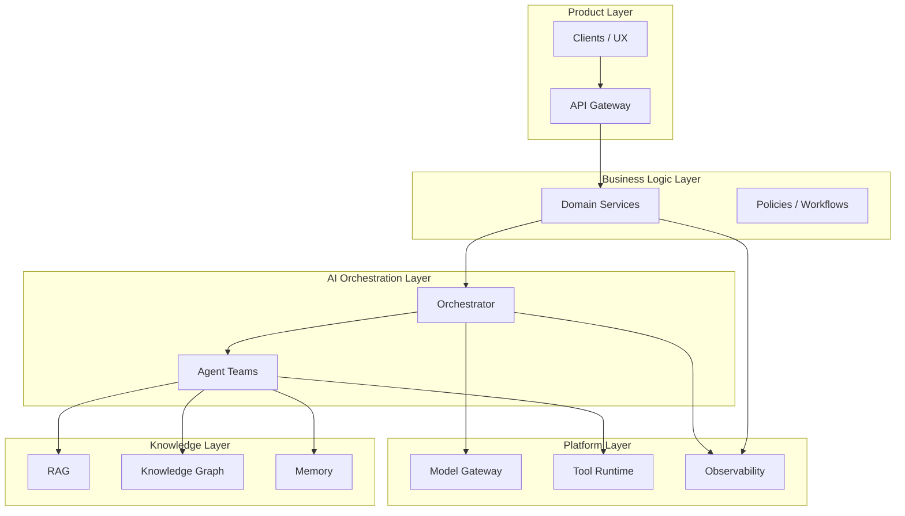

---

### 2.2 C4 Architecture Diagrams (Reference)

MES uses the C4 model. Projects **shall** maintain C4 views appropriate to system complexity. Companion stubs live under `Architecture/C4/`:

| Level | Document | Purpose |
|-------|----------|---------|
| 1 — Context | `Architecture/C4/Level1_Context.md` | System in its environment: users, external systems |
| 2 — Container | `Architecture/C4/Level2_Container.md` | Deployable/runnable units and tech choices |
| 3 — Component | `Architecture/C4/Level3_Component.md` | Major components inside key containers |
| 4 — Code | `Architecture/C4/Level4_Code.md` | Selective deep dives for critical modules |

C4 companions are **minimum patterns**; project `ARCHITECTURE.md` **shall** extend them with product-specific actors, containers, and trust boundaries.

Projects **should** embed living mermaid (or exported) diagrams in project `ARCHITECTURE.md` and keep them synchronized with reality.

---

### 2.3 Context Diagram Pattern (C4 Level 1)

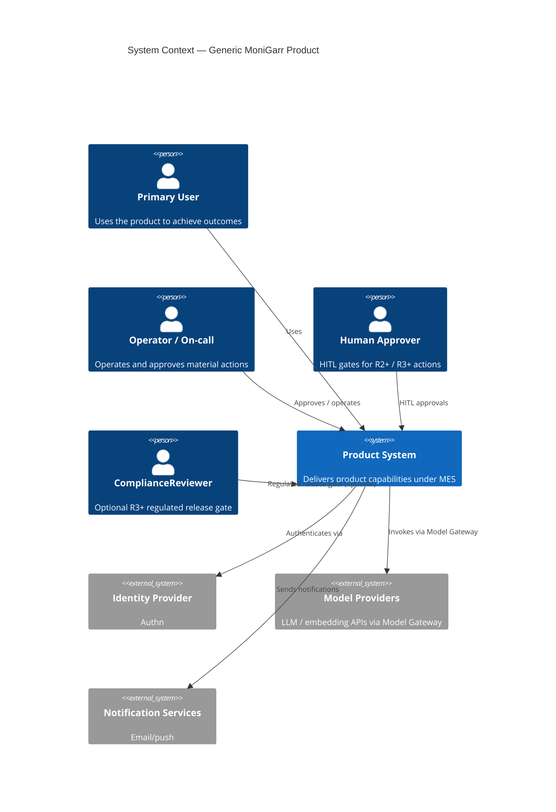

**Shall include:** actors, system boundary, external dependencies, data sensitivity notes, AI vs deterministic touchpoints.

**Trust-boundary narrative (required):** Project Context docs **shall** include a 3–5 bullet trust-boundary narrative covering data classes at crossings, highest-sensitivity path, optional `ComplianceReviewer` for R3+, privacy doc pointer when regulated data is in scope, and explicit N/A for unused regulated classes. Canonical template: [`C4/Level1_Context.md`](C4/Level1_Context.md).

**Normative:** Model providers appear as external systems; the Model Gateway remains **inside** the system boundary.

---

### 2.4 Container Diagram Pattern (C4 Level 2)

```mermaid
flowchart TB
  client[WebClient]
  api[APIGateway]
  app[ApplicationServices]
  orch[AIOrchestration]
  gw[ModelGateway]
  rag[RAGLayer]
  graph[GraphStore]
  db[(PrimaryDB)]
  queue[EventBus]
  eval[EvalWorkers]
  obs[Observability]
  subgraph ControlPlane["Control Plane"]
    policy[PolicyEngine]
    regs[RegistryServices]
    kms[SecretsKmsBroker]
  end
  client --> api
  api --> app
  api --> orch
  orch --> gw
  orch --> rag
  orch --> graph
  orch --> policy
  orch --> regs
  app --> db
  orch --> db
  app --> queue
  orch --> queue
  eval --> rag
  eval --> orch
  app --> kms
  orch --> kms
  gw --> kms
  app --> obs
  orch --> obs
```

| Container | Responsibility |
|-----------|----------------|
| Web / Client | UX, accessibility, auth session handling |
| API Gateway / BFF | External API edge, authn enforcement |
| Application Services | Deterministic domain logic |
| AI Orchestration | Agent teams, loops, tool calls |
| Model Gateway | Sole egress to providers; budgets; safety hooks |
| Retrieval / RAG | Hybrid search, rerank, citations |
| Graph Store | Knowledge graph |
| Primary Database | Transactional state |
| Queue / Bus | Async events and jobs |
| Eval / Harness Workers | Golden and continuous evaluation |
| Observability | OTel collection / export |
| **Control Plane — Policy Engine** | AuthZ, entitlement, AI policy decisions (PDP) |
| **Control Plane — Registry Services** | Prompt / agent / tool registries |
| **Control Plane — Secrets / KMS Broker** | Secret materialization; key unwrap |

Containers **shall** document ownership, scaling unit, data stores, and failure domains.

**Control plane rules:**

1. Draw Control Plane as a distinct group. Request-path containers call into it; they **shall not** co-host its privileged runtime without an ADR and blast-radius analysis.  
2. Control plane aligns with §2.7 runtime planes and Part III registries / Model Gateway / safety.  
3. Detail companion: [`C4/Level2_Container.md`](C4/Level2_Container.md).

---

### 2.5 Component Diagram Pattern (C4 Level 3)

Component diagrams **shall** be produced for the AI orchestration container and any high-risk domain container.

#### AI orchestration components (normative pattern)

| Component | Responsibility |
|-----------|----------------|
| Agent Registry | Catalog of agents, versions, owners |
| Team Coordinator | Routes work to agent teams |
| Loop Engine | Canonical loop: Draft→Critique→Repair→Re-score→Compare→Improve→Evaluate→Approve (Part VIII; stages skippable only by ADR) |
| Tool Runtime | Schema validation, retries, breakers |
| Prompt Runtime | Loads versioned prompts |
| Memory Manager | Working/session/project memory lifecycle |
| Retrieval Assembler | Builds evidence bundles for grounded generation |
| Rank / Rerank | Scores and reorders retrieved candidates |
| Safety Filter | Policy and hallucination checks |
| Eval Hook | Emits samples to evaluation pipeline |
| **ModelGatewayClient** | Sole client to Model Gateway; budgets, pins, class routing |
| **KillSwitch** | Emergency disable for write / irreversible model egress and tool paths (required pattern: C4 Level 4) |
| **AuditEmitter** | Security- and AI-significant audit/events |
| **ClassificationEnforcer** | Applies data-sensitivity / residency labels before model or egress calls |

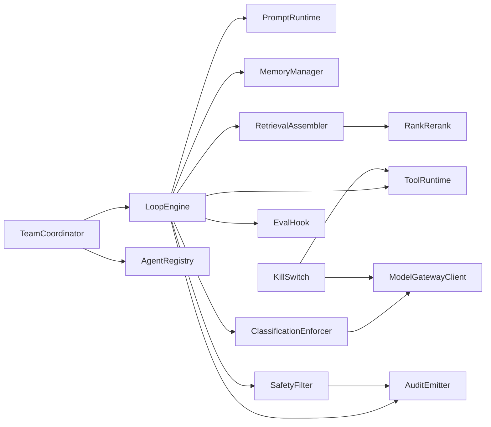

#### Application services components

| Component | Responsibility |
|-----------|----------------|
| API Controllers | Transport adapters |
| Domain Services | Business rules |
| Repositories | Persistence ports |
| **PolicyClient** | Calls Control Plane Policy Engine (PDP); does not embed the PDP |
| Event Publisher | Domain events |
| Anti-Corruption Layer | External system translation |

**Policy naming (canonical):**

| Name | Plane | Role |
|------|-------|------|
| **Policy Engine (PDP)** | Control Plane | Authoritative decide/enforce for AuthZ and AI policy |
| **PolicyClient** | Application / Orchestration | Embeds call to PDP; deny-by-default when PDP unreachable if fail-closed required |
| **PolicyDecisionPoint** | Level 4 (optional) | Code-level PDP interface when documented at L4 |

Do not place a second authoritative Policy Engine inside Application Services. Detail companion: [`C4/Level3_Component.md`](C4/Level3_Component.md).

---

### 2.6 Deployment Diagram Pattern

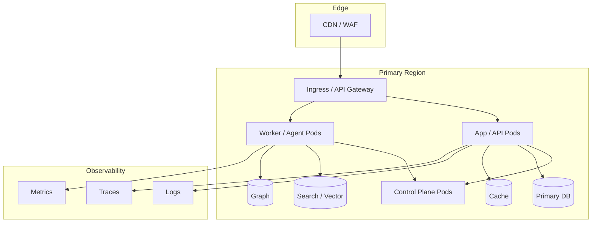

Deployment docs **shall** state: environments, promotion path, secrets injection, health checks, rollback, RPO/RTO for critical data, and control-plane isolation. See [`Engineering/DEVOPS.md`](../Engineering/DEVOPS.md) · [`Engineering/RELEASE_PROCESS.md`](../Engineering/RELEASE_PROCESS.md).

---

### 2.7 Runtime Architecture

Runtime architecture **shall** distinguish:

| Plane | Responsibility |
|-------|----------------|
| Control plane | Config, policy (PDP), registries, feature flags, model routing rules, secrets/KMS broker |
| Data plane | User requests, transactional writes, retrieval queries |
| Intelligence plane | Agent runs, model calls, eval jobs, loop iterations |
| Observation plane | Logs, metrics, traces, cost, quality signals |

#### Runtime rules

1. Intelligence plane calls **shall** go through the Model Gateway (Part III) via **ModelGatewayClient**.  
2. ClassificationEnforcer **shall** run before model or regulated egress when sensitivity labels apply.  
3. Long-running agent work **should** be async with durable job state.  
4. Timeouts, retries, and circuit breakers **shall** exist on external calls.  
5. Idempotency **shall** be defined for write-side tools and workflows.  
6. Degraded modes **shall** be designed (e.g., retrieval-only, template-only, human-only) when models fail.  
7. Control plane **shall not** share runtime with untrusted request parsing without ADR.  

---

### 2.8 Event Architecture

Event-driven designs **shall** treat events as contracts.

| Requirement | Norm |
|-------------|------|
| Schema | Versioned event schemas with compatibility policy |
| Identity | Stable event IDs; producer identity; correlation/causation IDs |
| Ordering | Document per-stream ordering guarantees (or lack thereof) |
| Delivery | At-least-once assumed unless proven otherwise; consumers idempotent |
| PII | Classification and redaction rules for event payloads |
| Audit | Security- and AI-significant actions emit audit events |
| Poison | Dead-letter / quarantine strategy required |

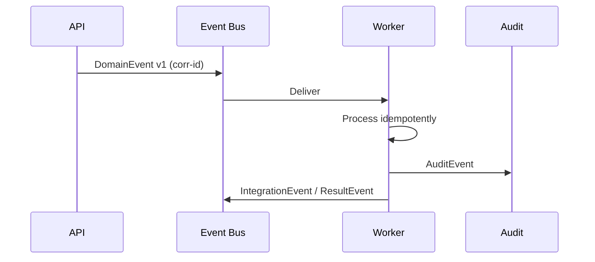

---

### 2.9 Service Boundaries

Service (or module) boundaries **shall** be drawn around **business capability** and **change frequency**, not around technical layers alone.

#### Boundary checklist

- [ ] Owns its data (no shared DB write access across services without ADR)  
- [ ] Publishes explicit APIs/events  
- [ ] Has a clear team owner  
- [ ] Has independent testability  
- [ ] Declares SLOs and failure modes  
- [ ] Does not leak internal models across boundaries without versioned DTOs  

Anti-patterns (non-conformant without ADR): shared mutable databases across bounded contexts; chatty synchronous meshes without resilience; “AI service” that owns unrelated domain state.

---

### 2.10 Domain-Driven Design

MoniGarr systems **should** apply Domain-Driven Design (DDD) practices proportional to domain complexity.

| Concept | Normative expectation |
|---------|------------------------|
| Ubiquitous language | Shared terms in PRD, code, docs, evals; glossary when needed |
| Entities / value objects | Explicit identity vs value semantics |
| Aggregates | Consistency boundaries documented |
| Domain services | Pure domain rules separated from infrastructure |
| Application services | Orchestrate use cases; may invoke AI orchestration |
| Anti-corruption layer | Isolate external/vendor models from core domain |

AI agents **shall** speak the domain language and **shall not** invent alternate entity names in persisted records without mapping.

---

### 2.11 Bounded Contexts

Bounded contexts **shall** be named, owned, and mapped.

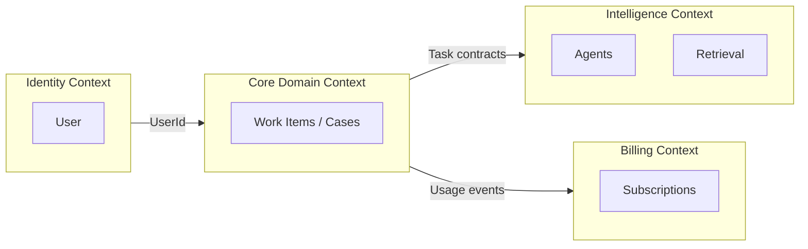

#### Context mapping requirements

1. Publish a context map in `ARCHITECTURE.md`.  
2. Define upstream/downstream relationships and integration style (ACL, shared kernel—rare, customer-supplier, conformist).  
3. Treat **Intelligence** as its own context with contracts into core domains—not as an informal plugin.  
4. Prefer explicit translation over leaking LLM JSON shapes into core persistence.  

**Example (CareerPilot):** bounded contexts might include Identity, Profile/Resume, Job Market, Applications, Interview Prep, Analytics, Compliance, and Intelligence Platform—each with clear ownership. CareerPilot is illustrative only.

---

### 2.12 Part II Conformance Checklist

- [ ] Architectural style selected and justified  
- [ ] C4 Level 1–2 present; Level 3 for AI and high-risk containers  
- [ ] Trust boundaries, runtime planes, and degrade modes documented  
- [ ] Event/API contracts versioned where used  
- [ ] Service/module boundaries and DDD bounded contexts mapped  
- [ ] Deployment, observability, and rollback documented  

---

## Part III — AI Architecture

**Canonical owner:** Architecture (`Architecture/ARCHITECTURE.md` Part III)  
**Related procedures:** [`AI/AI_GUIDELINES.md`](../AI/AI_GUIDELINES.md) · [`AI/MODEL_ROUTING.md`](../AI/MODEL_ROUTING.md) · [`AI/AGENTS.md`](../AI/AGENTS.md) · [`AI/TOOLS.md`](../AI/TOOLS.md) · [`AI/EVALS.md`](../AI/EVALS.md) · [`AI/INDEX.md`](../AI/INDEX.md)

An **AI Platform** is a governed set of capabilities that any MoniGarr product may consume. Products **shall not** treat “call a model” as architecture. Full procedural depth: [`AI/AI_GUIDELINES.md`](../AI/AI_GUIDELINES.md) · [`AI/PROMPTS.md`](../AI/PROMPTS.md) · [`AI/TOOLS.md`](../AI/TOOLS.md) · [`AI/MEMORY.md`](../AI/MEMORY.md) · [`AI/RAG.md`](../AI/RAG.md) · [`AI/EVALS.md`](../AI/EVALS.md) · [`AI/MODEL_ROUTING.md`](../AI/MODEL_ROUTING.md) · [`AI/GOLDEN_DATASETS.md`](../AI/GOLDEN_DATASETS.md).

---

### 3.1 AI Platform Definition

An MES-conformant AI Platform **shall** provide the following components (logical; may be co-located physically early, with clear module boundaries):

| Component | Purpose |
|-----------|---------|
| Model Gateway | Single controlled egress to model providers |
| KillSwitch | Emergency disable for write / irreversible AI egress and tool paths (required pattern: C4 Level 4) |
| Prompt Library | Curated, reusable prompt assets |
| Prompt Registry | Versioned, policy-bound prompt deployment |
| Agent Registry | Catalog of agents, contracts, owners |
| Tool Registry | Catalog of tools with schemas and controls |
| Memory Layer | Working/session/project/long-term memory with lifecycle |
| RAG Layer | Retrieval, ranking, citation assembly |
| Knowledge Graph | Explicit entities and relationships |
| Evaluation Layer | Scoring, thresholds, regression |
| Golden Evaluation Sets | Frozen/versioned benchmarks |
| Continuous Evaluation Pipeline | CI/CD and production monitoring evals |
| Safety Layer | Policy, PII, jailbreak, toxic/unsafe filters |
| Hallucination Detection | Ungrounded claim detection and refusal/repair |
| Model Selection Router | Task → model routing policies (via Model Gateway) |
| Cost Optimization | Budgets, caching, routing for cost |
| Token Analytics | Token/cost/latency product analytics |
| ClassificationEnforcer | Sensitivity / residency labels before model or regulated egress |

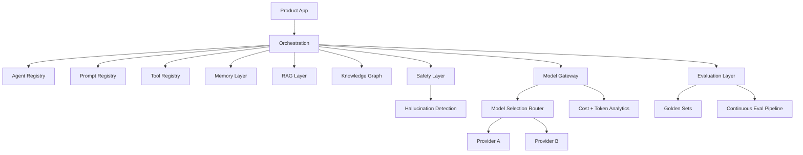

---

### 3.2 Model Gateway

The Model Gateway **shall** be the only production path for model inference and embeddings (except documented offline/batch jobs that still log equivalently).

**Shall provide:**

- Authn to providers; secret isolation  
- Request/response logging with redaction policy  
- Timeouts, retries, circuit breakers  
- Model allowlists and environment promotion  
- Correlation IDs linking product request → agent → model call  
- Streaming support with backpressure where used  
- Provider failover according to policy  

**Shall not:** allow ad-hoc SDK calls from feature code that bypass policy, logging, or budgets.

---

### 3.3 Prompt Library

The Prompt Library is the curated corpus of prompt templates, system instructions, graders, and critique prompts.

Rules:

1. Prompts **shall** be stored as versioned artifacts (not only chat history).  
2. Prompts **should** be modular (system, developer, task, style, safety appendices).  
3. Prompts **shall** declare intended model class and known failure modes.  
4. Examples and counter-examples **should** accompany high-risk prompts.  

---

### 3.4 Prompt Registry

The Prompt Registry **shall** control which prompt versions are active in each environment.

| Field | Required |
|-------|----------|
| Prompt ID | Yes |
| Semantic version | Yes |
| Owner | Yes |
| Risk class | Yes |
| Linked golden eval set | Yes for R1+ |
| Changelog | Yes |
| Active environments | Yes |
| Rollback target | Yes |

Silent production prompt edits are non-conformant. Promotion **shall** follow eval gates.

---

### 3.5 Agent Registry

Every production agent **shall** be registered with:

Purpose · Inputs · Outputs · Tools · Memory scopes · Evaluation · Failure modes · Escalation rules · Ownership · Risk class · Version

Prefer many specialized agents over one monolith agent. See Parts VI–VII and [`AI/AGENTS.md`](../AI/AGENTS.md).

---

### 3.6 Tool Registry

Every tool **shall** define: schema, validation, retries, timeouts, circuit breakers, observability, security, tests, documentation, version, examples.

Tools are products. Untested tools **shall not** be exposed to high-risk agents. Detail: [`AI/TOOLS.md`](../AI/TOOLS.md).

---

### 3.7 Memory Layer

| Memory type | Use | Lifecycle |
|-------------|-----|-----------|
| Working memory | Current task scratchpad | Ephemeral; task-scoped |
| Session memory | Conversation / workflow episode | TTL; user/session scoped |
| Project memory | Product- or tenant-scoped durable facts | Retention policy; reviewable |
| Long-term memory | Curated knowledge | Explicit promotion; retention |
| Reference knowledge | Docs, policies, golden materials | Versioned with docs |

Memory **shall** have: access control, retention/deletion, provenance, and “do not train / do not leak” flags as applicable. Detail: [`AI/MEMORY.md`](../AI/MEMORY.md).

---

### 3.8 RAG Layer

The RAG Layer **shall** implement retrieval before generation for factual/consequential tasks, with citation and provenance. Normative depth: Part IV and [`AI/RAG.md`](../AI/RAG.md).

---

### 3.9 Knowledge Graph

The Knowledge Graph **shall** model domain entities and typed relationships for traversal-backed reasoning. Normative depth: Part V and [`AI/KNOWLEDGE_GRAPH.md`](../AI/KNOWLEDGE_GRAPH.md).

---

### 3.10 Evaluation Layer

The Evaluation Layer **shall** score AI outputs against defined metrics and thresholds.

Minimum capabilities:

- Offline eval runners  
- Online/sampled production eval  
- Metric registry (quality, safety, groundedness, latency, cost)  
- Pass/fail gates wired to release  

No AI capability ships without measurable evaluation ([`Governance/MILE.md`](../Governance/MILE.md)).

---

### 3.11 Golden Evaluation Sets

Golden sets **shall** be representative, versioned, and change-controlled.

Maintain sets for: prompts, retrieval, graphs, agents, RAG, safety, performance, plus domain corpora.

**Example (CareerPilot):** resumes, job descriptions, interview questions, cover letters, portfolios, salary datasets, repositories—illustrative corpora only.

Model upgrades **shall** run against the same frozen benchmark before promotion. Detail: [`AI/GOLDEN_DATASETS.md`](../AI/GOLDEN_DATASETS.md) · [`AI/EVALS.md`](../AI/EVALS.md).

---

### 3.12 Continuous Evaluation Pipeline


Pipeline **shall** fail closed on threshold breaches for R2+ capabilities (R2–R4).

---

### 3.13 Safety Layer

Safety **shall** include, as applicable to product risk:

- Input injection / jailbreak defenses  
- PII detection and redaction policies  
- Allow/deny tool lists per agent  
- Content policy filters  
- Secrets exfiltration prevention  
- Rate limits and abuse detection  

Safety failures **shall** escalate per risk class; they **shall not** be silently ignored.

---

### 3.14 Hallucination Detection

Systems **shall** define operational hallucination controls for factual tasks:

| Technique | Expectation |
|-----------|-------------|
| Groundedness check | Claims supported by retrieved/tool evidence |
| Citation coverage | Material claims cite sources |
| Contradiction detection | Output vs sources / user profile |
| Refusal / repair | Ungrounded → refuse, ask, or repair loop |
| Metrics | Hallucination rate monitored in production |

Thresholds **shall** be part of release gates for AI-affecting production systems.

---

### 3.15 Model Selection Router

The router **shall** map task class → model tier using policy, not hard-coded one-offs in feature code.

Routing inputs may include: task type, risk class, latency SLO, cost budget, required capabilities (tools, long context, JSON), data residency.

Detail: [`AI/MODEL_ROUTING.md`](../AI/MODEL_ROUTING.md).

---

### 3.16 Cost Optimization

Teams **shall** define budgets and **should** apply:

- Prompt compression and context budgets  
- Caching for idempotent retrieval/embeddings  
- Cheaper models for triage; expensive models for hard tasks  
- Early-exit when confidence/evidence sufficient  
- Batch where interactive latency not required  

Cost is a product quality attribute, not an afterthought.

---

### 3.17 Token Analytics

Platforms **shall** capture and expose:

- Tokens in/out per request, agent, prompt version, model  
- Cost per tenant/feature (as applicable)  
- Latency distributions  
- Error/retry rates  
- Quality scores joined to cost (efficiency)  

If it cannot be measured, it cannot improve ([`Engineering/OBSERVABILITY.md`](../Engineering/OBSERVABILITY.md)).

---

### 3.18 Part III Conformance Checklist

- [ ] Model Gateway is sole production egress  
- [ ] Prompt/Agent/Tool registries exist with owners and versions  
- [ ] Memory/RAG/Graph responsibilities assigned  
- [ ] Golden sets + continuous eval pipeline gate releases  
- [ ] Safety + hallucination controls for factual/consequential paths  
- [ ] Router, cost, and token analytics operational  

---

## Part IV — Enterprise RAG

**Canonical owner:** Architecture (`Architecture/ARCHITECTURE.md` Part IV)  
**Related procedures:** [`AI/RAG.md`](../AI/RAG.md) · [`AI/KNOWLEDGE_GRAPH.md`](../AI/KNOWLEDGE_GRAPH.md) · [`AI/EVALS.md`](../AI/EVALS.md) · [`Engineering/OBSERVABILITY.md`](../Engineering/OBSERVABILITY.md)

Enterprise Retrieval-Augmented Generation (RAG) is how MoniGarr grounds probabilistic generation in evidence. Detail: [`AI/RAG.md`](../AI/RAG.md) · [`AI/KNOWLEDGE_GRAPH.md`](../AI/KNOWLEDGE_GRAPH.md) · [`AI/EVALS.md`](../AI/EVALS.md).

---

### 4.1 Layered Retrieval

RAG **shall** be designed as layers, not a single vector search call:

```text
1. Authorize & scope
2. Metadata filter / ACL
3. Candidate retrieval (keyword + dense + sparse as applicable)
4. Hybrid fusion
5. Graph expansion (optional / required by domain)
6. Ranking / re-ranking
7. Compression / context assembly
8. Generation with citations
9. Groundedness / provenance checks
```

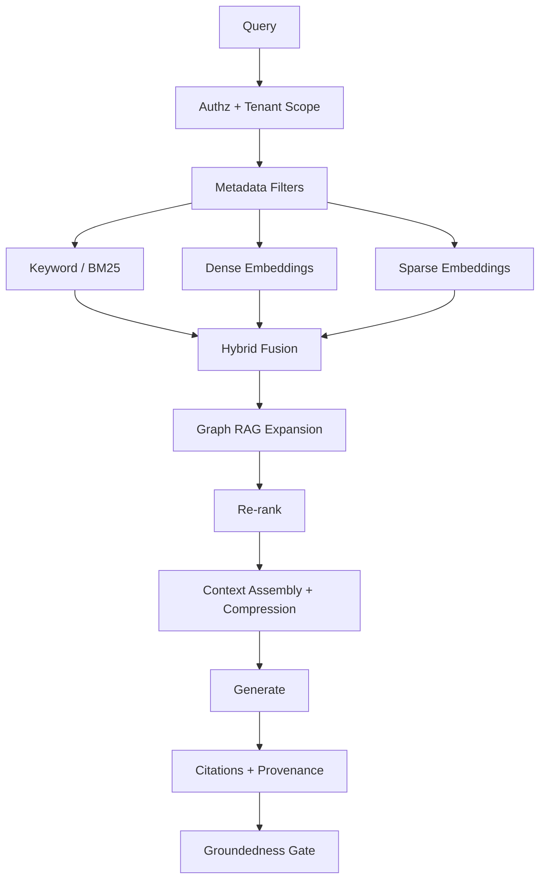

---

### 4.2 Semantic Search

Semantic (dense) search **shall** use embedding models approved via Model Gateway, with:

- Document chunking strategy documented (size, overlap, structure awareness)  
- Embedding version recorded per index  
- Re-embed plan on model change  
- Evaluation of recall@k / nDCG on golden queries  

---

### 4.3 Keyword Search

Keyword search **shall** remain available for exact tokens (IDs, names, error codes, statutes, skill spellings). Semantic-only retrieval is insufficient for enterprise corpora.

---

### 4.4 Hybrid Retrieval

Hybrid retrieval **should** be the default: fuse BM25/keyword with dense (and sparse when valuable). Fusion method (RRF, weighted, learned) **shall** be documented and evaluated.

---

### 4.5 Metadata Filtering

Every indexed document **shall** carry metadata sufficient for:

- Tenant / ACL enforcement  
- Doc type, source system, freshness  
- Language, region, sensitivity classification  
- Provenance pointers  

Filters **shall** apply **before** or as hard constraints during retrieval—not as best-effort post-hoc hopes.

---

### 4.6 BM25

BM25 (or equivalent lexical scorer) **should** be part of hybrid stacks. Teams **shall** tune analyzers (stemming, stopwords, synonyms) deliberately and version synonym lists.

---

### 4.7 Dense Embeddings

Dense embeddings capture semantic similarity. Requirements:

1. Chunk boundaries prefer semantic structure (headings, sections) over naive fixed windows when practical.  
2. Store `embedding_model_id` + `index_version` with vectors.  
3. Evaluate drift when upgrading embedding models.  

---

### 4.8 Sparse Embeddings

Sparse learned retrievers (e.g., SPLADE-style) **may** be used to improve lexical-semantic recall. When used, they **shall** be evaluated against hybrid baselines and cost/latency budgets.

---

### 4.9 Graph RAG

Graph RAG **shall** expand retrieval using typed relationships when relational structure matters more than text similarity alone.

Pattern:

1. Retrieve seed entities/docs  
2. Traverse allowed relationship types within hop/budget limits  
3. Collect neighborhood evidence  
4. Assemble structured context for the generator  

Detail: Part V.

---

### 4.10 Entity Graph Patterns (Illustrative Domain)

The following node families are **patterns**, not MES product requirements. They illustrate how a career/work domain might model Graph RAG.

**Example (CareerPilot) entity graphs:**

| Graph facet | Example nodes | Example use |
|-------------|---------------|-------------|
| Entity | Person, Organization | Identity resolution |
| Skill | Skill, SkillCluster | Matching and gaps |
| Company | Company, Industry | Employer context |
| Career | Role, CareerPath | Trajectory reasoning |
| Resume | Resume, Section, Claim | Evidence for statements |
| Job | JobPosting, Requirement | Fit analysis |
| Relationship | Typed edges among the above | GraphRAG expansion |

Products in other domains **shall** substitute their own ubiquitous language while keeping the same normative Graph RAG controls (ACL, hop limits, provenance, eval).

---

### 4.11 Context Assembly

Context assembly **shall**:

- Respect token budgets  
- Prefer higher-ranked, more recent, more authoritative evidence  
- Preserve source boundaries (do not merge distinct docs into unmarked blobs)  
- Include structured fields when helpful (tables, requirements lists)  
- Attach citation IDs stable for the request  

---

### 4.12 Ranking

Initial ranking **shall** combine retrieval signals (lexical, dense, sparse, metadata boosts, recency, authority). Ranking configuration **shall** be versioned.

---

### 4.13 Re-ranking

Cross-encoder or LLM re-rankers **should** be used when quality gains justify latency/cost. Re-rankers **shall** be evaluated on golden sets; they **shall not** silently reorder beyond declared `top_n`.

---

### 4.14 Compression

Context compression **may** summarize or extractively compress retrieved passages. Compressed context **shall** retain citation links to original spans. Abstractive compression of legal/safety-critical text **should** be avoided or heavily gated.

---

### 4.15 Citation Generation

For factual/consequential answers, systems **shall** generate citations mapping claims → sources (document ID, span/chunk ID, timestamp/version).

User-visible answers **should** expose citations; internal traces **shall** always retain them for audit.

---

### 4.16 Provenance Tracking

Provenance **shall** record:

- Source system and document ID  
- Ingest pipeline version  
- Chunking/embedding/index versions  
- Retrieval query and filters  
- Ranker/re-ranker versions  
- Prompt/model versions used in generation  

Provenance enables debug, dispute resolution, and continuous improvement.

---

### 4.17 RAG Quality Gates

| Metric | Shall track |
|--------|-------------|
| Recall@k / nDCG | Golden query sets |
| Citation coverage | Factual answers |
| Groundedness rate | Production samples |
| Latency | p50/p95 retrieval + e2e |
| Cost | Per query / per tenant |
| ACL correctness | Zero-tolerance for cross-tenant leakage |

---

### 4.18 Part IV Conformance Checklist

- [ ] Layered retrieval documented and implemented  
- [ ] Hybrid retrieval default unless ADR  
- [ ] Metadata ACL filters enforced  
- [ ] Graph RAG used where relationships matter  
- [ ] Ranking/re-ranking/compression versioned  
- [ ] Citations + provenance for factual/consequential outputs  

---

## Part V — Enterprise Knowledge Graph

**Canonical owner:** Architecture (`Architecture/ARCHITECTURE.md` Part V)  
**Related procedures:** [`AI/KNOWLEDGE_GRAPH.md`](../AI/KNOWLEDGE_GRAPH.md) · [`AI/RAG.md`](../AI/RAG.md) · [`AI/EVALS.md`](../AI/EVALS.md)

This Part is the MES standard for graph applications. Procedural depth: [`AI/KNOWLEDGE_GRAPH.md`](../AI/KNOWLEDGE_GRAPH.md).

---

### 5.1 Purpose

Knowledge graphs make relationships explicit so systems prefer **traversal over prompt guessing**. Graphs **shall** support:

- Deterministic queries for known relationship patterns  
- GraphRAG expansion for grounded generation  
- Analytics and explainability (“why matched”)  
- Provenance-aware knowledge evolution  

---

### 5.2 Modeling Norms

1. Nodes and relationships **shall** use a versioned schema (ontology/taxonomy).  
2. Every node **shall** have: stable ID, type, created/updated timestamps, source provenance, tenant/ACL scope as applicable.  
3. Every relationship **shall** have: type, direction semantics, provenance, confidence (if probabilistic), valid_time if temporal.  
4. Soft-delete / supersede patterns **should** be preferred over silent hard-delete for audited knowledge.  
5. LLM-extracted edges **shall** be marked `GENERATED` or equivalent and **shall not** be treated as ground truth without validation policy.  

---

### 5.3 Nodes Catalog (Pattern Library)

The catalog below is a **domain pattern library**. Products **shall** adapt names to their ubiquitous language.

**Example (CareerPilot) node types:**

| Node type | Description | Typical properties |
|-----------|-------------|--------------------|
| Users | People using the system | identity refs, preferences |
| Skills | Competencies | name, aliases, category |
| Jobs | Roles or postings | title, requirements, level |
| Companies | Employers / orgs | name, industry, size |
| Certifications | Credentials | issuer, date, expiry |
| Projects | Work products | role, outcomes, links |
| Interviews | Interview events | stage, date, outcome |
| Applications | Job applications | status, timeline |
| Technologies | Tools/languages/platforms | ecosystem tags |
| Recruiters | Recruiting contacts | org affiliation |
| Publications | Papers/articles/posts | venue, URL, date |

Other MoniGarr products **shall** define analogous catalogs (e.g., Orders, Assets, Claims) with the same rigor.

---

### 5.4 Relationships (Normative Pattern Set)

Relationship types **shall** be enumerated in schema. The following verbs are a shared pattern set for career/work-style domains and may be reused or mapped:

| Relationship | Meaning | Notes |
|--------------|---------|-------|
| USES | Entity uses a technology/tool | Often Project/User → Technology |
| KNOWS | Entity knows a skill | Confidence/evidence recommended |
| REQUIRES | Job/cert requires skill/tech | From posting or policy |
| MATCHES | Computed fit between entities | Always provenance + score version |
| WORKED_AT | User worked at company | Temporal validity |
| INTERVIEWED_FOR | User interviewed for job | Link to Interview node |
| RECOMMENDED | Recommendation edge | Who/what recommended; policy-sensitive |
| MENTORED | Mentorship relation | Directional |
| REFERENCES | Document/entity references another | Citation backbone |
| GENERATED | Edge/node produced by AI | Must be labeled; lower trust until validated |

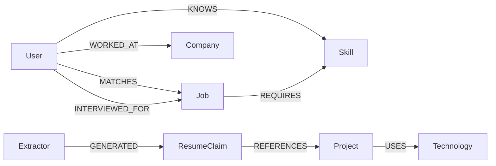

---

### 5.5 Versioning

Graph schema **shall** be versioned (e.g., `ontology_semver`). Migrations **shall** be documented. Breaking relationship semantic changes **require** ADR + dual-read/dual-write or batch migration plan.

Indexes and materialized match scores **shall** record algorithm/version so historical explanations remain reproducible.

---

### 5.6 Provenance

Every write path **shall** capture:

- Source system / document / user action  
- Extractor ID (human, tool, agent, model+prompt version)  
- Confidence and validation state  
- Timestamp  

Queries used for consequential decisions **should** return provenance summaries.

---

### 5.7 Query and Safety Rules

1. Traversal **shall** enforce ACL at seed and expansion.  
2. Hop limits and fan-out budgets **shall** prevent graph explosion.  
3. `GENERATED` edges **shall** be excludable by policy for R2+ decisions (R2–R4).  
4. Graph mutations by agents **shall** go through validated tools, not free-form cypher from the LLM.  

---

### 5.8 Evaluation

Golden graph evals **shall** cover: entity resolution precision/recall, relationship accuracy, traversal explanations, and end-to-end GraphRAG answer quality.

---

### 5.9 Part V Conformance Checklist

- [ ] Versioned ontology with node/relationship catalog  
- [ ] Provenance on nodes/edges  
- [ ] ACL + hop budgets  
- [ ] GENERATED vs validated distinction  
- [ ] GraphRAG and analytics use cases documented  
- [ ] Golden graph evals exist for production graph features  

---

## Part VI — AI Agent Platform

**Canonical owner:** Architecture (`Architecture/ARCHITECTURE.md` Part VI)  
**Related procedures:** [`AI/AGENTS.md`](../AI/AGENTS.md) · [`AI/TOOLS.md`](../AI/TOOLS.md) · [`AI/EVALS.md`](../AI/EVALS.md) · [`AI/SUBAGENTS.md`](../AI/SUBAGENTS.md)

MoniGarr builds **teams of agents**, not one omniscient agent. Detail: [`AI/AGENTS.md`](../AI/AGENTS.md) · [`AI/TOOLS.md`](../AI/TOOLS.md) · [`AI/EVALS.md`](../AI/EVALS.md).

---

### 6.1 Team Pattern (Normative for Any Product)

An **Agent Team** is a coordinated set of specialized agents sharing:

- A mission and risk class envelope  
- Shared registries (prompt/tool/model)  
- Shared memory scopes with ACL  
- Shared evaluation harness  
- Explicit orchestrator / coordinator  
- Escalation to humans  

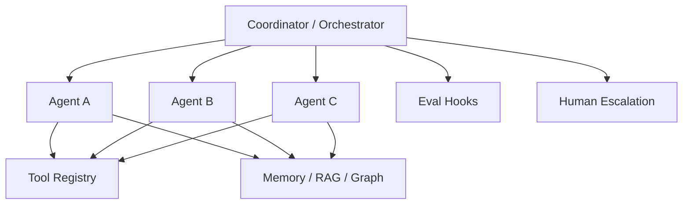

#### Team contract (shall define)

| Element | Requirement |
|---------|-------------|
| Mission | One paragraph; non-goals listed |
| Members | Agent IDs + responsibilities |
| Protocols | Handoff schemas between agents |
| Shared tools | Allowlist |
| KPIs | Team-level outcome metrics |
| Failure modes | Team-level degrade behavior |
| Escalation | When to stop and ask a human |
| Ownership | Human team owner |

Agents remain small and specialized. Monolith agents are non-conformant without ADR.

---

### 6.2 Per-Agent Minimum Spec

Every agent **shall** document:

| Field | Description |
|-------|-------------|
| Responsibilities | What it does / does not do |
| Inputs | Schema + examples |
| Outputs | Schema + examples |
| KPIs | Business/product signals |
| Evaluation Metrics | Automated scores/thresholds |
| Failure Modes | Likely breaks |
| Escalation Rules | Deterministic triggers |
| Tools / Memory | Allowlists |
| Risk Class | R0–R4 ([`GLOSSARY.md` — Risk Class](../GLOSSARY.md#risk-class)) |

---

### 6.3 Example (CareerPilot) — Career Team

The following team is **illustrative only**. Other products shall instantiate the Team pattern with their own domain agents. Full agent contract tables: [`AI/AGENTS.md`](../AI/AGENTS.md).

**Example (CareerPilot) Career Team mission:** help a user navigate discovery → application → interview → negotiation → learning with grounded, evaluable assistance and human approval for externalized materials.

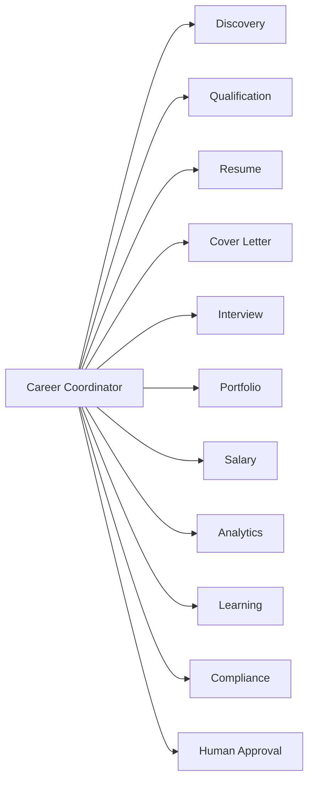

#### Sample agent specification — Resume Agent (Example)

| Field | Spec |
|-------|------|
| Responsibilities | Draft/revise resume content; coordinate sub-agents (Part VII); never invent employment facts |
| Inputs | Profile, target job, existing resume, evidence docs |
| Outputs | Resume draft + change log + citation map |
| KPIs | ATS pass proxies; user edit distance; interview callback (lagging) |
| Evaluation Metrics | Factual consistency; ATS structure scores; grammar |
| Failure Modes | Hallucinated jobs/dates; keyword stuffing; formatting breakage |
| Escalation Rules | Any new factual claim without evidence; external send |

Remaining Career Team agents (Discovery, Qualification, Cover Letter, Interview, Portfolio, Salary, Analytics, Learning, Compliance) follow the same §6.2 field set; maintain full tables in project docs or [`AI/AGENTS.md`](../AI/AGENTS.md)—do not duplicate encyclopedic catalogs here.

---

### 6.4 Coordination Rules

1. Coordinator **shall** own sequencing and shall not dump full unconstrained context into every agent.  
2. Handoffs **shall** use typed artifacts (JSON/schemas), not prose-only.  
3. Compliance/safety checks **should** run before externalization.  
4. Parallelism **may** be used when agents are independent; write conflicts **shall** be mediated.  

---

### 6.5 Part VI Conformance Checklist

- [ ] Team pattern adopted (not single mega-agent)  
- [ ] Every agent registered with full contract  
- [ ] KPIs + eval metrics + failure modes + escalation defined  
- [ ] HITL path for R2+ externalization and R3/R4 production or irreversible actions  
- [ ] Example mappings treated as illustrative when using CareerPilot labels  

---

## Part VII — Sub-Agent Architecture

**Canonical owner:** Architecture (`Architecture/ARCHITECTURE.md` Part VII)  
**Related procedures:** [`AI/SUBAGENTS.md`](../AI/SUBAGENTS.md) · [`AI/AGENTS.md`](../AI/AGENTS.md) · [`AI/LOOP_ENGINEERING.md`](../AI/LOOP_ENGINEERING.md)

Complex agent responsibilities **shall** be delegated to sub-agents with one primary responsibility each. Detail: [`AI/SUBAGENTS.md`](../AI/SUBAGENTS.md) · [`AI/LOOP_ENGINEERING.md`](../AI/LOOP_ENGINEERING.md).

---

### 7.1 Delegation Pattern

Extended delegation topology (Research / Reasoner optional). Default team roles: [`AI/AGENTS.md`](../AI/AGENTS.md). Extended chain: [`AI/SUBAGENTS.md`](../AI/SUBAGENTS.md).

```text
Coordinator → Planner → Research → Retriever → Reasoner → Writer → Critic → Evaluator → Exporter
```

 Normative rules:

1. Parent agent **shall** define the sub-agent DAG / workflow.  
2. Each sub-agent **shall** have a narrow contract (inputs/outputs/tools).  
3. Critic/Evaluator sub-agents **should** be separated from Writer (separation of duties).  
4. Export/side-effect sub-agents **shall** be last and policy-gated.  
5. Loops **shall** record prompt, response, evaluation, token cost, runtime, quality score.  

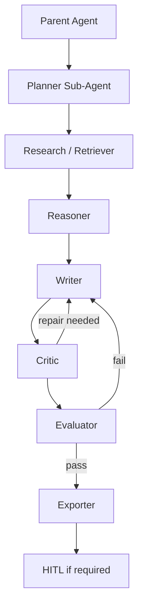

---

### 7.2 Sub-Agent Contract Template

| Field | Required |
|-------|----------|
| Parent agent | Yes |
| Single responsibility | Yes |
| Inputs / outputs schemas | Yes |
| Tools allowlist | Yes |
| Max iterations / timeouts | Yes |
| Success criteria | Yes |
| Failure / escalate criteria | Yes |
| Eval hooks | Yes for production paths |

---

### 7.3 Example (CareerPilot) — Resume Agent Decomposition

**Example (CareerPilot):** Resume Agent delegates to specialized sub-agents. Illustrative only.

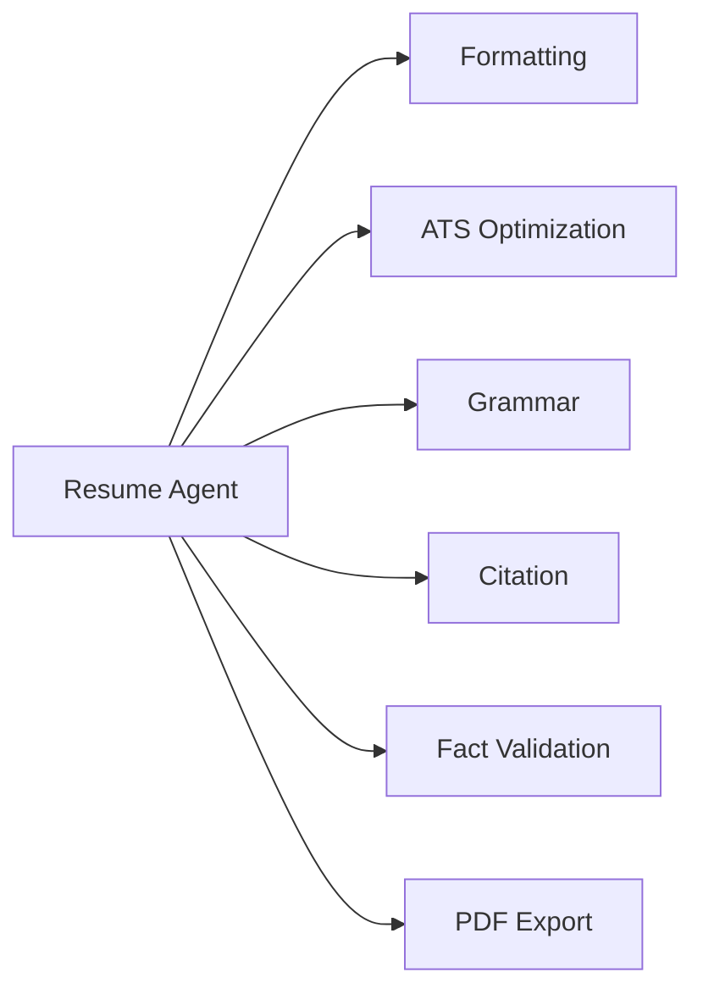

##### Formatting Sub-Agent

| Field | Spec |
|-------|------|
| Responsibilities | Normalize structure, headings, dates, bullet consistency; no content invention |
| Inputs | Resume IR (intermediate representation) |
| Outputs | Formatted IR + formatting diff |
| KPIs | Format acceptance; render success |
| Evaluation Metrics | Schema validation; section completeness |
| Failure Modes | Destroying content; bad date normalization |
| Escalation Rules | Unparseable source; conflicting structures |

##### ATS Optimization Sub-Agent

| Field | Spec |
|-------|------|
| Responsibilities | Improve parseability and relevant keyword alignment **without** fabricating skills |
| Inputs | Resume IR, target job requirements, skills graph evidence |
| Outputs | ATS-oriented IR + keyword rationale tied to evidence |
| KPIs | ATS parse proxies; grounded keyword ratio |
| Evaluation Metrics | Keyword precision (evidence-backed); spam score |
| Failure Modes | Keyword stuffing; invisible text tricks (forbidden) |
| Escalation Rules | Any proposed claim lacking evidence |

##### Grammar Sub-Agent

| Field | Spec |
|-------|------|
| Responsibilities | Grammar, spelling, clarity edits preserving meaning |
| Inputs | Text spans |
| Outputs | Revised spans + edit list |
| KPIs | Edit acceptance rate |
| Evaluation Metrics | Grammar golden set; meaning-preservation checks |
| Failure Modes | Changing facts while “editing” |
| Escalation Rules | Edits that alter employers, dates, metrics |

##### Citation Sub-Agent

| Field | Spec |
|-------|------|
| Responsibilities | Attach evidence links to claims (projects, metrics, employers) |
| Inputs | Claims + evidence corpus/graph |
| Outputs | Claim→source map |
| KPIs | Citation coverage |
| Evaluation Metrics | Citation precision/recall |
| Failure Modes | Wrong source mapping |
| Escalation Rules | Uncitable material claims |

##### Fact Validation Sub-Agent

| Field | Spec |
|-------|------|
| Responsibilities | Verify claims against profile, documents, graph; block or flag inventions |
| Inputs | Claims + sources |
| Outputs | Validation report (pass/fail/unknown) |
| KPIs | Hallucinated-claim escape rate (target: near zero) |
| Evaluation Metrics | Contradiction detection golden set |
| Failure Modes | False confidence on unknowns |
| Escalation Rules | Unknown high-impact claims → human |

##### PDF Export Sub-Agent

| Field | Spec |
|-------|------|
| Responsibilities | Render final artifact; no content changes beyond layout |
| Inputs | Approved IR |
| Outputs | PDF (or other format) + checksum |
| KPIs | Render success; visual QA pass rate |
| Evaluation Metrics | Template regression fixtures |
| Failure Modes | Truncation; broken Unicode; layout overflow |
| Escalation Rules | Export after failed validation; external distribute without HITL |

---

### 7.4 Loop Engineering for Sub-Agents

Sub-agent pipelines **shall** support structured iteration:

```text
Draft → Critique → Repair → Re-score → Compare → Improve → Evaluate → Approve
```

Each iteration **shall** be bounded (max loops, max tokens, max wall time). Infinite repair loops are non-conformant.

---

### 7.5 Observability and Ownership

Parent agents **shall** emit traces that include sub-agent spans. Token/cost analytics **shall** roll up by parent and sub-agent. Human owners **shall** be defined at parent level; sub-agents inherit unless overridden.

---

### 7.6 Part VII Conformance Checklist

- [ ] Delegation used for complex responsibilities  
- [ ] Critic/evaluator separated from writer where risk warrants  
- [ ] Side-effect/export steps gated  
- [ ] Loop bounds + recorded metrics  
- [ ] CareerPilot resume decomposition used only as labeled example  

---

### Cross-Links Index (Parts I–VII)

| Topic | Document |
|-------|----------|
| Operating model | [`Governance/MOM.md`](../Governance/MOM.md) |
| Intelligence-led engineering | [`Governance/MILE.md`](../Governance/MILE.md) |
| ADRs | [`Governance/ADR_GUIDE.md`](../Governance/ADR_GUIDE.md) |
| AI guidelines | [`AI/AI_GUIDELINES.md`](../AI/AI_GUIDELINES.md) |
| Agents / sub-agents | [`AI/AGENTS.md`](../AI/AGENTS.md) · [`AI/SUBAGENTS.md`](../AI/SUBAGENTS.md) |
| Prompts / tools | [`AI/PROMPTS.md`](../AI/PROMPTS.md) · [`AI/TOOLS.md`](../AI/TOOLS.md) |
| RAG / graph / memory | [`AI/RAG.md`](../AI/RAG.md) · [`AI/KNOWLEDGE_GRAPH.md`](../AI/KNOWLEDGE_GRAPH.md) · [`AI/MEMORY.md`](../AI/MEMORY.md) |
| Evals / golden sets / loops / harnesses | [`AI/EVALS.md`](../AI/EVALS.md) · [`AI/GOLDEN_DATASETS.md`](../AI/GOLDEN_DATASETS.md) · [`AI/LOOP_ENGINEERING.md`](../AI/LOOP_ENGINEERING.md) · [`AI/HARNESS_ENGINEERING.md`](../AI/HARNESS_ENGINEERING.md) |
| Model routing | [`AI/MODEL_ROUTING.md`](../AI/MODEL_ROUTING.md) |
| Engineering practices | [`Engineering/ENGINEERING_STANDARDS.md`](../Engineering/ENGINEERING_STANDARDS.md) · [`Engineering/OBSERVABILITY.md`](../Engineering/OBSERVABILITY.md) · [`Engineering/SECURITY.md`](../Engineering/SECURITY.md) · [`Engineering/DEVOPS.md`](../Engineering/DEVOPS.md) |
| C4 companions | [`Architecture/C4/Level1_Context.md`](C4/Level1_Context.md) · [`Level2_Container.md`](C4/Level2_Container.md) · [`Level3_Component.md`](C4/Level3_Component.md) · [`Level4_Code.md`](C4/Level4_Code.md) |

---

## Part VIII — Loop Engineering

**Canonical owner:** Architecture (`Architecture/ARCHITECTURE.md` Part VIII)  
**Related procedures:** [`AI/LOOP_ENGINEERING.md`](../AI/LOOP_ENGINEERING.md) · [`Governance/MILE.md`](../Governance/MILE.md) · [`Governance/MOM.md`](../Governance/MOM.md)  
**Normative status:** Mandatory for all probabilistic generation, agent workflows, and multi-step AI orchestration under MES v1.1.  
**Canonical depth:** [`AI/LOOP_ENGINEERING.md`](../AI/LOOP_ENGINEERING.md)  
**Governance anchors:** [`Governance/MILE.md`](../Governance/MILE.md) · [`Governance/MOM.md`](../Governance/MOM.md)

### VIII.1 Purpose

Loop Engineering is the discipline of improving probabilistic outputs through **structured, measured iteration** rather than ad-hoc re-prompting. Every MoniGarr AI capability that produces customer-facing or decision-influencing text, structured artifacts, tool plans, or retrieval-augmented answers **shall** implement an explicit improvement loop with recorded evidence.

Factory maxim applied: *AI accelerates. Deterministic systems prove. Humans remain accountable. Systems remain governable.*

Loops convert model variance into governed process: fixed stages, stop rules, cost ceilings, and human approval gates.

### VIII.2 Canonical Loop

Every generation loop **shall** follow this ordered pipeline (stages may be skipped only when an ADR documents why the risk class permits omission):

```text
Draft → Critique → Repair → Re-score → Compare → Improve → Evaluate → Approve
```

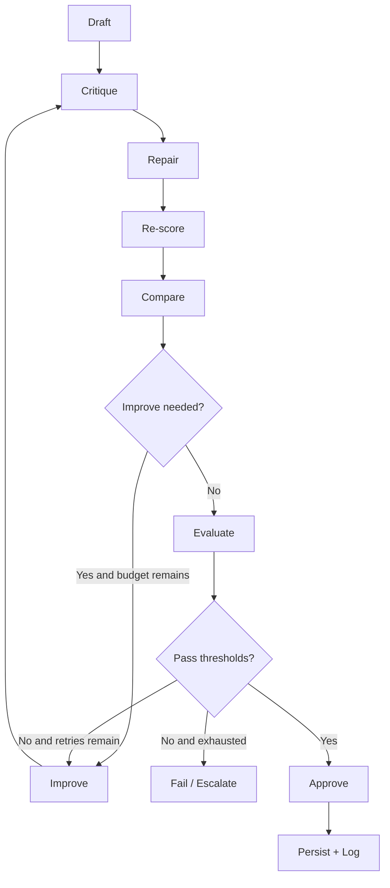

| Stage | Requirement | Output artifact |
|-------|-------------|-----------------|
| **Draft** | Produce first candidate under versioned prompt + tools | Candidate artifact + provenance |
| **Critique** | Identify defects against rubric (grounding, schema, policy, style) | Critique report with scored dimensions |
| **Repair** | Apply targeted fixes; do not silently rewrite unconstrained | Patched candidate + change diff |
| **Re-score** | Re-run deterministic and/or model judges on same rubric | Updated quality vector |
| **Compare** | Diff against prior candidate and/or golden baseline | Comparison record (wins/losses) |
| **Improve** | Select next action: re-retrieve, re-tool, re-prompt, or abort | Improvement decision |
| **Evaluate** | Run harness / golden checks for this capability | Eval result + gate status |
| **Approve** | Apply HITL or automated approval per risk class | Approval record |

### VIII.3 Mandatory Telemetry Per Loop Iteration

Every loop iteration **shall** record at least:

| Field | Type | Requirement |
|-------|------|-------------|
| `loop_id` | UUID | Stable across iterations of one task |
| `iteration` | int ≥ 0 | Monotonic |
| `stage` | enum | One of the eight stages |
| `prompt_id` / `prompt_version` | string / semver | From Prompt Library |
| `prompt` | redacted text or hash+ref | Full text only if policy allows |
| `response` | redacted text or structured payload | Schema-validated when structured |
| `evaluation` | object | Rubric scores + pass/fail |
| `token_cost` | object | Input/output/total tokens + USD estimate |
| `runtime_ms` | int | Wall clock for stage |
| `quality_score` | float 0–1 or domain scale | Comparable across iterations |
| `model_id` | string | Exact model/router decision |
| `tool_calls` | array | Tool names, latency, success |
| `retrieval_ids` | array | Chunk/graph node IDs when RAG/graph used |
| `stop_reason` | enum | See §VIII.5 |
| `approver` | string \| null | Human identity when HITL |
| `timestamp` | ISO-8601 | UTC |

Optional but **should** be recorded: temperature/top-p, seed (if supported), cache hits, circuit-breaker state, tenant/project id (non-PII), experiment flag.

**Example (CareerPilot):** A cover-letter loop records each draft’s rubric scores for tone, JD alignment, hallucination flags, token cost, and human “send” approval before export.

### VIII.4 Logging Schema (Normative Minimum)

Projects **shall** emit loop logs as structured JSON Lines (or equivalent) to the observability pipeline. Schema **shall** be versioned (`schema_version`).

```json
{
  "schema_version": "1.0.0",
  "loop_id": "018f...",
  "iteration": 2,
  "stage": "re_score",
  "prompt_id": "cover_letter.v3",
  "prompt_version": "3.2.1",
  "response_ref": "s3://.../redacted.json",
  "evaluation": {
    "grounding": 0.91,
    "schema_valid": true,
    "policy": "pass",
    "composite": 0.88
  },
  "token_cost": {
    "input": 4200,
    "output": 900,
    "total": 5100,
    "usd": 0.042
  },
  "runtime_ms": 1840,
  "quality_score": 0.88,
  "model_id": "provider/model@rev",
  "stop_reason": null,
  "approver": null,
  "timestamp": "2026-07-12T17:00:00Z"
}
```

PII **must** be redacted or stored only in approved vaults; see Part X and [`Engineering/SECURITY.md`](../Engineering/SECURITY.md).

### VIII.5 Stopping Criteria

Loops **shall not** run unbounded. Each capability **shall** declare stop criteria in code and docs:

| Criterion | Rule |
|-----------|------|
| Quality threshold | Stop when `quality_score ≥ T` and all blocking dims pass |
| Max iterations | Hard cap (default **should** be ≤ 5 unless ADR) |
| Token budget | Stop when cumulative tokens/USD exceed budget |
| Latency budget | Stop when wall clock exceeds SLA |
| Oscillation | Stop if score delta < ε for N iterations |
| Critique exhaustion | Stop if critique finds no actionable defects |
| Safety / policy fail | Immediate abort; do not “improve into compliance” by fabrication |
| Human reject | Immediate abort or escalate |

On stop without Approve, the system **must** return a governed failure (partial safe output, refusal, or escalation)—never a silent best-effort hallucination.

### VIII.6 Human Approval Gates

Aligned with M.I.L.E. “Human Approved,” M.O.M. quality gates, and [`AI/AI_GUIDELINES.md`](../AI/AI_GUIDELINES.md) risk classes R0–R4 ([`GLOSSARY.md` — Risk Class](../GLOSSARY.md#risk-class)):

| Risk class | Approval rule |
|------------|---------------|
| **R0 — Advisory** | Optional review; automated approve if evals pass |
| **R1 — Internal draft** | Automated approve if evals pass; should review before merge/publish |
| **R2 — Customer-visible draft** | HITL required before send/publish |
| **R3 — Production change** | HITL required with evidence pack before Approve |
| **R4 — Irreversible / regulated** | Dual control or designated approver; ADR if automated |

Approval records **shall** include who, when, what artifact hash, and which eval evidence was reviewed.

**Example (CareerPilot):** Auto-apply or outbound application materials **must** pass HITL or an explicit user confirmation gate—not silent agent send.

### VIII.7 Critique & Repair Contracts

Critique **shall** be rubric-driven, not free-form vibes:

- Dimension scores with definitions  
- Evidence pointers (retrieved spans, schema paths)  
- Severity (`blocker` / `major` / `minor`)  
- Suggested repair actions  

Repair **shall**:

- Address blockers first  
- Preserve citations / provenance when grounded  
- Prefer minimal diffs over full rewrites  
- Re-validate schema after each repair  

Critique and repair may use separate models/agents; they **must** still log under the same `loop_id`.

### VIII.8 Compare & Improve Discipline

Compare **shall** produce a machine-readable delta:

- Score delta per dimension  
- Token/cost delta  
- Factual claim set difference  
- Regression flags vs golden or previous production baseline  

Improve **shall** choose from an explicit action enum (`re_retrieve`, `call_tool`, `tighten_prompt`, `simplify_structure`, `escalate_human`, `abort`). Free-form “try again harder” without an action code is non-conformant.

### VIII.9 Relationship to Other Parts

| Concern | Where |
|---------|-------|
| Harness execution of Evaluate stage | Part IX · [`AI/HARNESS_ENGINEERING.md`](../AI/HARNESS_ENGINEERING.md) |
| Golden thresholds | Part X · [`AI/GOLDEN_DATASETS.md`](../AI/GOLDEN_DATASETS.md) |
| Production continuous eval | Part XI · [`AI/EVALS.md`](../AI/EVALS.md) |
| Prompt versions in Draft | Part XII · [`AI/PROMPTS.md`](../AI/PROMPTS.md) |
| Tool calls inside loops | Part XIII · [`AI/TOOLS.md`](../AI/TOOLS.md) |

### VIII.10 Conformance Checklist

- [ ] Canonical eight-stage loop documented for each AI workflow  
- [ ] Every iteration logs Prompt, Response, Evaluation, Token Cost, Runtime, Quality Score  
- [ ] Stop criteria: quality, iteration, token, latency, oscillation, safety  
- [ ] HITL gates mapped to risk class  
- [ ] Failures escalate without fabrication  
- [ ] Loop schema versioned; PII redacted  
- [ ] ADR exists for any stage omission  

---

## Part IX — Harness Engineering

**Canonical owner:** Architecture (`Architecture/ARCHITECTURE.md` Part IX)  
**Related procedures:** [`AI/HARNESS_ENGINEERING.md`](../AI/HARNESS_ENGINEERING.md) · [`Engineering/TESTING.md`](../Engineering/TESTING.md) · Part XV  
**Normative status:** Mandatory—every AI workflow **shall** have a test harness.  
**Canonical depth:** [`AI/HARNESS_ENGINEERING.md`](../AI/HARNESS_ENGINEERING.md)  
**Related:** [`Engineering/TESTING.md`](../Engineering/TESTING.md) · Part XV (Testing handbook expansion)

### IX.1 Purpose

A **harness** is the deterministic cage around probabilistic behavior: fixtures, runners, scorers, budgets, and CI hooks that prove a workflow still meets thresholds after change.

No harness ⇒ no production claim of reliability.

### IX.2 Universal Harness Requirements

Every harness **shall** include:

| Component | Requirement |
|-----------|-------------|
| Synthetic data | Generated fixtures covering schemas and distributions |
| Real data | De-identified or consented production-like samples under privacy controls |
| Golden examples | Frozen expected I/O or score bands (Part X) |
| Edge cases | Empty, oversized, multilingual, adversarial, truncated |
| Failure scenarios | Tool timeout, retrieval miss, malformed model JSON, rate limits |
| Regression tests | Prior bugs encoded as permanent cases |
| Cost benchmarks | Token/USD ceilings per case class |
| Latency benchmarks | p50/p95 budgets |
| Safety checks | Injection, PII leak, policy refusal paths |
| Observability hooks | Emit loop/eval metrics compatible with Part VIII/XI |

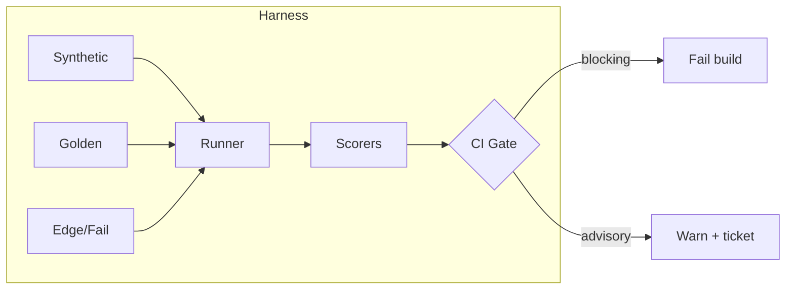

### IX.3 Workflow Harness Catalog (Product-Agnostic)

Projects **shall** map each customer-facing AI workflow to at least one named harness. The following catalog is normative as a **pattern**; domains adapt names.

| Harness type | Proves | Typical scorers |
|--------------|--------|-----------------|
| Document / profile harness | Extraction, normalization, schema | Schema validity, field F1, PII redaction |
| Matching / ranking harness | Relevance ordering | nDCG, precision@k, pairwise preference |
| Dialogue / interview harness | Turn quality, policy | Rubric, toxicity, grounding |
| Generation harness | Letters, summaries, plans | Rubric + hallucination rate |
| Graph harness | Traversal correctness | Path accuracy, constraint satisfaction |
| RAG harness | Retrieve → generate | Recall@k, citation precision, faithfulness |
| Tool harness | Tool selection & args | Tool accuracy, retry success, timeout handling |
| Prompt harness | Prompt version deltas | Scorecard vs frozen set |
| Evaluation harness | Meta: judges/scorers | Judge agreement, calibration |
| Agent / loop harness | Multi-step loops | Success rate, stop reason distribution, cost |

**Example (CareerPilot):** Resume, Job Matching, Interview, Cover Letter, Graph, RAG, Tool, Prompt, and Evaluation harnesses instantiate this catalog for career-domain workflows—without making those domains MES requirements for other products.

### IX.4 Data Layers Inside a Harness

| Layer | Shall | Should | Must not |
|-------|-------|--------|----------|
| Synthetic | Cover schema + rare enums | Mirror production cardinality | Invent impossible legal facts as “truth” |
| Real (de-id) | Consent/license documented | Refresh on schedule | Commit raw PII to git |
| Golden | Immutable under change control | Span risk tiers | Silently edit expected outputs |
| Edge | Include null/empty/hostile | Multilingual if product supports | Depend on live network unless marked integration |
| Failure | Inject faults via stubs | Chaos flags in CI nightly | Leave fault injection on in prod |

### IX.5 Harness Runner Contract

Runners **shall**:

1. Load fixtures by version pin  
2. Execute workflow through the same code path as production (no “eval-only forks” without ADR)  
3. Capture Part VIII telemetry fields  
4. Score with versioned scorers  
5. Emit machine-readable report (`junit` + JSON summary)  
6. Exit non-zero on blocking gate failure  

Runners **should** support: parallel shards, deterministic seeds, record/replay of tool I/O, cost dry-run mode.

### IX.6 CI Integration Requirements

Aligned with [`Governance/MOM.md`](../Governance/MOM.md) quality gates and [`Engineering/DEVOPS.md`](../Engineering/DEVOPS.md):

| Event | Harness policy |
|-------|----------------|
| PR to default branch | Unit + golden smoke (blocking) |
| Merge / main | Full golden set for touched capabilities (blocking) |
| Nightly | Full suite + failure injection + cost/latency (blocking or sev-ticket) |
| Pre-release | Frozen benchmark pack (Part X) (blocking) |
| Post-deploy | Canary continuous eval (Part XI) (blocking rollback triggers) |

CI **shall** publish: pass rate, mean quality score, hallucination rate, p95 latency, mean USD/case, flaky test list.

Flakes **must** be quarantined with owner + expiry; silent ignore is non-conformant.

### IX.7 Failure Injection Matrix (Minimum)

| Fault | Expected behavior |
|-------|-------------------|
| Model 5xx / timeout | Retry with backoff → graceful degrade |
| Tool circuit open | Fallback or safe refusal |
| Empty retrieval | Refuse or ask clarifying question—no fabricated cites |
| Invalid JSON from model | Repair once → fail closed |
| Authz deny on tool | No privilege escalation; log + refuse |
| Budget exceeded | Stop loop; return partial safe result |

### IX.8 Harness Ownership

| Role | Responsibility |
|------|----------------|
| Capability owner | Harness correctness & thresholds |
| Platform / AI eng | Runner, scorers, CI templates |
| Security | Adversarial & PII cases |
| QA / Eval | Golden curation & flake triage |

### IX.9 Conformance Checklist

- [ ] Every AI workflow mapped to a named harness  
- [ ] Synthetic, real (de-id), golden, edge, failure, regression present  
- [ ] Cost + latency benchmarks defined  
- [ ] CI blocking gates configured for PR/main/release  
- [ ] Reports machine-readable; flakes owned  
- [ ] Same code path as production (or ADR)  

---

## Part X — Golden Evaluation Sets

**Canonical owner:** Architecture (`Architecture/ARCHITECTURE.md` Part X)  
**Related procedures:** [`AI/GOLDEN_DATASETS.md`](../AI/GOLDEN_DATASETS.md) · [`AI/EVALS.md`](../AI/EVALS.md) · [`AI/HARNESS_ENGINEERING.md`](../AI/HARNESS_ENGINEERING.md)  
**Normative status:** Mandatory for each production AI capability.  
**Canonical depth:** [`AI/GOLDEN_DATASETS.md`](../AI/GOLDEN_DATASETS.md) · [`AI/EVALS.md`](../AI/EVALS.md)

### X.1 Purpose

Golden evaluation sets are **frozen, versioned corpora** used to compare systems fairly across prompts, models, retrieval stacks, and releases. They are the yardstick; production traffic is the weather.

### X.2 N=100 Sizing Guidance Pattern

MES does not mandate a single global N. Projects **shall** use the **N≈100 pattern** as the default starting size **per capability slice**, then scale by risk:

| Slice risk | Minimum golden N (guidance) | Notes |
|------------|----------------------------|-------|
| Low | 30–50 | Still must cover edges |
| Medium | **~100** | Default company pattern |
| High | 200–500 | Stratified + adversarial |
| Safety-critical | 500+ with red team pack | Dual review of labels |

**Stratification rule:** Of any ~100-set, projects **should** allocate approximately:

| Bucket | Share | Intent |
|--------|-------|--------|
| Head / common | 40% | Typical happy path |
| Torso | 25% | Secondary personas/locales |
| Tail / rare | 15% | Long-tail schemas |
| Adversarial / abuse | 10% | Injection, jailbreaks, policy |
| Regression museum | 10% | Historical production bugs |

N may be smaller for narrow tools if an ADR proves statistical sufficiency and risk acceptance; N **must not** be “a handful of demos.”

### X.3 Category Patterns (Illustrative Domains)

Golden categories **shall** match product entities. The following are **patterns**, not MES product requirements:

| Category pattern | What goldens assert |
|------------------|---------------------|
| Profile / resume-like documents | Parse fidelity, redaction, skill extraction |
| Opportunity / job-description-like docs | Requirement extraction, seniority, constraints |
| Q&A / interview-like turns | Answer quality, fairness, no prohibited coaching claims |
| Outreach / cover-letter-like generation | Grounding to source docs, tone, factuality |
| Code repository snapshots | Summarization, skill inference, license respect |
| Portfolio / artifact bundles | Multimodal or multi-file coherence |
| Market / salary-like datasets | Numeric grounding, citation, no fabricated figures |
| Retrieval corpora | Chunking, recall, citation integrity |
| Graph fixtures | Edge types, path queries |
| Tool transcripts | Argument validity |

**Example (CareerPilot):** resumes, job descriptions, interview questions, cover letters, GitHub repositories, portfolios, and salary datasets appear as golden categories for that product only.

### X.4 Record Schema (Minimum)

Each golden item **shall** include:

| Field | Requirement |
|-------|-------------|
| `id` | Stable opaque id |
| `version` | Dataset semver |
| `split` | `core` / `holdout` / `canary` |
| `input` | Fixture reference |
| `expected` | Labels, spans, ranked ids, or rubric targets |
| `tags` | Domain, language, risk, persona |
| `pii_class` | none / synthetic / deid / restricted |
| `license` | Provenance |
| `created_by` / `reviewed_by` | Accountability |
| `notes` | Non-normative |

Holdout **shall** not be used for prompt fiddling; it is for promotion decisions.

### X.5 Change Control

Golden sets are controlled artifacts:

1. Propose change via PR + rationale  
2. Dual review for High/Critical risk labels  
3. Bump dataset semver (`MAJOR` = incompatible label ontology; `MINOR` = add cases; `PATCH` = fix corrupt fixture)  
4. Re-baseline model/prompt scorecards  
5. Update release notes  

Silent edits to expected outputs to “make CI green” are **forbidden**.

### X.6 Frozen Benchmarks for Model Upgrades

Before promoting a new model, router policy, embedding model, or major prompt:

| Step | Requirement |
|------|-------------|
| Pin | Run against **frozen** golden pack version `X.Y.Z` |
| Compare | Delta vs current production baseline |
| Gates | Meet or exceed blocking metrics (Part XI) |
| Cost | Report token/USD delta |
| ADR | Record accept/reject for regressions |

“Looks better on three examples” is non-conformant evidence.

### X.7 Versioning & Storage

| Concern | Shall |
|---------|-------|
| Git | Metadata + small synthetics; LFS or object store for large blobs |
| Immutability | Published packs are content-addressed or tag-immutable |
| Access | Restricted packs behind IAM; no public accidental publish |
| Reproducibility | Lockfile listing pack version + scorer versions |

### X.8 PII Handling

| Rule | Normative |
|------|-----------|
| Prefer synthetic | **Should** |
| Real data | De-identify; document method; legal basis |
| Secrets / credentials | **Must** strip |
| Training reuse | Golden eval data **must not** silently enter training corpora |
| Access logs | Who accessed restricted packs |
| Retention | Align with [`Templates/PRIVACY_DATA_GOVERNANCE_TEMPLATE.md`](../Templates/PRIVACY_DATA_GOVERNANCE_TEMPLATE.md) and project privacy doc |

### X.9 Conformance Checklist

- [ ] Each AI capability has a versioned golden set  
- [ ] Sizing follows N≈100 pattern or ADR’d exception  
- [ ] Stratification includes adversarial + regression museum  
- [ ] Change control + dual review for high risk  
- [ ] Frozen pack used for model upgrades  
- [ ] PII/license/provenance documented  
- [ ] Holdout protected from prompt overfitting  

---

## Part XI — Continuous Evaluation

**Canonical owner:** Architecture (`Architecture/ARCHITECTURE.md` Part XI)  
**Related procedures:** [`AI/EVALS.md`](../AI/EVALS.md) · [`Engineering/OBSERVABILITY.md`](../Engineering/OBSERVABILITY.md) · [`Engineering/RELEASE_PROCESS.md`](../Engineering/RELEASE_PROCESS.md)  
**Normative status:** Mandatory for every deployment of AI-enabled systems.  
**Canonical depth:** [`AI/EVALS.md`](../AI/EVALS.md) · [`Engineering/OBSERVABILITY.md`](../Engineering/OBSERVABILITY.md)

### XI.1 Purpose

Continuous Evaluation (CE) ensures quality does not rot after ship. Pre-merge goldens are necessary; production CE is sufficient only when dashboards, alerts, and gates are enforced.

### XI.2 Mandatory Evaluation Dimensions

Every deployment **shall** evaluate (measure and report) at least:

| Dimension | Definition | Typical signals |
|-----------|------------|-----------------|
| **Accuracy** | Correctness vs labels/oracles | Task F1, exact match, ranking metrics |
| **Grounding** | Claims supported by retrieved/tool evidence | Faithfulness, entailment, citation coverage |
| **Hallucination** | Unsupported or contradicted claims | Hallucination rate, critical halluc rate |
| **Citation Quality** | Citations resolve, relevant, sufficient | Precision/recall of cites, dead links |
| **Latency** | End-to-end and stage timings | p50/p95/p99 |
| **Cost** | USD per request / per successful outcome | Provider + infra |
| **Token Usage** | Input/output/cached tokens | Per route, per tenant class |
| **Business KPI** | Product outcome metrics | Conversion, task success, retention proxy |
| **Human Satisfaction** | Explicit or sampled human judgment | Thumbs, CSAT, review queues |

Additional dimensions **should** include: tool success rate, retrieval recall, toxicity/policy, loop iteration count, escalation rate.

### XI.3 Evaluation Cadence

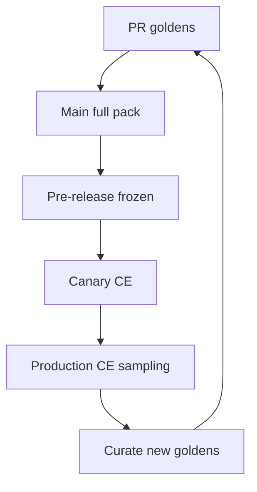

| Cadence | Scope |
|---------|-------|
| Per request (async) | Cheap heuristics: schema, cite resolve, toxicity classifiers |
| Continuous sample | 1–100% by risk; stratified |
| Hourly / daily rollups | Dashboards + burn alerts |
| Weekly | Human review calibration |
| Release | Full frozen pack + holdout |

### XI.4 Dashboards (Minimum Panels)

Projects **shall** expose:

1. Quality composite vs baseline  
2. Hallucination rate (overall + critical)  
3. Grounding / citation panels  
4. Latency SLO burn  
5. Cost per successful task  
6. Token trends by model route  
7. Business KPI overlay  
8. Human satisfaction / review queue depth  
9. Gate status (blocking vs advisory)  
10. Top failing golden tags / prod clusters  

Dashboards **must** support drill-down to `loop_id` / trace id without exposing raw PII to unauthorized roles.

### XI.5 Alert Thresholds (Pattern)

Thresholds are product-set; MES requires they exist and bind to actions:

| Signal | Example pattern | Action class |
|--------|-----------------|--------------|
| Critical hallucination rate | > 0.5% for 15m | **Blocking** page + consider canary halt |
| Grounding score | < baseline − 5 pts | **Blocking** for High risk |
| p95 latency | > SLO 2× for 30m | Advisory → Blocking if sustained |
| Cost / request | > budget 1.5× | Advisory + auto-throttle **should** |
| Eval pass rate (golden shadow) | < 95% | **Blocking** promote |
| Human reject rate | Spike > 2× baseline | Advisory investigate |
| Citation resolve fail | > 2% | Blocking for citation-required modes |

Exact numbers **shall** live in project `VERIFY.md` / eval config, not only in chat history.

### XI.6 Blocking vs Advisory Gates

| Gate type | Meaning | Examples |
|-----------|---------|----------|
| **Blocking** | Prevent merge, prevent release, or auto-rollback / stop canary | Golden fail, critical halluc breach, security eval fail |
| **Advisory** | Alert + ticket; deploy may proceed with owner ack | Mild cost creep, latency near SLO, judge disagreement |

M.O.M. production deployment rules apply: material risk requires human approval even if automated gates are green ([`Governance/MOM.md`](../Governance/MOM.md)).

### XI.7 Shadow, Canary, and Rollback

| Mode | Requirement |
|------|-------------|
| Shadow | New prompt/model scores on sampled traffic without user-visible change |
| Canary | Small % live; CE gates watched |
| Rollback | One-click / automated revert to last green prompt+model+retrieval pin |

Rollback **shall** be tested in drills at least quarterly for High-risk systems.

### XI.8 Human Satisfaction Loops

Human feedback **shall** be:

- Attributable to version (prompt/model/app)  
- Separated into UX vs factual errors  
- Sampled into golden candidate review (not auto-promoted)  

**Example (CareerPilot):** Recruiter or candidate thumbs-down on a match explanation feeds an advisory queue; promotion to golden requires human labeler approval.

### XI.9 Conformance Checklist

- [ ] All nine mandatory dimensions measured in prod or justified N/A  
- [ ] Dashboards + owners listed in runbook  
- [ ] Blocking vs advisory thresholds documented  
- [ ] Canary + rollback path proven  
- [ ] Feedback curation into goldens under change control  

---

## Part XII — Prompt Engineering

**Canonical owner:** Architecture (`Architecture/ARCHITECTURE.md` Part XII)  
**Related procedures:** [`AI/PROMPTS.md`](../AI/PROMPTS.md) · [`AI/EVALS.md`](../AI/EVALS.md) · [`AI/HARNESS_ENGINEERING.md`](../AI/HARNESS_ENGINEERING.md)  
**Normative status:** Mandatory for all production prompts.  
**Canonical depth:** [`AI/PROMPTS.md`](../AI/PROMPTS.md)

### XII.1 Purpose

Prompts are production code. They **shall** be versioned, reviewed, tested, benchmarked, and roll-backable—never edited silently in a vendor UI without trace.

### XII.2 Versioned Prompt Library

Every repository with AI **shall** maintain a Prompt Library (directory, package, or service) containing:

| Asset | Requirement |
|-------|-------------|
| Prompt id | Stable name (`domain.task.role`) |
| Semver | See §XII.6 |
| Template body | Checked into git |
| Variables schema | JSON Schema / typed dict |
| Output contract | Schema, cite rules, refusal behavior |
| Owner | Named human |
| Risk class | R0–R4 ([`GLOSSARY.md` — Risk Class](../GLOSSARY.md#risk-class)) |
| Linked evals | Golden pack + harness ids |
| Changelog | Why each version changed |

Runtime **shall** load prompts by pin (`prompt_id@version`), not “latest” in production without explicit progressive delivery.

### XII.3 Prompt Reviews

Prompt changes **shall** follow code review norms ([`Governance/CONTRIBUTING.md`](../Governance/CONTRIBUTING.md)):

| Check | Reviewer verifies |
|-------|-------------------|
| Intent | Matches PRD / capability |
| Safety | Injection resistance, secrets, PII instructions |
| Grounding | Retrieval-before-generation instructions when needed |
| Contracts | Output schema & tool policy |
| Eval plan | Which goldens must pass |
| Cost | Likely token impact |

High/Critical prompts **require** dual review (eng + domain or safety).

### XII.4 Prompt Testing

Each prompt version **shall** have automated tests:

- Template renders with required variables  
- Snapshot / structural tests for system sections  
- Harness run on smoke golden subset  
- Adversarial prompt-injection cases  
- Refusal tests for disallowed asks  

### XII.5 Prompt Regression & Benchmarking

| Activity | Requirement |
|----------|-------------|
| Regression | Full linked golden pack on MAJOR/MINOR; smoke on PATCH |
| Benchmarking | Scorecard vs prior version and vs frozen model baseline |
| Cross-model | When router may switch models, benchmark each allowed model |

Regressions on blocking metrics **must** fail CI unless explicit waiver ADR with expiry.

### XII.6 Semantic Versioning for Prompts

| Bump | When |
|------|------|
| **MAJOR** | Behavior/contract change; output schema break; safety posture change |
| **MINOR** | New optional section, improved instructions, additive variables |
| **PATCH** | Typos, clarification without behavior intent change |

Migrating callers to a new MAJOR **shall** use explicit rollout (shadow → canary → full).

### XII.7 Prompt Scorecards

Scorecards **shall** record per version:

| Column | Content |
|--------|---------|
| Quality composite | Vs golden |
| Hallucination rate | |
| Grounding / cites | |
| Latency / tokens / USD | |
| Human pref (if collected) | Pairwise or Likert |
| Decision | Promote / hold / rollback |

Scorecards are evidence for release reviews (M.O.M.).

### XII.8 Ownership & Rollback

| Control | Requirement |
|---------|-------------|
| Owner | Every prompt has a human owner on-call path |
| Rollback | Prior version remains deployable ≤ N versions (min 3) |
| Kill switch | Feature flag to force safe prompt or disable feature |
| Drift ban | No production edits outside library pipeline |

### XII.9 Conformance Checklist

- [ ] Prompt Library in repo with semver pins  
- [ ] Reviews + dual control for High/Critical  
- [ ] Tests + regression harness linked  
- [ ] Scorecards stored with releases  
- [ ] Rollback / kill switch verified  

---

## Part XIII — Tool Engineering

**Canonical owner:** Architecture (`Architecture/ARCHITECTURE.md` Part XIII)  
**Related procedures:** [`AI/TOOLS.md`](../AI/TOOLS.md) · [`Governance/MILE.md`](../Governance/MILE.md) · [`AI/AGENTS.md`](../AI/AGENTS.md)  
**Normative status:** Mandatory for every agent/tool interface.  
**Canonical depth:** [`AI/TOOLS.md`](../AI/TOOLS.md) · [`Governance/MILE.md`](../Governance/MILE.md) Tool Engineering section

### XIII.1 Purpose

Tools are how probabilistic planners touch deterministic systems. Unvalidated tools turn agents into incident generators. Every tool **shall** be engineered as a miniature product.

### XIII.2 Mandatory Tool Properties

Every tool **shall** define and implement:

| Property | Requirement |
|----------|-------------|
| **Schema** | Strict input/output JSON Schema (or equivalent); no free-form “any” |
| **Validation** | Server-side validation before side effects |
| **Retries** | Idempotent retry policy; bounded attempts |
| **Timeouts** | Explicit deadlines; no infinite hangs |
| **Circuit Breakers** | Open on error budget burn; fail closed or safe fallback |
| **Observability** | Traces, metrics, structured logs with tool name + version |
| **Metrics** | Success rate, latency, error class, cost if paid API |
| **Tests** | Unit + contract + failure injection |
| **Documentation** | Purpose, authz, side effects, examples |
| **Examples** | Positive + negative invocation examples for agents and humans |
| **Security** | Authn/authz, least privilege, argument injection defense |
| **Version** | Semver; registry pin |

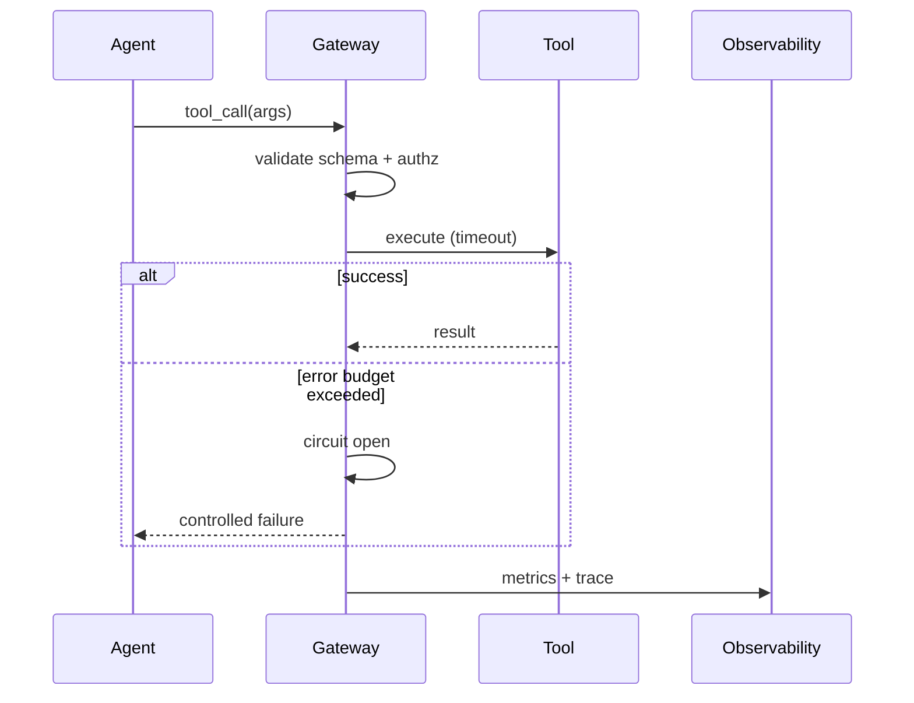

### XIII.3 Tool Registry Requirements

Organizations **shall** maintain a Tool Registry (per product or platform) listing:

| Field | Required |
|-------|----------|
| `tool_id` / version | Yes |
| Owner | Yes |
| Side-effect class | `read` \| `draft` \| `write` \| `irreversible` (canonical: [`../AI/TOOLS.md`](../AI/TOOLS.md) / [`../GLOSSARY.md`](../GLOSSARY.md)) |
| Authz model | Yes |
| Rate limits | Yes |
| PII / data classes touched | Yes |
| Eval / harness link | Yes |
| Deprecation date | When applicable |
| Allowlist for agents | Yes |

Agents **must** only call registry-allowlisted tools. Dynamic “install arbitrary tool from string” in production is non-conformant without extreme controls + ADR.

### XIII.4 Reliability Patterns

| Pattern | Shall |
|---------|-------|
| Idempotency keys | For write tools |
| Partial failure | Explicit error codes; no ambiguous 200 |
| Bulkheads | Isolate flaky dependencies |
| Backpressure | Queue or reject when saturated |
| Human escalation | For irreversible tools above threshold |

**Example (CareerPilot):** A “submit application” tool is irreversible-class: schema-validated, user-confirm gated, circuit-broken on vendor outage, fully traced.

### XIII.5 Testing Tools

Minimum tests:

- Schema accept/reject  
- Authz deny paths  
- Timeout + retry behavior  
- Circuit open/half-open  
- Contract tests vs downstream  
- Agent arg-selection evals (tool harness)  

### XIII.6 Conformance Checklist

- [ ] All ten+ mandatory properties implemented  
- [ ] Registry entry complete; agent allowlisted  
- [ ] Side-effect class documented  
- [ ] Harness + metrics live  
- [ ] Irreversible tools have HITL / confirm  

---

## Part XIV — Engineering Standards

**Canonical owner:** Architecture (`Architecture/ARCHITECTURE.md` Part XIV)  
**Related procedures:** [`Engineering/ENGINEERING_STANDARDS.md`](../Engineering/ENGINEERING_STANDARDS.md) · [`Engineering/CODING_STANDARDS.md`](../Engineering/CODING_STANDARDS.md) · [`Governance/MOM.md`](../Governance/MOM.md) · [`Governance/CONTRIBUTING.md`](../Governance/CONTRIBUTING.md)  
**Normative status:** Company-wide minimums. Procedural depth lives under [`Engineering/*`](../Engineering/).  
**Governance:** [`Governance/MOM.md`](../Governance/MOM.md) · [`Governance/CONTRIBUTING.md`](../Governance/CONTRIBUTING.md)

### XIV.1 Purpose

This Part states **normative minimums** so Architecture readers inherit coding, API, data, docs, and release discipline without duplicating the full Engineering library. When conflict arises, `SYSTEM_CONTEXT.md` hierarchy applies; Engineering docs provide procedure.

### XIV.2 Coding Standards Overview

All languages **shall**:

- Prefer clarity over cleverness  
- Fail closed on authz and validation  
- Avoid secrets in source; use vaults + `.env.example`  
- Keep modules testable without network by default  
- Use exhaustive handling for unions/enums (TypeScript `never` default; Python `assert_never` / equivalent)  
- Place imports at module top (no inline imports unless documented circular-dependency exception)  
- Document non-obvious invariants  

Depth: [`Engineering/CODING_STANDARDS.md`](../Engineering/CODING_STANDARDS.md) · [`Engineering/ENGINEERING_STANDARDS.md`](../Engineering/ENGINEERING_STANDARDS.md)

### XIV.3 Python Minimums

| Topic | Shall |
|-------|-------|
| Style | Formatter + linter in CI (e.g., ruff/black equivalent) |
| Types | Type hints on public APIs; CI typecheck for packages |
| Packaging | Lockfiles; pinned deps for apps |
| Testing | pytest; no network in unit tests |
| Async | Explicit timeout boundaries |
| Security | Bandit/pip-audit or equivalent in CI |

### XIV.4 TypeScript Minimums

| Topic | Shall |
|-------|-------|
| `strict` | Enabled |
| Exhaustiveness | Discriminated unions with `never` default |
| Lint | ESLint (or org standard) in CI |
| Types | No accidental `any` on exported APIs without justification |
| Testing | Unit + component tests for UI logic |

### XIV.5 FastAPI Minimums

| Topic | Shall |
|-------|-------|
| OpenAPI | Generated and published as `API.md` companion |
| Validation | Pydantic models at boundary |
| Authn/authz | Explicit dependencies; deny by default |
| Errors | Consistent problem shape; no stack traces to clients |
| Observability | Request ids, metrics, structured logs |
| Tests | Contract tests for public routes |

### XIV.6 React Minimums

| Topic | Shall |
|-------|-------|
| Accessibility | Keyboard + semantics for interactive flows |
| Security | XSS-safe rendering; CSP-compatible patterns |
| State | Prefer simple data flow; no secret material in client bundles |
| Testing | Component tests for critical journeys |
| Design | Follow product design system; avoid one-off inaccessible widgets |

Preserve existing design systems when extending products (user frontend rules apply inside product repos).

### XIV.7 Database Minimums

| Topic | Shall |
|-------|-------|
| Migrations | Versioned, reviewable, reversible where feasible |
| Least privilege | App roles ≠ DBA roles |
| PII | Encryption/retention per privacy doc |
| Backup / restore | Documented and tested |
| Query safety | Parameterized queries only |

Depth: project `DATA_MODEL.md` + Engineering security/observability docs.

### XIV.8 API Minimums

| Topic | Shall |
|-------|-------|
| Contract-first | Breaking changes via versioning |
| Auth | Documented schemes |
| Idempotency | For unsafe retries |
| Pagination / limits | Enforced |
| Audit | Security-relevant events logged |
| Compatibility | Consumer-driven tests where multiple clients |

### XIV.9 Documentation Minimums

Per M.O.M. and Part XVIII expansion:

- Root docs exist and stay synchronized with behavior  
- ADRs for significant decisions ([`Governance/ADR_GUIDE.md`](../Governance/ADR_GUIDE.md))  
- Runbooks for on-call  
- Agent-facing `CLAUDE.md` (or equivalent) current  

Depth: [`Engineering/DOCUMENTATION_STANDARDS.md`](../Engineering/DOCUMENTATION_STANDARDS.md)

### XIV.10 Git, Branch, Release, SemVer

| Practice | Shall |
|----------|-------|
| Git | No secrets; signed commits **should** where org requires |
| Branch | Short-lived branches; protected default branch |
| Reviews | Required before merge to protected branches |
| Commits | Conventional commits preferred (`feat`, `fix`, `chore`, `docs`, `refactor`, `test`) |
| Release | Changelog + tagged semver; evidence pack for prod |
| SemVer | `MAJOR.MINOR.PATCH` for libraries and public APIs; apps may use calibrated scheme with ADR |
| Rollback | Documented; release artifacts immutable |

Depth: [`Engineering/RELEASE_PROCESS.md`](../Engineering/RELEASE_PROCESS.md) · [`Engineering/DEVOPS.md`](../Engineering/DEVOPS.md)

```mermaid
gitGraph
  commit id: "main"
  branch feature
  checkout feature
  commit id: "feat"
  checkout main
  merge feature id: "PR+gates"
  commit id: "tag vX.Y.Z"
```

### XIV.11 Cross-Links Map (Parts VIII–XIV → Suite)

| Part | Primary satellites |
|------|--------------------|
| VIII Loop | `AI/LOOP_ENGINEERING.md`, `Governance/MILE.md` |
| IX Harness | `AI/HARNESS_ENGINEERING.md`, `Engineering/TESTING.md` |
| X Golden | `AI/GOLDEN_DATASETS.md`, `AI/EVALS.md` |
| XI CE | `AI/EVALS.md`, `Engineering/OBSERVABILITY.md`, `Governance/MOM.md` |
| XII Prompt | `AI/PROMPTS.md` |
| XIII Tool | `AI/TOOLS.md`, `Governance/MILE.md` |
| XIV Eng | `Engineering/*`, `Governance/CONTRIBUTING.md` |

### XIV.12 Conformance Checklist

- [ ] Language CI (format, lint, typecheck, tests) green on default branch  
- [ ] API/data/docs minimums met for system type  
- [ ] Protected branches + review + release tags  
- [ ] Semver / changelog discipline  
- [ ] Engineering/* consulted for depth; deviations ADR’d  

---

### Parts VIII–XIV Closing Statement

Parts VIII–XIV operationalize M.I.L.E. inside the Architecture handbook: **loops measure improvement**, **harnesses cage variance**, **goldens freeze truth**, **continuous evaluation guards production**, **prompts and tools are versioned products**, and **engineering standards keep deterministic systems worthy of governing intelligence**. CareerPilot examples illustrate patterns only; every MoniGarr product **shall** instantiate these controls to its own domain under [`Governance/MOM.md`](../Governance/MOM.md) and [`Governance/MILE.md`](../Governance/MILE.md).

---

## Part XV — Testing

**Canonical owner (portfolio ambition):** Architecture Part XV  
**Operational floors (project procedure):** [`Engineering/TESTING.md`](../Engineering/TESTING.md)  
**Related procedures:** [`AI/EVALS.md`](../AI/EVALS.md) · [`AI/GOLDEN_DATASETS.md`](../AI/GOLDEN_DATASETS.md) · [`AI/HARNESS_ENGINEERING.md`](../AI/HARNESS_ENGINEERING.md) · [`Governance/MOM.md`](../Governance/MOM.md) · [`Governance/MILE.md`](../Governance/MILE.md)

**Hierarchy rule:** This Part states **portfolio ambition** for coverage domains. [`Engineering/TESTING.md`](../Engineering/TESTING.md) defines **project operational floors** (critical-path deterministic targets, dual coverage model, CI gates). When ambition and floors appear to conflict, Engineering/TESTING.md wins for project conformance; Architecture Part XV wins for roadmap and handbook intent. Projects **shall** document gaps between floor and ambition in `VERIFY.md` or an ADR.

**Normative companion:** [`Engineering/TESTING.md`](../Engineering/TESTING.md) · [`AI/EVALS.md`](../AI/EVALS.md) · [`AI/GOLDEN_DATASETS.md`](../AI/GOLDEN_DATASETS.md) · [`AI/HARNESS_ENGINEERING.md`](../AI/HARNESS_ENGINEERING.md) · [`Governance/MOM.md`](../Governance/MOM.md) · [`Governance/MILE.md`](../Governance/MILE.md)

### XV.1 Purpose and Scope

Testing is the primary deterministic proof that MoniGarr systems behave as designed. Evaluation is the primary measurable proof that probabilistic (AI) subsystems behave within declared bounds. MES requires both. A system that ships features without tests is non-conformant. A system that ships AI capabilities without evaluations is non-conformant.

This part applies to every MoniGarr repository that contains executable software, infrastructure-as-code, agents, prompts, retrieval pipelines, APIs, or user-facing interfaces. Libraries, services, CLIs, mobile clients, and internal tools shall meet the same bar scaled to risk class.

**Factory maxim (applied to testing):** AI accelerates test authoring. Deterministic systems prove correctness. Humans remain accountable for coverage decisions and release gates. Systems remain governable through evidence that survives handoff.

### XV.2 What “100% Coverage Target” Means Practically

MES declares a **100% coverage target** for the following domains:

| Domain | Coverage class | Practical meaning of “100%” |
|--------|----------------|-----------------------------|
| Business Logic | Deterministic | Line **and** branch coverage of all domain/business decision paths |
| API | Deterministic + Contract | Every public endpoint, method, status class, and error contract exercised |
| Domain | Deterministic | Every aggregate/entity invariant and domain rule tested |
| Services | Deterministic | Every service method with observable side effects tested (unit + integration as appropriate) |
| Graph | Deterministic + Eval | Every schema edge type, query template, and traversal policy covered by tests; semantic graph answers covered by golden evals |
| RAG | Eval-first | Every retrieval strategy, filter, reranker path, and citation rule covered by golden retrieval/generation evals |
| Prompts | Eval-first | Every production prompt version has golden cases, regression suite, and threshold |
| Agents | Eval + Integration | Every agent purpose, tool path, escalation, and failure mode covered by harness + golden scenarios |
| Evaluations | Meta-coverage | Eval suites themselves versioned, regression-tested for score stability, and owned |
| Regression | Continuous | Prior defects and prior golden failures remain permanently guarded |
| Integration | Deterministic | Critical cross-boundary flows covered end-to-end |
| Contract | Deterministic | Provider/consumer contracts locked and CI-enforced |
| Performance | SLO-bound | Declared latency/throughput budgets measured under representative load |
| Load | Capacity | Sustained load at expected peak with resource/error budgets |
| Stress | Resilience | Beyond-peak and failure-injection behavior characterized |
| Security | Risk-bound | Security test matrix mapped to threat model; critical paths 100% of planned cases |
| Accessibility | WCAG-bound | Declared accessibility criteria covered by automated + sample manual checks |
| Snapshot | Deterministic | UI/API/schema snapshots for stable surfaces under change control |
| Golden Sets | Eval corpus | 100% of production AI capability surfaces mapped to at least one golden set |

#### XV.2.1 Deterministic coverage (line / branch)

For deterministic code (business logic, domain, services, API handlers, validators, transformers, graph schema migrations, tool adapters):

1. Repositories **shall** measure **line coverage** and **branch coverage** (or equivalent decision coverage) with a CI-reported tool.
2. The **target** for Business Logic, Domain, and core Services is **100% line and 100% branch** on owned production code paths.
3. Generated code, vendored third-party code, and pure glue that is integration-tested may be excluded only via an explicit allowlist in `TESTING.md` with rationale.
4. “Coverage” without assertions is non-conformant. Covered lines **must** execute meaningful checks (assertions, property checks, contract validators).
5. Unreachable defensive `default` / `never` exhaustive branches **should** still be tested via forced invalid inputs or type-erasure harnesses where language tooling permits.

**Interpretation rule:** 100% is a **target and gate ambition**, not a vanity percentage. Temporary gaps **must** be tracked as defects or ADRs with owners and expiry. Shipping below target without ADR is non-conformant for production.

**Operational floor:** For day-to-day project gates, apply [`Engineering/TESTING.md`](../Engineering/TESTING.md) Dual Coverage Model (critical-path deterministic target + eval coverage). See Part XV hierarchy rule above.

#### XV.2.2 Probabilistic coverage (evaluation coverage)

For probabilistic components (prompts, agents, RAG answers, ranking, summarization, extraction, free-form generation):

1. Line/branch coverage of the orchestrator wrapper is **necessary but not sufficient**.
2. **Evaluation coverage** is the normative measure: every production capability surface **shall** map to golden cases that exercise representative success, failure, edge, adversarial, and empty-retrieval scenarios.
3. Evaluation coverage is complete when:
   - each capability has a named golden set;
   - each golden set has a pass threshold;
   - CI or pre-release gates enforce the threshold;
   - production monitoring continues the same metric family.
4. Sampling is allowed inside a golden set only when the sampling method, seed policy, and confidence rationale are documented in `TESTING.md` / `evals/README.md`.

#### XV.2.3 Coverage report requirements

Every repository **shall** publish (in CI artifacts or `VERIFY.md` evidence links):

| Artifact | Required |
|----------|----------|
| Unit/integration coverage report (line + branch) | Yes for deterministic code |
| Mutation score report (where applicable) | Yes for Business Logic / Domain cores |
| Contract test results | Yes for published APIs |
| Eval suite results + thresholds | Yes for AI capabilities |
| Performance/load summary for gated releases | Yes for user-facing services |
| Security + a11y summaries for gated releases | Yes when applicable |

### XV.3 Testing Pyramid and Layering

```mermaid
flowchart TB
  subgraph pyramid [MES Test Pyramid]
    E2E[E2E / Journey / Agent scenarios<br/>few, high value]
    INT[Integration / Contract / Graph / RAG harness<br/>moderate]
    UNIT[Unit / Domain / Pure logic / Prompt unit fixtures<br/>many, fast]
  end
  EVAL[Continuous Evaluations<br/>golden sets + thresholds]
  PERF[Performance / Load / Stress]
  SEC[Security / A11y / Chaos]
  UNIT --> INT --> E2E
  EVAL -.-> INT
  EVAL -.-> E2E
  PERF -.-> E2E
  SEC -.-> INT
```

| Layer | Shall contain | Should avoid |
|-------|---------------|--------------|
| Unit | Pure domain rules, parsers, validators, scoring functions, prompt template rendering | Live network, live DB, live LLM |
| Integration | DB, queues, search indexes, graph stores, tool adapters with test doubles or ephemeral infra | Full multi-tenant production clones by default |
| Contract | OpenAPI/AsyncAPI/GraphQL/Protobuf consumer-provider checks | Informal “curl examples only” |
| Eval | Golden datasets, judges, rubric scores, retrieval metrics | One-off manual chat screenshots as sole proof |
| E2E | Critical user journeys and agent success paths | Exhaustive combinatorial UI walks |
| Non-functional | Perf, load, stress, security, a11y | Treating them as optional forever |

**Example (CareerPilot):** unit tests prove resume skill extraction invariants; integration tests prove job-index retrieval + graph edge writes; evals prove cover-letter grounding and citation quality; E2E proves “import résumé → match jobs → draft letter → human approve.”

### XV.4 Domain-Specific Testing Requirements

#### XV.4.1 Business Logic, Domain, Services

- Domain invariants **shall** be tested independently of frameworks.
- Side-effecting services **shall** be tested with fakes/stubs at unit layer and real or ephemeral dependencies at integration layer.
- Time, randomness, and clocks **shall** be injectable.
- Idempotency, retries, and compensation paths **must** be tested for services that mutate durable state.

#### XV.4.2 API

- Every public route **shall** have positive and negative tests.
- AuthZ failures, validation failures, and not-found paths **must** be covered.
- Pagination, filtering, and versioning behavior **shall** be contract-tested.
- Breaking changes **must** fail contract CI before merge.

#### XV.4.3 Graph

- Schema migrations **shall** be tested for forward apply and documented rollback.
- Typed edge creation/deletion rules **shall** be unit-tested.
- Traversal policies (depth limits, ACL filters) **shall** be integration-tested.
- Graph-backed answers **shall** have golden evals with expected entities/relations.

#### XV.4.4 RAG

- Chunking, embedding, indexing, retrieval, rerank, and citation assembly **shall** each have harness coverage.
- Empty corpus, stale corpus, conflicting sources, and poisoned/untrusted documents **must** appear in golden adversarial sets.
- Retrieval metrics (recall@k, MRR, nDCG, citation precision as applicable) **shall** be recorded per release.

Details: [`AI/RAG.md`](../AI/RAG.md).

#### XV.4.5 Prompts

- Prompts are versioned products. Each production prompt **shall** have:
  - identifier + semver or content hash;
  - golden input/output (or scored) cases;
  - regression suite;
  - owner.
- Prompt edits **must** not merge without eval delta report.

Details: [`AI/PROMPTS.md`](../AI/PROMPTS.md).

#### XV.4.6 Agents

Every agent **shall** be tested for:

| Dimension | Requirement |
|-----------|-------------|
| Purpose fitness | Golden scenarios for primary job |
| Tool selection | Correct tool chosen under fixtures |
| Tool schema validation | Invalid tool args rejected |
| Escalation | HITL triggers fire when risk rules say so |
| Stop conditions | Loops terminate; budget caps enforced |
| Failure modes | Timeouts, empty retrieval, tool errors handled |
| Non-goals | Agent refuses out-of-scope tasks |

Details: [`AI/AGENTS.md`](../AI/AGENTS.md) · [`AI/SUBAGENTS.md`](../AI/SUBAGENTS.md) · [`AI/TOOLS.md`](../AI/TOOLS.md).

#### XV.4.7 Evaluations and Golden Sets

- Golden sets **shall** be stored under version control (or content-addressed store with pinned digests).
- Labels and rubrics **shall** be reviewed by a human owner.
- Model upgrades **must** run against frozen benchmarks before promotion.
- Flaky evals **shall** be quarantined with owner and fix-by date; silent disabling is forbidden.

Details: [`AI/EVALS.md`](../AI/EVALS.md) · [`AI/GOLDEN_DATASETS.md`](../AI/GOLDEN_DATASETS.md).

#### XV.4.8 Regression

- Every production Sev-1/Sev-2 defect **shall** yield a regression test or eval case before close.
- Prior golden failures **must** remain in the suite unless explicitly retired with ADR.

#### XV.4.9 Integration and Contract

- Critical cross-service flows **shall** have integration tests in CI (local compose, ephemeral cloud, or recorded contract stubs as justified).
- Published APIs **shall** use consumer-driven or bidirectional contract tests.

#### XV.4.10 Performance, Load, Stress

| Mode | Purpose | Gate rule |
|------|---------|-----------|
| Performance | Latency/throughput vs SLO | Fail release if p95/p99 budgets breached without waiver |
| Load | Sustained expected peak | Error rate and saturation within budget |
| Stress | Beyond peak / resource starvation | Characterized degradation; no silent data corruption |

AI systems **shall** additionally track tokens/request and cost/request under load.

#### XV.4.11 Security Testing

Security tests **shall** map to `THREAT_MODEL.md` and include at minimum:

- authn/authz negative tests;
- injection suites (including prompt injection for AI surfaces);
- secrets exposure checks;
- dependency/CVE gate evidence;
- abuse-case tests for high-risk flows.

See Part XVII and [`Templates/SECURITY_REQUIREMENTS_TEMPLATE.md`](../Templates/SECURITY_REQUIREMENTS_TEMPLATE.md).

#### XV.4.12 Accessibility

User-facing surfaces **shall** define an accessibility target (default: WCAG 2.2 AA unless ADR states otherwise) and cover it with automated checks plus sampling of critical journeys.

#### XV.4.13 Snapshot and Schema Snapshots

Snapshots **may** guard stable UI/API/schema artifacts. Snapshot updates **must** be intentional, reviewed, and tied to changelog entries. Golden “looks right” without review is non-conformant.

### XV.5 Mutation Testing

Mutation testing measures whether the test suite detects deliberate faults.

1. Business Logic and Domain cores **should** run mutation testing in CI (nightly acceptable for large suites; blocking on critical packages preferred).
2. Mutation score **shall** be reported as a KPI (Part XIX).
3. Surviving mutants in security-sensitive or money/eligibility logic **must** be treated as defects.
4. Equivalent mutants **may** be exempted with documented rationale.

**Target:** mutation score ≥ team-declared threshold (default recommendation: **≥ 80%** for domain cores unless ADR justifies otherwise).

### XV.6 Test Data, Isolation, and Determinism

- Tests **shall** be hermetic: no undeclared dependency on laptop state, production data, or live paid APIs in default CI.
- Live-model tests **may** run in scheduled pipelines with budget caps; they **must not** be the only gate for AI changes.
- PII/CUI fixtures **shall** be synthetic or properly redacted; real customer data in git is forbidden.
- Seeds for sampling and embeddings tests **shall** be pinned when determinism is claimed.

### XV.7 CI Gates for Testing

```mermaid
flowchart LR
  PR[Pull Request] --> U[Unit + Lint + Type]
  U --> C[Contract + Integration]
  C --> M[Mutation optional/nightly]
  C --> E[Eval golden thresholds]
  E --> S[Security scans]
  S --> H[Human review if risk]
  H --> Merge[Merge]
```

Pull requests that change AI behavior **must** include eval evidence. Pull requests that change domain logic **must** include unit/branch evidence.

### XV.8 Repository Testing Checklist

- [ ] `TESTING.md` defines pyramid, tools, coverage targets, exclusions, and owners
- [ ] Line + branch coverage published for deterministic cores
- [ ] 100% target domains listed with current % and gap plan
- [ ] Mutation strategy declared for domain cores
- [ ] API contract tests exist for published interfaces
- [ ] Graph schema + traversal tests exist when graphs are used
- [ ] RAG/prompt/agent golden sets exist for each production capability
- [ ] Eval thresholds enforced in CI or release gate
- [ ] Regression cases for closed Sev-1/Sev-2 defects
- [ ] Perf/load/stress plan for user-facing services
- [ ] Security and a11y tests mapped to requirements
- [ ] Snapshot updates reviewed
- [ ] `VERIFY.md` links to how to run the full proof suite

### XV.9 Definition of Test-Ready

A change is test-ready to merge only when:

1. Automated tests for touched deterministic paths pass.
2. Required evals for touched probabilistic paths pass thresholds.
3. Coverage does not regress without ADR.
4. New public behavior has positive and negative tests.
5. Docs (`TESTING.md`, `CHANGELOG.md`, relevant ADRs) are updated.

---

## Part XVI — DevOps

**Canonical owner (architectural control points):** Architecture Part XVI  
**Operational procedures:** [`Engineering/DEVOPS.md`](../Engineering/DEVOPS.md)  
**Related procedures:** [`Engineering/RELEASE_PROCESS.md`](../Engineering/RELEASE_PROCESS.md) · [`Engineering/OBSERVABILITY.md`](../Engineering/OBSERVABILITY.md) · [`Governance/MOM.md`](../Governance/MOM.md)

**Hierarchy rule:** Vendor names in this Part are **reference implementations**. Normative control points and ADR escape live in [`Engineering/DEVOPS.md`](../Engineering/DEVOPS.md).

**Normative companion:** [`Engineering/DEVOPS.md`](../Engineering/DEVOPS.md) · [`Engineering/RELEASE_PROCESS.md`](../Engineering/RELEASE_PROCESS.md) · [`Engineering/OBSERVABILITY.md`](../Engineering/OBSERVABILITY.md) · [`Governance/MOM.md`](../Governance/MOM.md)

### XVI.1 Purpose and Scope

DevOps in MES is the disciplined path from committed intent to operated reality. It covers continuous integration, continuous delivery, environments, infrastructure as code, secrets, backups, monitoring, observability, tracing, promotion gates, and supply-chain artifacts (including SBOM).

**Illustrative MoniGarr defaults (2026)** — toolchain brands are **reference implementations**, not mandatory vendors. Teams **shall** implement the normative control points in [`Engineering/DEVOPS.md`](../Engineering/DEVOPS.md). Substitute via ADR with equivalent controls, evidence, and runbooks:

| Concern | Illustrative default (replaceable) |
|---------|--------------------------------------|
| CI/CD | GitHub Actions (or GitLab CI / Azure DevOps / Jenkins with equivalent gates) |
| Containers | Docker (or OCI-compatible equivalent) |
| App hosting (common SaaS path) | Render (or equivalent PaaS / cloud runtime) |
| Infrastructure as code | Terraform (or equivalent declarative IaC) |
| Telemetry | OpenTelemetry (vendor-neutral default) |
| Secrets | Platform secret stores (never git) |

Teams **may** use alternate platforms if and only if equivalent controls, evidence, and runbooks exist and deviations are ADRed. Skimmers **shall not** treat brand names in section titles (e.g., “GitHub Actions Standards”) as mandatory — they document control expectations for the common MoniGarr path.

### XVI.2 Environments and Promotion Model

```mermaid
flowchart LR
  DEV[dev] --> STG[staging]
  STG --> PROD[production]
  PR[preview / ephemeral] -.-> STG
```

| Environment | Purpose | Data rules | Deploy authority |
|-------------|---------|------------|------------------|
| `dev` | Engineer/agent experimentation | Synthetic / scrubbed | Automated from main or feature policies |
| `staging` | Release candidate validation | Production-like synthetic or carefully scrubbed | Automated after CI green + gates |
| `production` | Customer traffic | Real data under controls | Human approval for R3+ (R4 dual-control) |
| Preview/ephemeral | PR validation | Synthetic only | Automated, time-bounded |

Rules:

1. Production credentials **shall not** be available to local developer default profiles.
2. Promotion **shall** be forward-only through declared environments unless emergency rollback procedures apply.
3. Infrastructure drift **shall** be detected; manual hotspot console changes **must** be reconciled into Terraform (or equivalent) within a defined SLA.

### XVI.3 GitHub Actions Standards

Every application repository **shall** implement CI workflows that at minimum:

- install dependencies with locked versions;
- run lint/typecheck/unit tests;
- run contract/integration tests as applicable;
- run security scans (SAST/SCA/secrets) as applicable;
- run eval gates for AI changes;
- upload coverage and SBOM artifacts;
- block merge on required checks.

CD workflows **shall**:

- build immutable artifacts (container digest or versioned package);
- sign or attest artifacts when platform supports it;
- deploy only from trusted branches/tags;
- record release metadata (git SHA, SBOM URI, approver).

Workflow files **must** pin actions by commit SHA or verified immutable reference. `pull_request_target` with untrusted checkout **shall** be avoided unless explicitly hardened.

### XVI.4 Docker Standards

- Dockerfiles **shall** be multi-stage when build tools are not needed at runtime.
- Base images **shall** be pinned by digest for production builds (or equivalently locked).
- Containers **shall** run as non-root when the runtime permits.
- Healthcheck endpoints **shall** exist for services.
- Secrets **must not** be baked into images; use runtime injection.
- Image builds **shall** produce SBOM and vulnerability scan evidence before promotion.

### XVI.5 Render (and equivalent PaaS) Standards

When Render (or similar PaaS) is used:

- Services, cron jobs, and env groups **shall** be documented in `SYSTEM_PROFILE.md` and `docs/DEPLOYMENT.md`.
- Production and staging **shall** be separate services/projects.
- Autodeploy from `main` to production **may** be used only with strong CI gates and rapid rollback; human approval **should** remain for high-risk systems.
- Disk, region, plan, and scaling assumptions **shall** be recorded.

**Example (CareerPilot):** staging web + worker + Redis on Render validate RAG index rebuild jobs before production worker promotion.

### XVI.6 Terraform Standards

- All durable cloud resources **should** be managed as code.
- State **shall** be remote, locked, and access-controlled.
- Modules **shall** encode tagging, encryption, and logging defaults.
- `terraform plan` evidence **shall** be reviewed for production applies.
- Destroy workflows **must** be protected (manual approval).

### XVI.7 Secrets Management

| Rule | Normative language |
|------|--------------------|
| No secrets in git | **Shall not** commit tokens, keys, private certs, or `.env` with secrets |
| `.env.example` | **Shall** list required keys without values |
| Rotation | **Shall** define rotation owners and intervals |
| Least privilege | Tokens **must** be scoped to environment and service |
| Break-glass | Emergency access **shall** be logged and time-bounded |
| AI agents | Coding agents **shall not** be given production secret write access by default |

Secret scanning **shall** run in CI. Leaked secret response **must** include revoke/rotate + incident note.

### XVI.8 Backups and Recovery

Every stateful system **shall** declare:

- backup frequency;
- retention;
- encryption;
- restore test cadence;
- RPO/RTO targets;
- owner.

Restore drills **should** run at least quarterly for production data stores. Untested backups are assumed unreliable.

### XVI.9 Monitoring, Observability, and Tracing

Observability is mandatory production infrastructure, not a polish phase.

#### XVI.9.1 Signals

| Signal | Requirement |
|--------|-------------|
| Metrics | RED/USE or equivalent; SLIs for user journeys |
| Logs | Structured, correlatable, retention declared |
| Traces | Distributed traces via OpenTelemetry for request paths |
| Alerts | Actionable pages/tickets with runbook links |
| AI signals | Latency, tokens, cost, eval score, hallucination proxies, tool error rate |

Details: [`Engineering/OBSERVABILITY.md`](../Engineering/OBSERVABILITY.md).

#### XVI.9.2 OpenTelemetry

Services **shall** emit OpenTelemetry traces for inbound requests, outbound calls, DB/search/graph operations, and AI/tool spans with attributes that enable cost and quality debugging (without logging raw secrets or unnecessary PII).

Trace context **must** propagate across async workers where technically feasible.

```mermaid
sequenceDiagram
  participant U as User/API
  participant S as Service
  participant A as Agent/Orchestrator
  participant T as Tool/RAG
  participant O as OTel Backend
  U->>S: request
  S->>O: span service
  S->>A: invoke
  A->>O: span agent
  A->>T: retrieve/tool
  T->>O: span tool/rag
  T-->>A: result
  A-->>S: response
  S-->>U: response
```

### XVI.10 Promotion Gates

A release **shall not** promote to production unless the following gates pass (or risk-accepted via signed waiver with expiry):

1. CI green (tests, lint/types as applicable)
2. Security scans within policy (no unresolved criticals)
3. SBOM generated and retained
4. Eval thresholds met for AI-impacting changes
5. Migration plan + rollback plan documented
6. Observability dashboards/alerts verified
7. Human approval recorded for material risk classes
8. `CHANGELOG.md` updated

### XVI.11 SBOM and Supply Chain Artifacts

Every production build **shall** produce a Software Bill of Materials (SBOM) for application dependencies and container contents as applicable. SBOMs **shall** be retained with the release record.

Provenance attestations **should** be generated when the platform supports SLSA-aligned tooling.

### XVI.12 DevOps Checklist

- [ ] Environments named and documented (`SYSTEM_PROFILE.md`)
- [ ] GitHub Actions pinned and required checks enforced
- [ ] Docker images pinned/scanned; non-root where possible
- [ ] Terraform (or equivalent) covers durable infra
- [ ] Secrets only in secret stores; scanning on
- [ ] Backups + restore drill schedule
- [ ] Metrics, logs, traces (OTel) live in staging and production
- [ ] Alerts mapped to `RUNBOOK.md`
- [ ] Promotion gates encoded in CD
- [ ] SBOM retained per release
- [ ] Rollback tested or rehearsed

---

## Part XVII — Security

**Canonical owner:** Architecture (`Architecture/ARCHITECTURE.md` Part XVII)  
**Related procedures:** [`Engineering/SECURITY.md`](../Engineering/SECURITY.md) · [`AI/REGULATED_PROFILES.md`](../AI/REGULATED_PROFILES.md) · [`../REFERENCES.md`](../REFERENCES.md) · [`Templates/SECURITY_REQUIREMENTS_TEMPLATE.md`](../Templates/SECURITY_REQUIREMENTS_TEMPLATE.md)  
**Normative companion:** [`Engineering/SECURITY.md`](../Engineering/SECURITY.md) · [`Templates/SECURITY_REQUIREMENTS_TEMPLATE.md`](../Templates/SECURITY_REQUIREMENTS_TEMPLATE.md) · [`Templates/THREAT_MODEL_TEMPLATE.md`](../Templates/THREAT_MODEL_TEMPLATE.md) · [`Governance/MOM.md`](../Governance/MOM.md) · [`AI/AI_GUIDELINES.md`](../AI/AI_GUIDELINES.md) · [`AI/REGULATED_PROFILES.md`](../AI/REGULATED_PROFILES.md) · [`../REFERENCES.md`](../REFERENCES.md)

### XVII.1 Purpose, Posture Language, and Non-Claims

Security is an architectural property. MES requires risk-based, evidence-based, lifecycle-aware security engineering.

**SOC 2 posture language (normative wording):**

> MoniGarr engineering practices are designed to **support a SOC 2–aligned control posture** across security, availability, processing integrity, confidentiality, and privacy-relevant operations. This includes control design, evidence retention, access governance, change management, and monitoring expectations suitable for future attestation readiness.

**Hard non-claim:** MES conformance is **not** a SOC 2 certification, report, or attestation. Projects **shall not** state “SOC 2 certified” or equivalent unless an independent report covering that system/period exists. Federal and other framework references in templates are starter architecture language, not automatic compliance.

Projects instantiate requirements from [`Templates/SECURITY_REQUIREMENTS_TEMPLATE.md`](../Templates/SECURITY_REQUIREMENTS_TEMPLATE.md) into repository `SECURITY.md`.

### XVII.2 Security Principles

| Principle | Requirement |
|-----------|-------------|
| Secure by design | Threat model before exposing new trust boundaries |
| Least privilege | Default deny; scoped roles and tokens |
| Defense in depth | No single control assumed sufficient |
| Zero Trust | Never trust network location alone; authenticate and authorize continuously |
| Evidence over assertion | Controls require artifacts |
| Human accountability | AI may assist review; humans own authorization decisions |

### XVII.3 Zero Trust Expectations

Systems **shall**:

1. Authenticate callers (users, services, agents, webhooks) with appropriate assurance.
2. Authorize every sensitive action via explicit policy (RBAC/ABAC/ReBAC as designed).
3. Encrypt data in transit (TLS) and at rest for sensitive stores.
4. Segment environments and admin planes.
5. Assume breach: detect, contain, recover, learn.
6. Treat plugins, tools, and model providers as distinct trust zones.

Service-to-service calls **should** use short-lived credentials or mTLS where platform-appropriate.

### XVII.4 OWASP Alignment

Teams **shall** address applicable OWASP risks for web/API systems (OWASP Top 10) and AI/LLM applications (OWASP LLM Top 10 or successor guidance), including:

- injection (SQL/command/prompt);
- broken authn/authz;
- SSRF and unsafe tool egress;
- sensitive data exposure;
- supply-chain compromise;
- insecure output handling;
- unbounded agency / excessive permissions for agents.

Mapping of controls to OWASP categories **should** appear in `SECURITY.md` or `THREAT_MODEL.md`.

### XVII.5 Encryption

| State | Requirement |
|-------|-------------|
| In transit | TLS 1.2+ (1.3 preferred) for external and sensitive internal links |
| At rest | Platform encryption enabled for databases, object storage, backups |
| Application-level | Additional encryption for high-sensitivity fields when threat model requires |
| Key management | Keys in KMS/secret manager; rotation declared |
| Crypto agility | Algorithms reviewed; deprecated ciphers forbidden |

Custom cryptography **shall not** be invented. Use vetted libraries.

### XVII.6 Identity, RBAC, and Session Security

- Authentication strength **shall** match impact (MFA for privileged human access).
- Authorization **shall** be server-side enforced; UI hiding is not a control.
- Roles **must** be documented; privilege escalation paths tested.
- Agent tool permissions **shall** be narrower than the invoking user’s full authority unless explicitly designed and approved.
- Session fixation, CSRF (where cookie sessions apply), and token leakage defenses **shall** be implemented.

**Example (CareerPilot):** a coaching agent may draft application materials but **must not** hold unrestricted Gmail send scope without explicit user grant and audit logging.

### XVII.7 Audit Logs

Security-relevant events **shall** be logged immutably enough for investigation:

- authentication success/failure;
- authorization denials for sensitive resources;
- admin/privilege changes;
- secret access/rotation events (metadata);
- production deploys and approvals;
- agent tool invocations that mutate state or egress data;
- data export/delete events.

Logs **must** avoid storing secrets and minimize raw sensitive payloads. Retention **shall** be declared.

### XVII.8 Threat Modeling

Threat modeling **shall** occur:

- before first production exposure;
- on material architecture change;
- when adding AI tools, new data classes, or new trust boundaries.

Use [`Templates/THREAT_MODEL_TEMPLATE.md`](../Templates/THREAT_MODEL_TEMPLATE.md). Minimum contents:

- assets and data classes;
- actors (including malicious and confused-deputy agents);
- trust boundaries;
- attack paths;
- mitigations;
- residual risk and owners;
- verification tests.

### XVII.9 Dependency Scanning and Vulnerability Management

| Control | Requirement |
|---------|-------------|
| SCA | Dependency scanning in CI |
| Container scan | Image scan before promote |
| IaC scan | Terraform/policy scan where used |
| SAST | Language-appropriate static analysis for app code |
| Remediation SLAs | Critical/High timelines defined in `SECURITY.md` |
| Exceptions | Time-bounded waivers with owner |

Unscanned production dependencies are non-conformant.

### XVII.10 Secrets Management (Security View)

Complements Part XVI:

- production secrets **shall** be rotatable without code change;
- CI secrets **shall** be least privilege;
- forked PR workflows **must not** expose production secrets;
- prompt logs and traces **shall** redact credentials and tokens.

### XVII.11 Supply Chain Security

Projects **shall**:

1. Pin dependencies and CI actions.
2. Generate and retain SBOMs (Part XVI).
3. Prefer signed packages/images when available.
4. Review licenses for distribution constraints.
5. Treat model providers, embedding endpoints, and plugin marketplaces as supply-chain components with vendor due diligence.
6. Protect release credentials and signing keys as tier-0 secrets.

### XVII.12 AI-Specific Security Controls

AI systems **shall** implement:

| Control | Requirement |
|---------|-------------|
| Prompt injection defenses | Untrusted content treated as data; tool allowlists |
| Output handling | Sanitize/escape before privileged actions |
| Grounding | Retrieval + refusal when evidence insufficient |
| Data egress | Tools cannot exfiltrate beyond policy |
| Training/logging eligibility | Document what may be sent to third-party models |
| Eval for safety | Jailbreak/abuse cases in golden sets |
| Kill switch | Ability to disable agents/tools quickly |

Details: [`AI/AI_GUIDELINES.md`](../AI/AI_GUIDELINES.md) · [`Governance/MILE.md`](../Governance/MILE.md).

### XVII.13 Security Documentation Inheritance

Every repository **shall** maintain `SECURITY.md` derived from [`Templates/SECURITY_REQUIREMENTS_TEMPLATE.md`](../Templates/SECURITY_REQUIREMENTS_TEMPLATE.md). Tailoring rule: do not delete domains quietly; mark `Not Applicable` with rationale, reviewer, date, and residual-risk decision.

Related privacy/data docs **shall** be created when non-public, regulated, CUI, classified, or sovereign/community-protected data is processed (`PRIVACY_DATA_GOVERNANCE.md`).

### XVII.14 Security Checklist

- [ ] `SECURITY.md` instantiated from template
- [ ] Threat model current for exposed boundaries
- [ ] Zero Trust authn/authz design documented
- [ ] Encryption in transit/at rest confirmed
- [ ] RBAC matrix published and tested
- [ ] Audit logs for sensitive actions
- [ ] SCA/SAST/secrets/container scans gated
- [ ] Vulnerability SLA + POA&M-like tracking
- [ ] SBOM + supply-chain pins
- [ ] AI tool permissions bounded; safety evals present
- [ ] Incident response contacts in `RUNBOOK.md`
- [ ] No SOC 2 certification claims without attestation

### XVII.15 Regulated Environment Architecture Overlays

MES may be tailored for government, healthcare, and sovereign/community contexts. These overlays are **architecture posture** guidance. **MES is not a regulatory framework** and does not grant ATO, FedRAMP, HIPAA, or other compliance status.

| Overlay | Architecture expectations | Canonical pointers |
|---------|---------------------------|--------------------|
| **Government** | Map controls to NIST CSF / SP 800-53 via project security artifacts; treat FedRAMP/ATO language as starters | [`../REFERENCES.md`](../REFERENCES.md) · project `SECURITY.md` from template |
| **Healthcare** | Document PHI/ePHI flows; gate model providers/subprocessors with BAA (or equivalent) review before PHI egress; enforce minimum-necessary retrieval; prefer de-identified/synthetic golden sets | [`../AI/REGULATED_PROFILES.md`](../AI/REGULATED_PROFILES.md) · privacy + security project docs |
| **Tribal / sovereign** | Community data governance via privacy template overlay; document local authority | [`../Templates/PRIVACY_DATA_GOVERNANCE_TEMPLATE.md`](../Templates/PRIVACY_DATA_GOVERNANCE_TEMPLATE.md) |

**ATO inheritance** (including inherited cloud/PaaS controls) is a **project Authorizing Official (AO) responsibility**. Architecture narratives **shall not** claim inherited authorization without AO evidence.

**Control-list rule:** Architecture states principles and overlays. Canonical project control lists live only in `SECURITY.md` instantiated from [`../Templates/SECURITY_REQUIREMENTS_TEMPLATE.md`](../Templates/SECURITY_REQUIREMENTS_TEMPLATE.md). Do not duplicate full control catalogs in Architecture.

SOC 2 posture language in XVII.1 remains **non-claim**: support for attestation readiness is not certification.

---

## Part XVIII — Documentation

**Canonical owner:** Architecture (`Architecture/ARCHITECTURE.md` Part XVIII)  
**Related procedures:** [`Engineering/DOCUMENTATION_STANDARDS.md`](../Engineering/DOCUMENTATION_STANDARDS.md) · [`../MDES.md`](../MDES.md) · [`Governance/MES_REVIEW_PROCESS.md`](../Governance/MES_REVIEW_PROCESS.md) · [`Governance/CONTRIBUTING.md`](../Governance/CONTRIBUTING.md)  
**Normative companion:** [`Engineering/DOCUMENTATION_STANDARDS.md`](../Engineering/DOCUMENTATION_STANDARDS.md) · [`../MDES.md`](../MDES.md) · [`Governance/MOM.md`](../Governance/MOM.md) · [`Governance/CONTRIBUTING.md`](../Governance/CONTRIBUTING.md) · [`SYSTEM_CONTEXT.md`](../SYSTEM_CONTEXT.md)

### XVIII.1 Documentation Is Product

Documentation is an operational control. A repository without synchronized docs is unfinished software. MES requires that any qualified engineer or AI agent can understand, run, test, and safely change the system from repository artifacts alone ([`Governance/MOM.md`](../Governance/MOM.md) handoff-ready principle).

Documentation quality for the MES suite and material project documentation **shall** be evaluated under [`MDES.md`](../MDES.md). Authoring rules live in [`Engineering/DOCUMENTATION_STANDARDS.md`](../Engineering/DOCUMENTATION_STANDARDS.md).

### XVIII.2 Mandatory Repository Documents

**Canonical inventory:** suite [`README.md`](../README.md) § Minimum Project Repository Standard. Part XVIII summarizes purpose; do not invent a divergent tree.

Every MoniGarr software repository **shall** contain the following documents at the repository root (or with root stubs linking to canonical paths):

| Document | Purpose |
|----------|---------|
| `README.md` | Entry map: what the system is, quickstart, links to MES conformance and canonical docs |
| `ARCHITECTURE.md` | System design, boundaries, C4-level narrative, AI/deterministic split, deployment posture |
| `PRD.md` | Product intent, users, scope, non-goals, requirements, acceptance criteria, success metrics |
| `USERS.md` | Personas, journeys, trust expectations, accessibility assumptions |
| `API.md` | External/internal interface contracts, auth, errors, versioning |
| `DATA_MODEL.md` | Entities, relationships, retention, classification pointers |
| `DECISIONS.md` | ADR index (links to `docs/ADRS/`); significant choices and consequences |
| `CONTRIBUTING.md` | Branch/PR rules, coding standards pointers, human+AI contributor contract |
| `AI_GUIDELINES.md` | AI bounds, allowed tools, eval gates, refusal/escalation policy for this product |
| `CLAUDE.md` | Canonical agent operating contract (or equivalent Cursor/Codex agent contract file) |
| `SYSTEM_PROFILE.md` | Runtime topology, envs, versions, feature flags, resource profile |
| `RUNBOOK.md` | Operate, diagnose, roll back, escalate; alert→action map |
| `ONBOARDING.md` | Day-1 path for humans and coding agents |
| `TESTING.md` | Pyramid, coverage targets, eval strategy, how to run proof |
| `SECURITY.md` | Controls, evidence, tailoring from security template |
| `CHANGELOG.md` | User/operator-relevant history; release notes discipline |
| `VERIFY.md` | Evidence plan and proof commands (before serious implementation / release) |

When applicable, repositories **shall** also include `PRIVACY_DATA_GOVERNANCE.md` and `THREAT_MODEL.md` per GreenField workflow ([`Templates/MOM_MILE_GREENFIELD_BLUEPRINT.md`](../Templates/MOM_MILE_GREENFIELD_BLUEPRINT.md)).

### XVIII.3 Purpose Depth per Document

#### `README.md`
Shall answer in one screen: what, why, who, how to run, where truth lives, MES link, and “do not” list for agents.

#### `ARCHITECTURE.md`
Shall define containers/components, trust boundaries, data flows, failure modes, scalability notes, and MES Parts conformance mapping.

#### `PRD.md`
Owns product intent. Architecture **shall not** invent unauthorized scope.

#### `USERS.md`
Makes personas and critical journeys explicit so UX, a11y, and eval scenarios share a source of truth.

#### `API.md`
Contracts beat tribal knowledge. Breaking changes require version policy and changelog entries.

#### `DATA_MODEL.md`
Entities, keys, retention, deletion, and classification. Sync with migrations.

#### `DECISIONS.md` / ADRs
Record context, options, decision, consequences. Guide: [`Governance/ADR_GUIDE.md`](../Governance/ADR_GUIDE.md).

#### `CONTRIBUTING.md`
Defines how humans and AI agents propose changes, required checks, and review expectations.

#### `AI_GUIDELINES.md`
Product-local instantiation of [`AI/AI_GUIDELINES.md`](../AI/AI_GUIDELINES.md) and M.I.L.E. bounds.

#### `CLAUDE.md` (or equivalent)
Concise agent contract: repo map, forbidden actions, proof commands, doc sync rules.

#### `SYSTEM_PROFILE.md`
“What is actually running” — versions, services, queues, indexes, model endpoints, cron.

#### `RUNBOOK.md`
Operational truth for incidents; every page-worthy alert **should** link here.

#### `ONBOARDING.md`
Reduces time-to-first-safe-PR for juniors, seniors, and agents.

#### `TESTING.md`
Normative test/eval policy for the repo (Part XV).

#### `SECURITY.md`
Instantiated security requirements (Part XVII).

#### `CHANGELOG.md`
Keep a human-readable history; do not rely on git log alone for operators.

### XVIII.4 Sync Rules

| Trigger | Documents that must update |
|---------|----------------------------|
| Product scope change | `PRD.md`, possibly `USERS.md`, `ARCHITECTURE.md` |
| Boundary/trust change | `ARCHITECTURE.md`, `SECURITY.md`, `THREAT_MODEL.md` |
| API change | `API.md`, `CHANGELOG.md`, contracts/tests |
| Schema/migration | `DATA_MODEL.md`, tests, possibly `RUNBOOK.md` |
| New agent/prompt/RAG path | `AI_GUIDELINES.md`, `TESTING.md`, evals, `ARCHITECTURE.md` |
| Deploy topology change | `SYSTEM_PROFILE.md`, `RUNBOOK.md`, `docs/DEPLOYMENT.md` |
| Significant tradeoff | ADR + `DECISIONS.md` |
| Incident Sev-1/2 | `RUNBOOK.md`, regression tests/evals, `CHANGELOG.md` as needed |

**Conflict rule:** follow [`SYSTEM_CONTEXT.md`](../SYSTEM_CONTEXT.md) hierarchy. Within a product repo, `PRD.md` wins for intent; project `ARCHITECTURE.md` wins for implementation boundaries; domain security/privacy/verify docs win in their domains; all must remain MES-conformant or ADRed.

### XVIII.5 Documentation Quality Checklist

- [ ] All mandatory docs present (or root stubs with links)
- [ ] README links to MES and local SoT docs
- [ ] No contradictory secrets/run instructions across README/ONBOARDING/RUNBOOK
- [ ] ADRs exist for deviations and major choices
- [ ] AI agent file (`CLAUDE.md` or equivalent) matches current gates
- [ ] Docs updated in the same PR as behavior changes
- [ ] `VERIFY.md` (when required) can be followed by a stranger
- [ ] Material documentation changes MDES-evaluated ([`MDES.md`](../MDES.md)) with scores + disposition

---

## Part XIX — Engineering KPIs

**Canonical owner:** Architecture (`Architecture/ARCHITECTURE.md` Part XIX)  
**Related procedures:** [`Governance/MOM.md`](../Governance/MOM.md) · [`Governance/MILE.md`](../Governance/MILE.md) · [`Engineering/OBSERVABILITY.md`](../Engineering/OBSERVABILITY.md) · [`AI/EVALS.md`](../AI/EVALS.md)  
**Normative companion:** [`Governance/MOM.md`](../Governance/MOM.md) · [`Governance/MILE.md`](../Governance/MILE.md) · [`Engineering/TESTING.md`](../Engineering/TESTING.md) · [`AI/EVALS.md`](../AI/EVALS.md) · [`Engineering/OBSERVABILITY.md`](../Engineering/OBSERVABILITY.md)

### XIX.1 Purpose

KPIs make MES enforceable. Metrics without owners, targets, and review cadence are decoration. Every product team **shall** track the engineering KPIs below (or ADR an equivalent set with mapped intent) and review them on a declared cadence.

### XIX.2 KPI Catalog

| KPI | Definition | Formula / measurement | Primary owner | Review cadence |
|-----|------------|----------------------|---------------|----------------|
| **Coverage** | Deterministic proof density | Line% and Branch% on owned production code; report both | Eng lead | Per PR + monthly trend |
| **Mutation Score** | Test suite fault-detection power | \( \frac{\text{killed mutants}}{\text{non-equivalent mutants}} \) | Eng lead | Weekly/nightly CI + monthly |
| **Agent Success Rate** | Agent completes assigned goal within policy | \( \frac{\text{successful agent runs}}{\text{eligible agent runs}} \) over period | AI owner | Weekly |
| **Prompt Accuracy** | Prompt version meets rubric/exactness goals | \( \frac{\text{passing prompt eval cases}}{\text{prompt eval cases}} \) per prompt version | Prompt owner | Per prompt change + weekly |
| **Evaluation Pass Rate** | Release-blocking eval health | \( \frac{\text{passed gated eval suites}}{\text{gated eval suites}} \) | AI owner | Per release + weekly |
| **Latency** | User/API/AI responsiveness | p50/p95/p99 for key SLIs; AI includes time-to-first and total | SRE/eng | Continuous + weekly |
| **MTTR** | Mean time to recovery | \( \frac{\sum \text{incident resolve times}}{\text{incident count}} \) for Sev-1/2 | On-call lead | Per incident + monthly |
| **Deployment Frequency** | Throughput of production changes | Production deploys per week/day (normalize by team) | Eng lead | Weekly |
| **Lead Time** | Commit-to-production speed | Median time from commit (or PR open) to production | Eng lead | Weekly |
| **Defect Escape Rate** | Quality leakage | \( \frac{\text{prod defects found in period}}{\text{changes in period}} \) (define defect class) | Eng lead | Monthly |
| **Hallucination Rate** | Ungrounded/false AI assertions | \( \frac{\text{hallucination-labeled outputs}}{\text{evaluated AI outputs}} \) via golden+sampled audits | AI owner | Weekly |
| **Business KPIs** | Outcome metrics | Product-defined (conversion, retention, task success, NPS, revenue proxy) | Product + eng | Monthly |

Additional recommended metrics (should): change failure rate, eval flakiness rate, cost per successful AI task, retrieval recall@k, token budget adherence, engineering happiness/sustainable pace.

### XIX.3 Targets and Guardrails

1. Teams **shall** publish numeric targets in `SYSTEM_PROFILE.md` or a metrics appendix.
2. Targets **should** tighten over time; relaxing targets requires ADR.
3. Gaming metrics (deleting hard tests, shrinking golden sets without replacement) is non-conformant.
4. AI metrics **must** distinguish offline golden performance from online production estimates.
5. Business KPIs **shall not** override safety/security gates.

**Example (CareerPilot):** Agent Success Rate for “match jobs” might target ≥ 90% on golden scenarios; Hallucination Rate for cited employer facts ≤ 2% on audit sample; Lead Time tracked separately for prompt-only vs schema-migrating changes.

### XIX.4 Instrumentation Requirements

- Latency and error SLIs **shall** come from production telemetry (OpenTelemetry/metrics backends).
- Coverage/mutation **shall** come from CI artifacts.
- Agent/prompt/eval/hallucination KPIs **shall** come from eval harnesses and labeled traces.
- MTTR/deploy/lead time **shall** come from incident and deployment records (not anecdotes).

### XIX.5 Review Rituals

| Ritual | Cadence | Inputs |
|--------|---------|--------|
| PR gate review | Every merge | Coverage delta, eval delta |
| AI quality review | Weekly | Agent success, prompt accuracy, hallucination, cost |
| Delivery review | Weekly | Deploy frequency, lead time, change failures |
| Reliability review | Monthly | MTTR, defect escape, SLO burn |
| Business-engineering review | Monthly | Business KPIs vs engineering constraints |
| Standards sync | Quarterly | MES conformance and KPI target recalibration |

### XIX.6 KPI Checklist

- [ ] KPI owners named
- [ ] Formulas documented
- [ ] Dashboards or reports linked from `RUNBOOK.md` / eng wiki
- [ ] Weekly AI quality review occurs for AI systems
- [ ] Monthly reliability + defect escape review occurs
- [ ] Targets present; waivers time-bounded
- [ ] Metrics influence backlog (improve loops, not vanity)

---

## Part XX — M.O.M. + M.I.L.E.

**Canonical owner:** Architecture (`Architecture/ARCHITECTURE.md` Part XX)  
**Related procedures:** [`Governance/MOM.md`](../Governance/MOM.md) · [`Governance/MILE.md`](../Governance/MILE.md) · [`SYSTEM_CONTEXT.md`](../SYSTEM_CONTEXT.md) · [`AI/*`](../AI/) · [`Engineering/*`](../Engineering/)  
**Canonical governance:** [`Governance/MOM.md`](../Governance/MOM.md) · [`Governance/MILE.md`](../Governance/MILE.md)  
**Foundation:** [`SYSTEM_CONTEXT.md`](../SYSTEM_CONTEXT.md)  
**Procedural depth:** [`AI/*`](../AI/) · [`Engineering/*`](../Engineering/)  
**Instantiation:** [`Templates/MOM_MILE_GREENFIELD_BLUEPRINT.md`](../Templates/MOM_MILE_GREENFIELD_BLUEPRINT.md) · [`Templates/MOM_TEMPLATE.md`](../Templates/MOM_TEMPLATE.md) · [`Templates/MILE_TEMPLATE.md`](../Templates/MILE_TEMPLATE.md)

### XX.1 Crown Jewel Statement

**M.O.M. (MoniGarr Operating Model)** and **M.I.L.E. (MoniGarr Intelligence Led Engineering)** are the organization’s **engineering operating system**.

They are not logos, not slideware, and not optional flavor text for READMEs. They are the enforceable pair that makes MES real:

| Layer | System | Job |
|-------|--------|-----|
| Foundation | `SYSTEM_CONTEXT.md` | Philosophical constitution, SoT hierarchy, inheritance rule, normative language |
| Operating system — governance plane | **M.O.M.** | How work is designed, decided, gated, documented, released, and improved |
| Operating system — intelligence plane | **M.I.L.E.** | How probabilistic intelligence is bounded, evaluated, retrieved, looped, approved, and measured |
| Constitution handbook | `Architecture/ARCHITECTURE.md` Parts I–XX | Normative architecture law across the portfolio |
| Procedure manuals | `AI/*`, `Engineering/*` | Depth for daily practice |
| Project instances | Product repos + `Templates/*` | Local law consistent with MES |

**Factory maxim:** AI accelerates. Deterministic systems prove. Humans remain accountable. Systems remain governable.

Branding that claims M.O.M./M.I.L.E. without quality gates, ADRs, evals, and documentation sync is **non-conformant**.

### XX.2 Relationship to `SYSTEM_CONTEXT.md`

[`SYSTEM_CONTEXT.md`](../SYSTEM_CONTEXT.md) is the suite foundation. It establishes:

1. the durable-systems mission statement (non-dilutable);
2. what MES is and is not (including non-certification claims);
3. the source-of-truth hierarchy (Context → M.O.M. → M.I.L.E. → Architecture → AI/Engineering → Templates → project repos);
4. the inheritance rule for new repositories;
5. normative shall/must/should/may language.

Part XX **shall** be read as the operational synthesis of that foundation: how M.O.M. and M.I.L.E. jointly bind Parts I–XIX into a single operating system that every repository inherits.

When conflicts arise, `SYSTEM_CONTEXT.md` wins on scope and hierarchy; `Governance/MOM.md` wins on lifecycle/gates/rituals; `Governance/MILE.md` wins on intelligence discipline; this Architecture handbook wins on cross-cutting normative architecture requirements.

### XX.3 M.O.M. — Governance Plane (Operating System)

M.O.M. defines how MoniGarr designs, builds, evaluates, deploys, operates, and continuously improves software systems so they remain human-accountable, maintainable, auditable, transferable, and governable.

#### XX.3.1 M.O.M. subsystems

```mermaid
flowchart TB
  subgraph MOM [M.O.M. Governance Plane]
    G[Governance and ownership]
    ADR[ADR decision framework]
    R[Engineering rituals]
    D[Documentation standards]
    Q[Quality gates]
    L[Lifecycle management]
  end
  G --> ADR --> R
  R --> D
  D --> Q
  Q --> L
  L --> G
```

| Subsystem | Normative meaning | Evidence |
|-----------|-------------------|----------|
| **Governance** | Named owners for product, architecture, security, AI, on-call | README/ONBOARDING ownership tables |
| **ADRs** | Significant decisions recorded with context/options/consequences | `DECISIONS.md` + `docs/ADRS/` |
| **Rituals** | Architecture, ADR, eval, security, docs sync, post-incident, standards sync | Calendar + records |
| **Documentation standards** | Docs-as-product; mandatory set (Part XVIII) | Repo doc inventory |
| **Quality gates** | Functional, tested, documented, observable, secure, performant, accessible, maintainable, evaluated | CI + approvals |
| **Lifecycle management** | Discover→Design→Validate→Implement→Evaluate→Review→Deploy→Observe→Improve | Stage artifacts |

Standing standard: [`Governance/MOM.md`](../Governance/MOM.md).

#### XX.3.2 M.O.M. lifecycle (normative)

```text
Discover → Design → Validate → Implement → Evaluate → Review → Deploy → Observe → Improve
```

Skipping **Evaluate** or **Review** before **Deploy** is non-conformant for production systems.

Summary:

- Stage artifacts prove progress (problem framing through observe/improve evidence).
- Design precedes implementation; Evaluate and Review precede Deploy.
- Observe and Improve feed change-controlled updates only.
- Human approval binds material risk at Review/Deploy.

**Canonical detail:** [`Governance/MOM.md`](../Governance/MOM.md).

#### XX.3.3 M.O.M. quality gates (binding)

Every feature **must** be: Functional · Tested · Documented · Observable · Secure · Performant · Accessible · Maintainable · Evaluated (when AI/probabilistic components are involved).

Production deployment additionally **shall** require:

- explicit human approval for material risk;
- passing continuous evaluation thresholds;
- SBOM/dependency scan evidence;
- rollback plan.

#### XX.3.4 M.O.M. Definition of Done

A feature is complete only when code is merged; documentation updated; tests passing; evaluations passing if AI-involved; security reviewed as required; monitoring enabled; production deployed or explicitly deferred with ADR; and knowledge transferred.

### XX.4 M.I.L.E. — Intelligence Plane (Operating System)

M.I.L.E. defines how MoniGarr engineers AI-native systems: intelligence is a first-class architectural capability governed by deterministic surrounds.

Software is deterministic. AI is probabilistic. Enterprise engineering requires deterministic systems governing probabilistic intelligence. M.I.L.E. is that governance.

#### XX.4.1 M.I.L.E. subsystems

```mermaid
flowchart LR
  subgraph MILE [M.I.L.E. Intelligence Plane]
    O[Agent orchestration]
    E[Evaluation-first]
    R[Retrieval architecture]
    L[Loop engineering]
    P[Prompt lifecycle]
    H[Human approval checkpoints]
    C[Continuous improvement via metrics]
  end
  O --> E --> R --> L --> P --> H --> C --> O
```

| Subsystem | Normative meaning | Depth docs |
|-----------|-------------------|------------|
| **Agent orchestration** | Small specialized agents/teams; explicit tools, budgets, stop conditions | [`AI/AGENTS.md`](../AI/AGENTS.md), [`AI/SUBAGENTS.md`](../AI/SUBAGENTS.md), [`AI/TOOLS.md`](../AI/TOOLS.md) |
| **Evaluation-first** | No ship without measurable eval | [`AI/EVALS.md`](../AI/EVALS.md), [`AI/GOLDEN_DATASETS.md`](../AI/GOLDEN_DATASETS.md) |
| **Retrieval** | Hybrid retrieval / GraphRAG before generation when facts matter | [`AI/RAG.md`](../AI/RAG.md), [`AI/KNOWLEDGE_GRAPH.md`](../AI/KNOWLEDGE_GRAPH.md), [`AI/MEMORY.md`](../AI/MEMORY.md) |
| **Loop engineering** | Draft→Critique→Repair→Re-score→Compare→Improve→Evaluate→Approve with recorded costs | [`AI/LOOP_ENGINEERING.md`](../AI/LOOP_ENGINEERING.md) |
| **Prompt lifecycle** | Versioned prompts, owners, regression, no silent drift | [`AI/PROMPTS.md`](../AI/PROMPTS.md) |
| **Human approval checkpoints** | HITL for material risk, production changes, ethics/safety | [`Governance/MILE.md`](../Governance/MILE.md), project `AI_GUIDELINES.md` |
| **Continuous improvement via metrics** | Tokens, cost, quality, hallucinations, business outcomes drive change-controlled improvement | Part XIX, [`Engineering/OBSERVABILITY.md`](../Engineering/OBSERVABILITY.md) |

Standing standard: [`Governance/MILE.md`](../Governance/MILE.md).

#### XX.4.2 M.I.L.E. AI lifecycle (normative)

```text
Understand → Model → Retrieve → Reason → Generate → Evaluate → Improve → Deploy → Observe → Learn
```

Summary:

- Retrieve / GraphRAG before Generate when facts matter.
- Evaluate with golden sets before confidence; Improve via measured loops.
- Deploy only with AI quality gates and HITL per risk class (R0–R4).
- Observe and Learn under change control—never silent prompt or model drift.

**Canonical detail:** [`Governance/MILE.md`](../Governance/MILE.md).

Every intelligence-stack layer (Product → Business Logic → Orchestration → Agents → Tools → Knowledge → Models) **shall** be independently testable and observable (Parts III and XV). Depth: [`Governance/MILE.md`](../Governance/MILE.md).

#### XX.4.3 M.I.L.E. AI quality gates (binding)

Before deployment of AI-impacting changes:

- evaluation passes;
- golden datasets pass;
- regression passes;
- retrieval verified when used;
- hallucination thresholds met;
- cost acceptable;
- documentation updated;
- human review completed as required by risk class.

#### XX.4.4 Definition of Intelligence Ready

An AI capability is production-ready only when it is reliable, grounded, observable, secure, explainable, evaluated, repeatable, maintainable, cost effective, and aligned with customer value.

### XX.5 How M.O.M. and M.I.L.E. Interlock

```mermaid
flowchart TB
  SC[SYSTEM_CONTEXT.md foundation]
  MOM[M.O.M. governance plane]
  MILE[M.I.L.E. intelligence plane]
  PARTS[ARCHITECTURE Parts I–XIX]
  REPO[Product repository instance]
  SC --> MOM
  SC --> MILE
  MOM --> PARTS
  MILE --> PARTS
  PARTS --> REPO
  MOM -->|gates rituals docs lifecycle| REPO
  MILE -->|agents evals retrieval loops prompts HITL metrics| REPO
```

| Concern | M.O.M. contributes | M.I.L.E. contributes |
|---------|--------------------|----------------------|
| Planning | PRD/architecture before code | AI role bounded in design |
| Build | Coding standards, reviews | Tool/agent contracts |
| Prove | Tests, security, perf (Part XV–XVII) | Evals, golden sets, harnesses |
| Release | Promotion gates, SBOM, approvals | AI quality gates + HITL |
| Operate | Runbooks, MTTR, backups | Token/cost/hallucination monitors |
| Improve | Retros and standards sync | Change-controlled prompt/graph/model learning |

**Neither plane alone is sufficient.** A well-governed system without evals ships confident nonsense. A well-eval’d model stack without M.O.M. rituals ships unmaintainable, unauditable automation.

**Example (CareerPilot):** M.O.M. requires PRD + architecture + security + release approval for a new “interview coach” feature; M.I.L.E. requires retrieval grounding, agent tool allowlists, golden interview evals, loop repair on weak answers, and human approval before sending coach feedback that could affect a user’s job search decisions.

### XX.6 How Every New Repository Inherits These Standards

Inheritance is mandatory for MES-conformance claims.

#### XX.6.1 Inheritance mechanism

1. **Link** the MES suite from project `README.md` (version pinned or clearly dated).
2. **Instantiate** required docs from `Templates/` (PRD, architecture, security, verify, etc.).
3. **Map** project architecture to MES Parts I–XX (checklist in architecture template).
4. **Enforce** evaluation, security, documentation, and promotion gates before production.
5. **Adopt** M.O.M. rituals and M.I.L.E. AI gates proportionate to risk—but do not invent a parallel OS.
6. **ADR** any deviation; silent drift is non-conformant.

#### XX.6.2 Inheritance checklist (normative)

**Foundation**

- [ ] `README.md` links to MES `SYSTEM_CONTEXT.md` and declares MES version intent
- [ ] Factory maxim present or clearly referenced
- [ ] Product-agnostic MES rules not replaced by product marketing copy

**M.O.M. inheritance**

- [ ] Lifecycle stages identifiable in project process
- [ ] ADR practice initialized (`DECISIONS.md` / `docs/ADRS/`)
- [ ] Rituals scheduled (architecture, security, docs sync, eval gate as applicable)
- [ ] Mandatory documentation set present (Part XVIII)
- [ ] Quality gates encoded in CI/CD (Parts XV–XVII)
- [ ] Definition of Done used in PR templates
- [ ] Ownership and on-call clear in `ONBOARDING.md` / `RUNBOOK.md`

**M.I.L.E. inheritance (if any AI/LLM/agent/RAG/prompt feature exists—or is planned)**

- [ ] `AI_GUIDELINES.md` + agent contract file (`CLAUDE.md` or equivalent)
- [ ] Agents/tools documented with permissions and stop conditions
- [ ] Retrieval/graph/memory design declared when facts matter
- [ ] Golden datasets and eval thresholds exist before production claims
- [ ] Prompt versions owned and regression-gated
- [ ] Loop/harness engineering for critical generation paths
- [ ] HITL checkpoints defined by Risk Class R0–R4
- [ ] Side-effect class declared for tools/agents (`read` \| `draft` \| `write` \| `irreversible`)
- [ ] AI KPIs wired (Part XIX): agent success, eval pass, hallucination, cost/latency

**Evidence & operations**

- [ ] `VERIFY.md` (or equivalent) lists proof commands
- [ ] Observability live (OTel/metrics/logs/alerts)
- [ ] SBOM + scans on release path
- [ ] No certification claims without attestation
- [ ] Material documentation changes MDES-evaluated ([`MDES.md`](../MDES.md)) when required
- [ ] CareerPilot or other products appear only as labeled examples if referenced

#### XX.6.3 GreenField vs Brownfield

| Mode | Entry | Inheritance expectation |
|------|-------|-------------------------|
| GreenField | [`Templates/MOM_MILE_GREENFIELD_BLUEPRINT.md`](../Templates/MOM_MILE_GREENFIELD_BLUEPRINT.md) eight-step factory | Full OS from day one; no “temporary” undocumented prototype excuse |
| Brownfield | Audit + gap plan (`Templates/AUDIT_TEMPLATE.md` when used) | Time-bounded conformance plan with owners; new work meets MES immediately |

### XX.7 Cross-Link Map (Operating System Index)

| Need | Go to |
|------|-------|
| Foundation / SoT / inheritance | [`SYSTEM_CONTEXT.md`](../SYSTEM_CONTEXT.md) |
| Operating model | [`Governance/MOM.md`](../Governance/MOM.md) |
| Intelligence-led engineering | [`Governance/MILE.md`](../Governance/MILE.md) |
| ADRs | [`Governance/ADR_GUIDE.md`](../Governance/ADR_GUIDE.md) |
| Contributor contract | [`Governance/CONTRIBUTING.md`](../Governance/CONTRIBUTING.md) |
| AI guidelines/agents/prompts/tools | [`AI/AI_GUIDELINES.md`](../AI/AI_GUIDELINES.md), [`AI/AGENTS.md`](../AI/AGENTS.md), [`AI/PROMPTS.md`](../AI/PROMPTS.md), [`AI/TOOLS.md`](../AI/TOOLS.md) |
| RAG/graph/memory | [`AI/RAG.md`](../AI/RAG.md), [`AI/KNOWLEDGE_GRAPH.md`](../AI/KNOWLEDGE_GRAPH.md), [`AI/MEMORY.md`](../AI/MEMORY.md) |
| Evals/golden/loops/harnesses | [`AI/EVALS.md`](../AI/EVALS.md), [`AI/GOLDEN_DATASETS.md`](../AI/GOLDEN_DATASETS.md), [`AI/LOOP_ENGINEERING.md`](../AI/LOOP_ENGINEERING.md), [`AI/HARNESS_ENGINEERING.md`](../AI/HARNESS_ENGINEERING.md) |
| Testing/security/devops/docs/obs | [`Engineering/TESTING.md`](../Engineering/TESTING.md), [`Engineering/SECURITY.md`](../Engineering/SECURITY.md), [`Engineering/DEVOPS.md`](../Engineering/DEVOPS.md), [`Engineering/DOCUMENTATION_STANDARDS.md`](../Engineering/DOCUMENTATION_STANDARDS.md), [`Engineering/OBSERVABILITY.md`](../Engineering/OBSERVABILITY.md) |
| Security requirements template | [`Templates/SECURITY_REQUIREMENTS_TEMPLATE.md`](../Templates/SECURITY_REQUIREMENTS_TEMPLATE.md) |

### XX.8 Conformance Verdict Rules

A repository **may** claim MES v1.1 conformance only if:

1. inheritance checklist items applicable to its risk class are satisfied;
2. M.O.M. gates are evidenced in CI/release records;
3. M.I.L.E. gates are evidenced for all production AI capabilities;
4. deviations are ADRed and not expired without review;
5. statements about SOC 2/FedRAMP/etc. remain posture language unless attested.

Partial adoption **shall** be labeled “MES alignment in progress” with a public gap list—not “MES conformant.”

### XX.9 Closing Doctrine

MoniGarr does not ship vibes. MoniGarr ships systems that compound: clearer docs, stronger gates, better evals, tighter loops, faster recovery, and durable customer value.

M.O.M. keeps the factory governable.  
M.I.L.E. keeps intelligence accountable.  
`SYSTEM_CONTEXT.md` keeps the constitution coherent.  
Parts I–XIX keep the law specific.  
Part XX binds them into one operating system every repository inherits.

---

## Document Control — `ARCHITECTURE.md`

| Field | Value |
|-------|-------|
| **Document** | MoniGarr Engineering Standards (MES) — Architecture Handbook (`Architecture/ARCHITECTURE.md`) |
| **Parts covered** | Parts I–XX are complete in this single file |
| **Version** | 1.1.0 |
| **Status** | Active / Engineering Standard |
| **Owner** | MoniGarr Engineering |
| **Organization** | MoniGarr.com LLC |
| **Effective date** | 2026-07-12 |
| **Last updated** | 2026-07-12 |
| **Classification** | Internal engineering constitution / Project-adaptable |
| **Normative language** | shall / must / should / may per [`SYSTEM_CONTEXT.md`](../SYSTEM_CONTEXT.md) |
| **Related governance** | [`Governance/MOM.md`](../Governance/MOM.md), [`Governance/MILE.md`](../Governance/MILE.md) |
| **Related foundation** | [`SYSTEM_CONTEXT.md`](../SYSTEM_CONTEXT.md) |
| **Change control** | Material changes require MES changelog entry (`CHANGELOG.md`) and owner approval; breaking expectation changes bump MES minor/major version per suite policy |
| **Review cadence** | At least quarterly standards sync (M.O.M. ritual) or upon major toolchain/AI-platform change |
| **Certification notice** | This handbook describes engineering posture and controls. It does not constitute SOC 2, FedRAMP, or other formal certification. |

### Handbook structure (v1.x policy)

MES v1.x **shall** keep Parts I–XX in this **single** published file. One Architecture SoT simplifies search, agent traversal, and review.

**Do not** split the handbook into multiple published part files during v1.x unless maintainability **data** (not anticipation) shows at least one of:

1. Navigation becomes difficult for humans or AI agents despite ownership banners  
2. File size materially impairs maintenance (merge conflict rate, edit latency, or review cost)  
3. Multiple contributors regularly edit different architectural domains in parallel and conflict costs dominate  

Until then, discoverability is provided by **ownership banners** (`Canonical owner` + `Related procedures`) on each Part and by Domain SoT entries in [`SYSTEM_CONTEXT.md`](../SYSTEM_CONTEXT.md). Build fragments under `Architecture/_part_*.md` remain quarantined and are not published SoT.

**Approval record**

| Role | Name / function | Date |
|------|-----------------|------|
| Document owner | MoniGarr Engineering | 2026-07-12 |
| Suite authority | MoniGarr.com LLC | 2026-07-12 |

*— End of Parts I–XX / Document Control —*
