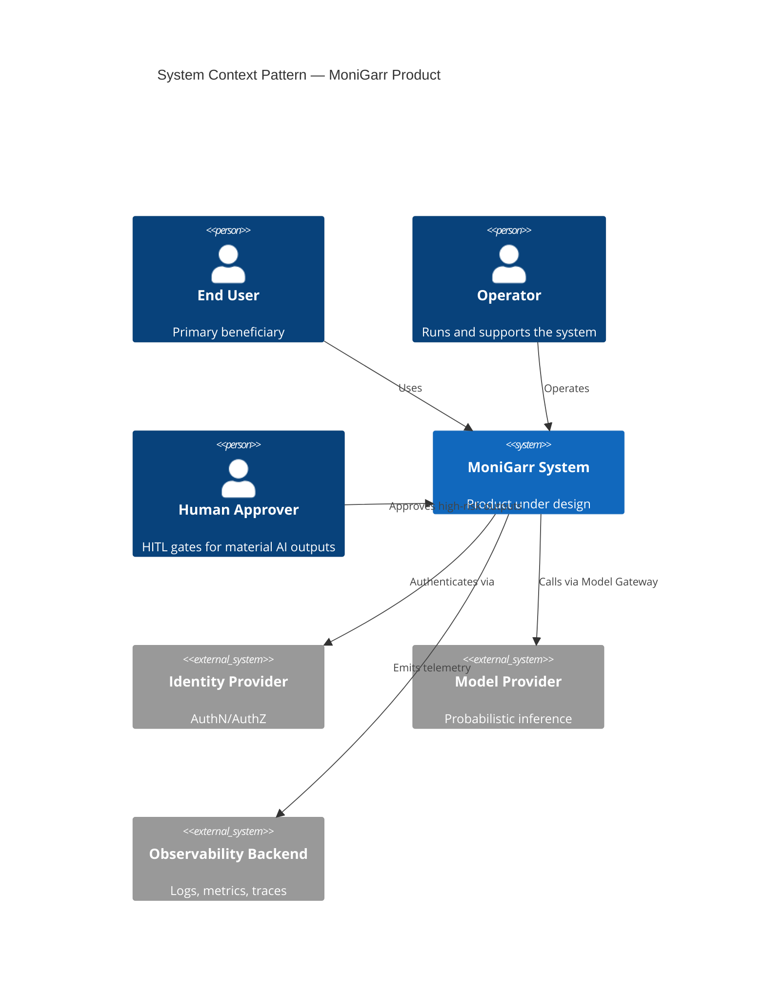
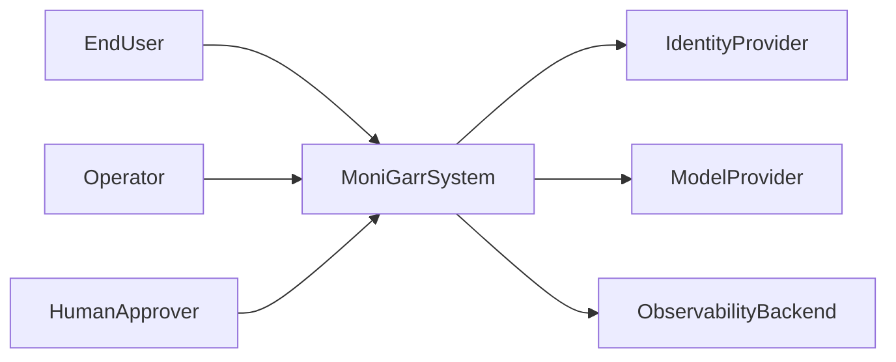

# C4 Level 1 — System Context

**MES Version:** 1.1.0  
**Status:** Architecture Companion  
**Parent:** [`../ARCHITECTURE.md`](../ARCHITECTURE.md) Part II  
**Audience:** Humans and AI coding agents

---

## Foundation

> MoniGarr Engineering exists to create durable software systems that compound in value over time. We measure success by customer outcomes, engineering quality, and the ability of future humans and AI agents to understand, extend, and confidently operate every system we build.

---

## Regulated readiness

When an inheriting project processes PHI/ePHI, CUI, sovereign/community-protected data, or accessibility-normative UI requirements, it **shall** adopt matching overlays via [`../../AI/REGULATED_PROFILES.md`](../../AI/REGULATED_PROFILES.md), map external authorities via [`../../REFERENCES.md`](../../REFERENCES.md), and follow the Regulated Operations Overlay in [`../../Governance/MOM.md`](../../Governance/MOM.md). MES documentation readiness is **not** certification, ATO, FedRAMP authorization, or HIPAA compliance evidence.

## Purpose

Level 1 (Context) shows the system as a single box interacting with users and external systems. Every MoniGarr product architecture shall include a Context diagram.

---

## Required Elements

| Element | Requirement |
|---------|-------------|
| System boundary | One named system under design |
| Human actors | Named roles (not anonymous "users" only) |
| External systems | Named dependencies with trust notes |
| Data crossings | What crosses the boundary (classes, not field lists) |
| AI involvement | Whether external model providers sit outside the boundary |

---

## Pattern Diagram

If C4-PlantUML/mermaid C4 is unavailable in a renderer, equivalent flowchart form is acceptable:

---

## Trust Boundary Narrative

Project Context docs **shall** include a short trust-boundary narrative (3–5 bullets). Template:

- **Data sensitivity at crossings:** What data classes leave or enter the system boundary (e.g., public, PII, PHI, CUI), and which crossings are encrypted / authenticated.  
- **Highest-sensitivity path:** One bullet naming the most sensitive flow and its external counterpart (or state N/A).  
- **ComplianceReviewer (R3+):** When risk class is R3+, name an optional `ComplianceReviewer` (or equivalent) human actor who gates regulated releases—or state why omitted with ADR.  
- **Privacy pointer:** When non-public, regulated, CUI, or sovereign data is in scope, link project `PRIVACY_DATA_GOVERNANCE.md` (see [`Templates/PRIVACY_DATA_GOVERNANCE_TEMPLATE.md`](../../Templates/PRIVACY_DATA_GOVERNANCE_TEMPLATE.md)).  
- **Out of scope crossings:** Explicit N/A for unused regulated classes, or ADR if deferred.

---

## Normative Rules

1. The Context diagram shall match actors in `USERS.md` / `PRD.md`.  
2. Model providers shall appear as external systems; the Model Gateway remains inside the system.  
3. Secrets and admin planes shall not be implied as publicly reachable.  
4. Project docs shall link this pattern and replace names with product-specific actors.  
5. PHI/CUI (and peer regulated classes) flows shall be identified in the trust-boundary narrative, or marked N/A with ADR.

---

## Checklist

- [ ] Actors named and role-justified  
- [ ] External systems listed with purpose  
- [ ] Trust boundary narrative present (data sensitivity at crossings)  
- [ ] PHI/CUI flows identified or N/A with ADR  
- [ ] ComplianceReviewer named for R3+ (or ADR omits)  
- [ ] AI provider explicitly external  
- [ ] Diagram synchronized with PRD scope  
- [ ] `PRIVACY_DATA_GOVERNANCE.md` linked when applicable  
