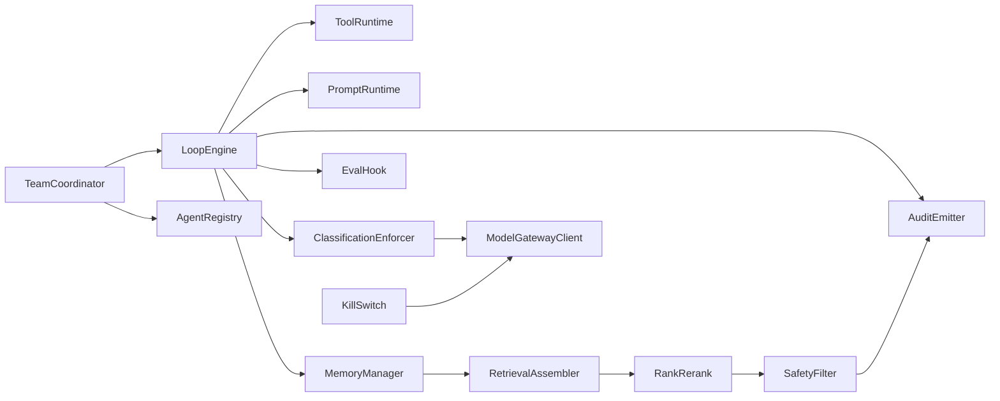

# C4 Level 3 — Components

**MES Version:** 1.1.0  
**Status:** Architecture Companion  
**Parent:** [`../ARCHITECTURE.md`](../ARCHITECTURE.md) Part II  
**Audience:** Humans and AI coding agents

---

## Foundation

> MoniGarr Engineering exists to create durable software systems that compound in value over time. We measure success by customer outcomes, engineering quality, and the ability of future humans and AI agents to understand, extend, and confidently operate every system we build.

---

## Regulated readiness

When an inheriting project processes PHI/ePHI, CUI, sovereign/community-protected data, or accessibility-normative UI requirements, it **shall** adopt matching overlays via [`../../AI/REGULATED_PROFILES.md`](../../AI/REGULATED_PROFILES.md), map external authorities via [`../../REFERENCES.md`](../../REFERENCES.md), and follow the Regulated Operations Overlay in [`../../Governance/MOM.md`](../../Governance/MOM.md). MES documentation readiness is **not** certification, ATO, FedRAMP authorization, or HIPAA compliance evidence.

## Purpose

Level 3 (Components) decomposes important containers into components with clear responsibilities and interfaces — especially AI Orchestration and Application Services.

---

## AI Orchestration Component Pattern

| Component | Responsibility |
|-----------|----------------|
| Agent Registry | Catalog of agents, versions, owners |
| Team Coordinator | Routes work to agent teams |
| Loop Engine | Draft→critique→repair→re-score→compare→improve→evaluate→approve (Part VIII) |
| Tool Runtime | Schema validation, retries, breakers |
| Prompt Runtime | Loads versioned prompts |
| Memory Manager | Working/session/project memory lifecycle |
| RetrievalAssembler | Assembles authorized evidence bundles for grounded generation |
| RankRerank | Ranking / re-ranking of retrieved candidates before assembly |
| Safety Filter | Policy and hallucination checks |
| Eval Hook | Emits samples to evaluation pipeline |
| ModelGatewayClient | Sole client to Model Gateway; budgets, pins, class routing (Part III) |
| AuditEmitter | Emits security- and AI-significant audit/events (Part II Audit/Event Emitter) |
| ClassificationEnforcer | Applies data-sensitivity / residency labels before model or egress calls |
| KillSwitch | Emergency disable for write / irreversible paths (C4 Level 4 pattern) |

Naming aligns with Architecture Part II §2.5 and Part III platform components.

---

## Application Services Component Pattern

| Component | Responsibility |
|-----------|----------------|
| API Controllers | Transport adapters |
| Domain Services | Business rules |
| Repositories | Persistence ports |
| PolicyClient | Calls Control Plane Policy Engine (PDP); does not embed the PDP |
| Event Publisher | Domain events |
| Anti-Corruption Layer | External system translation |

**Policy naming:** Control Plane hosts the authoritative **Policy Engine (PDP)**. Application Services embed a **PolicyClient** only. Optional Level 4 **PolicyDecisionPoint** documents the decide/enforce interface. See [`../ARCHITECTURE.md`](../ARCHITECTURE.md) §2.5.

---

## Normative Rules

1. Components shall have one primary responsibility.  
2. Cross-component calls shall be explicit (no hidden shared mutable globals).  
3. Agent components shall declare tools and escalation paths.  
4. Diagrams shall stay synchronized with package/module structure.

---

## Checklist

- [ ] Critical containers decomposed  
- [ ] Interfaces named  
- [ ] ModelGatewayClient / AuditEmitter / ClassificationEnforcer present where AI egress applies  
- [ ] RetrievalAssembler / RankRerank present where RAG/GraphRAG applies  
- [ ] KillSwitch (or equivalent control-plane disable) for write / irreversible paths  
- [ ] AI vs deterministic components labeled  
- [ ] Failure and escalation paths noted  
