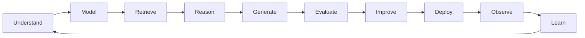
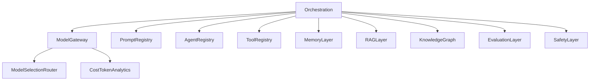

## Part I — Engineering Philosophy

> **BUILD FRAGMENT — NOT CANONICAL.** Do not publish, cite, or use as source of truth.
> Canonical handbook: [`ARCHITECTURE.md`](ARCHITECTURE.md) (Parts I–XX).
> CI guard: `scripts/check-fragment-citations.ps1`. Agents must not open `_part_*` as SoT.
> If this file diverges from ARCHITECTURE.md, ARCHITECTURE.md wins.

### I.1 Vision

MoniGarr Engineering builds AI-first software that compounds in value: systems that remain understandable, operable, and extensible by future humans and AI agents.

Vision success criteria:

1. Customer outcomes improve measurably over time.
2. Engineering quality is evidenced (tests, evals, scans, ADRs), not asserted.
3. Onboarding time for a new engineer or AI agent decreases as documentation and harnesses mature.
4. Probabilistic intelligence remains bounded by deterministic proof and human accountability.

### I.2 Engineering Principles

| # | Principle | Normative statement |
|---|-----------|---------------------|
| 1 | Value before velocity | Features shall map to customer, business, or engineering value metrics. |
| 2 | Architecture before implementation | Coding shall not begin without PRD, architecture, domain/data models, and acceptance criteria. |
| 3 | Documentation is product | Behavior-changing merges shall update docs in the same change set. |
| 4 | AI augments engineers | AI shall not hold unilateral production authority for material risk. |
| 5 | Production quality is default | Temporary hacks shall be tracked with expiry and ADR. |
| 6 | Evidence over assertion | Readiness claims shall cite artifacts. |
| 7 | Evaluation before confidence | AI capabilities shall not ship without golden evaluation. |
| 8 | Retrieval before generation | Fact-bearing outputs shall be grounded when practical. |
| 9 | Observability by design | New paths shall emit logs, metrics, and traces. |
| 10 | Handoff readiness | Repositories shall be operable from artifacts alone. |

### I.3 M.O.M. Framework

**M.O.M. (MoniGarr Operating Model)** is the governance and lifecycle operating system. Standing standard: [`../Governance/MOM.md`](../Governance/MOM.md).

M.O.M. specifies:

- Engineering lifecycle: Discover → Design → Validate → Implement → Evaluate → Review → Deploy → Observe → Improve
- Quality gates and Definition of Done
- Documentation requirements and ADRs
- Rituals (architecture review, eval gate, security review, post-incident)
- KPIs for delivery and reliability

### I.4 M.I.L.E. Methodology

**M.I.L.E. (MoniGarr Intelligence Led Engineering)** is the intelligence operating system. Standing standard: [`../Governance/MILE.md`](../Governance/MILE.md).

M.I.L.E. specifies:

- AI development lifecycle and intelligence stack
- Agent, sub-agent, tool, retrieval, graph, and memory standards
- Loop engineering and harness engineering
- Evaluation-first delivery and continuous learning under change control

### I.5 AI-First Development Lifecycle



| Stage | Deterministic owner | Probabilistic assistant |
|-------|---------------------|-------------------------|
| Understand | Product + engineering | Synthesis of research notes |
| Model | Domain modeling | Draft entity suggestions |
| Retrieve | Indexing pipelines | Query planning |
| Reason | Orchestration policies | Agent planning |
| Generate | Schema validation | Draft content |
| Evaluate | Scores, thresholds, harnesses | Critique agents |
| Improve | Change control | Proposed repairs |
| Deploy | CI/CD gates | Release notes drafts |
| Observe | Telemetry backends | Anomaly narratives |
| Learn | Curation workflow | Candidate dataset additions |

### I.6 Human-in-the-Loop Governance

| Risk class | Examples | HITL requirement |
|------------|----------|------------------|
| R0 — Advisory | Draft summaries, local lint suggestions, non-binding brainstorming | Optional review |
| R1 — Internal draft | PR description drafts, internal docs, eval report drafts | Should review before merge/publish |
| R2 — Customer-visible draft | Emails, resume text, support replies, marketing copy | Must human-approve before send/publish |
| R3 — Production change | Deployments, schema migrations, prompt promotions, model swaps | Must human-approve with evidence pack |
| R4 — Irreversible / regulated | Data deletion, legal commitments, financial transfers, privilege grants, production secret rotation affecting many tenants | Must dual-control or designated approver; ADR if automated |

> Fragment note: Canonical risk classes are R0–R4 in [`ARCHITECTURE.md`](ARCHITECTURE.md) / [`../GLOSSARY.md`](../GLOSSARY.md). This file is not published SoT.

Humans remain accountable for architecture, ethics, safety, governance, approval, and customer trust.

**Prohibited AI authority (shall not):**

- Unilateral production deploy of material risk changes
- Silent prompt, model, or registry changes bypassing review
- Disabling evaluation gates
- Exfiltrating secrets or bypassing RBAC
- Claiming certification or legal conclusions without qualified human review

### I.7 Definition of Production Ready

A system or capability is **Production Ready** only when all are true:

- [ ] Functional acceptance criteria met
- [ ] Automated tests required by Part XV passing
- [ ] AI evals and golden sets passing when AI-involved (Parts X–XI)
- [ ] Security controls evidenced for the risk class (Part XVII)
- [ ] Observability enabled (metrics, logs, traces, alerts)
- [ ] Runbook and rollback documented
- [ ] Documentation synchronized (Part XVIII)
- [ ] Human approval recorded for R2+ risk
- [ ] Cost and latency within agreed budgets

### I.8 Definition of Enterprise Ready

**Enterprise Ready** extends Production Ready with:

- [ ] Multi-tenant or org isolation model documented (if applicable)
- [ ] RBAC/ABAC and audit logging complete for admin actions
- [ ] Backup and restore exercised
- [ ] Threat model current for externally exposed surfaces
- [ ] Supply-chain controls (SBOM, dependency scanning, signed releases as applicable)
- [ ] SLOs defined and reviewed
- [ ] On-call ownership assigned
- [ ] Compliance posture language and evidence mapped (without false certification claims)
- [ ] MES Parts conformance checklist completed in project architecture

### I.9 Definition of AI-Native Software

Software is **AI-Native** under MES when:

1. Intelligence is a first-class architectural concern (not a bolt-on script).
2. An AI Platform exists (Part III), not a single undifferentiated "AI service."
3. Retrieval, memory, and/or graphs ground generation where facts matter.
4. Agents are specialized, evaluated, and escalated.
5. Loops and harnesses measure improvement.
6. Deterministic systems govern probabilistic outputs.
7. Humans retain approval authority proportional to risk.

---

## Part II — System Architecture

### II.1 High-Level Architecture

MoniGarr systems should separate:

1. **Experience plane** — clients, accessibility, UX
2. **Application plane** — deterministic domain logic and APIs
3. **Intelligence plane** — orchestration, agents, prompts, tools
4. **Knowledge plane** — RAG, graphs, memory
5. **Data plane** — transactional stores, object storage, warehouses
6. **Control plane** — identity, policy, secrets, feature flags
7. **Evidence plane** — tests, evals, observability, audit

```mermaid
flowchart TB
  subgraph experience [ExperiencePlane]
    web[WebClient]
  end
  subgraph application [ApplicationPlane]
    api[API]
    domain[DomainServices]
  end
  subgraph intelligence [IntelligencePlane]
    orch[Orchestration]
    agents[AgentTeams]
    gw[ModelGateway]
  end
  subgraph knowledge [KnowledgePlane]
    rag[RAG]
    graph[KnowledgeGraph]
    mem[Memory]
  end
  subgraph evidence [EvidencePlane]
    evals[EvalsHarnesses]
    otel[OpenTelemetry]
  end
  web --> api
  api --> domain
  api --> orch
  orch --> agents
  agents --> gw
  agents --> rag
  agents --> graph
  agents --> mem
  domain --> evals
  orch --> evals
  api --> otel
  orch --> otel
```

### II.2 C4 Architecture Diagrams

Every project shall maintain C4 views. Companions:

- [`C4/Level1_Context.md`](C4/Level1_Context.md)
- [`C4/Level2_Container.md`](C4/Level2_Container.md)
- [`C4/Level3_Component.md`](C4/Level3_Component.md)
- [`C4/Level4_Code.md`](C4/Level4_Code.md)

### II.3 Context Diagram

See Level 1 companion. Actors, external systems, and AI providers shall be explicit.

### II.4 Container Diagram

See Level 2 companion. Model Gateway, RAG, Graph, and Eval workers shall appear when AI-native.

### II.5 Component Diagram

See Level 3 companion. Orchestration components include coordinator, loop engine, tool runtime, prompt runtime, safety, and eval hooks.

### II.6 Deployment Diagram

Deployment views shall show environments (dev/stage/prod), regions, secrets injection, and network trust boundaries. See Part XVI and [`../Engineering/DEVOPS.md`](../Engineering/DEVOPS.md).

### II.7 Runtime Architecture

Runtime rules:

1. Request paths shall have timeouts at every remote call.
2. Side-effecting tools shall be idempotent where practical and always audited.
3. Long-running agent work shall be asynchronous with durable job state.
4. Backpressure and circuit breakers shall protect dependency fan-out.

### II.8 Event Architecture

| Concern | Requirement |
|---------|-------------|
| Event naming | Past-tense domain events (`ResumeExported`) |
| Schema | Versioned schemas; consumers tolerate additive changes |
| Delivery | At-least-once with idempotent handlers |
| PII | Classification tags on payloads; no secrets in events |
| AI jobs | Agent run events include prompt version, model id, token cost, eval ids |

### II.9 Service Boundaries

Services shall align to bounded contexts. Avoid shared databases across contexts without an explicit integration model. Synchronous calls across contexts should be minimized; prefer events for decoupled workflows.

### II.10 Domain Driven Design

Projects shall define:

- Ubiquitous language glossary (link suite `GLOSSARY.md` plus project terms)
- Aggregates and invariants
- Domain events
- Anti-corruption layers at external boundaries

### II.11 Bounded Contexts

**Example (CareerPilot)** illustrative contexts: Identity, Profile/Career Graph, Matching, Documents (Resume/Cover Letter), Interview Prep, Applications, Analytics, Billing, Admin/Compliance.

Each context shall declare ownership, data store, and publication contracts.

---

## Part III — AI Architecture

### III.1 AI Platform Mandate

MoniGarr shall not treat "an AI service" as sufficient architecture. AI-native products shall implement an **AI Platform** composed of governed capabilities.



### III.2 Model Gateway

The Model Gateway **shall** be the sole egress to external model providers.

Responsibilities: provider authentication, routing, retries, timeouts, budget enforcement, redaction hooks, response logging references, and provider failover.

### III.3 Prompt Library and Prompt Registry

| Capability | Requirement |
|------------|-------------|
| Prompt Library | Human-readable catalog of prompts by domain |
| Prompt Registry | Versioned, immutable prompt artifacts with semver, owner, tests |
| Runtime | Loads by id+version only; no anonymous inline production prompts for R1+ |

Details: Part XII · [`../AI/PROMPTS.md`](../AI/PROMPTS.md)

### III.4 Agent Registry

Every production agent shall be registered with purpose, inputs/outputs, tools, evals, owners, risk class, and escalation.

Details: Part VI · [`../AI/AGENTS.md`](../AI/AGENTS.md)

### III.5 Tool Registry

Tools are products with schemas, validation, breakers, tests, docs, and examples.

Details: Part XIII · [`../AI/TOOLS.md`](../AI/TOOLS.md)

### III.6 Memory Layer

Working, session, project, long-term, and reference memory with retention and deletion policies.

Details: [`../AI/MEMORY.md`](../AI/MEMORY.md)

### III.7 RAG Layer

Hybrid retrieval with citations and provenance. Part IV · [`../AI/RAG.md`](../AI/RAG.md)

### III.8 Knowledge Graph

Typed nodes/edges with GraphRAG support. Part V · [`../AI/KNOWLEDGE_GRAPH.md`](../AI/KNOWLEDGE_GRAPH.md)

### III.9 Evaluation Layer and Golden Sets

Offline and online evaluation; golden sets under change control. Parts X–XI · [`../AI/EVALS.md`](../AI/EVALS.md)

### III.10 Continuous Evaluation Pipeline

Deployments shall trigger evaluation suites; failing blocking gates shall stop promotion.

### III.11 Safety Layer and Hallucination Detection

Safety filters, policy checks, jailbreak/prompt-injection defenses, and hallucination detectors appropriate to risk class. Ungrounded factual claims shall be refused, flagged, or escalated.

### III.12 Model Selection Router

Routing by task class, latency/cost budget, capability needs, and data handling constraints. Details: [`../AI/MODEL_ROUTING.md`](../AI/MODEL_ROUTING.md)

### III.13 Cost Optimization and Token Analytics

Track tokens in/out, cost per feature, cost per tenant, and cache hit rates. Budgets shall be enforceable at the gateway.

---

## Part IV — Enterprise RAG

### IV.1 Layered Retrieval Mandate

Basic single-vector RAG is insufficient for enterprise MoniGarr systems that assert facts. Retrieval **shall** be layered.

```mermaid
flowchart TB
  q[Query] --> rewrite[QueryRewrite]
  rewrite --> kw[KeywordBM25]
  rewrite --> dense[DenseEmbeddings]
  rewrite --> sparse[SparseEmbeddings]
  rewrite --> meta[MetadataFilters]
  rewrite --> graph[GraphTraversal]
  kw --> fuse[HybridFusion]
  dense --> fuse
  sparse --> fuse
  meta --> fuse
  graph --> fuse
  fuse --> rank[Ranking]
  rank --> rerank[Reranking]
  rerank --> compress[Compression]
  compress --> cite[CitationAssembly]
  cite --> prov[ProvenanceRecords]
```

### IV.2 Retrieval Modes

| Mode | Use |
|------|-----|
| Semantic / dense | Paraphrase and conceptual match |
| Keyword / BM25 | Exact tokens, IDs, rare terms |
| Sparse embeddings | Lexical-semantic hybrid signals |
| Metadata filtering | Tenant, time, doc type, ACL |
| Graph RAG | Relationship-aware context |
| Hybrid | Default for enterprise fact answering |

### IV.3 Graph-Augmented Retrieval

Graph RAG shall combine vector/keyword hits with neighborhood expansion on typed edges.

**Example (CareerPilot)** graphs: Entity, Skill, Company, Career, Resume, Job, and Relationship graphs contributing context to matching and document generation.

### IV.4 Context Assembly, Ranking, Reranking, Compression

Assembled context shall respect token budgets, ACL filters, and diversity. Rerankers should be evaluated on golden retrieval sets. Compression shall not drop citation anchors.

### IV.5 Citation Generation and Provenance Tracking

| Requirement | Statement |
|-------------|-----------|
| Citations | User-visible grounded answers should cite sources |
| Provenance | Internal records map spans/claims to document id, chunk id, graph edge id, timestamp |
| Ungrounded | System shall label or refuse |

Details: [`../AI/RAG.md`](../AI/RAG.md)

---

## Part V — Enterprise Knowledge Graph

### V.1 Graph as Product Architecture

Career and knowledge domains should be modeled as graphs, not only documents.

### V.2 Node Catalog (Standard Pattern)

Projects shall publish their node types. **Example (CareerPilot)** nodes:

Users, Skills, Jobs, Companies, Certifications, Projects, Interviews, Applications, Technologies, Recruiters, Publications

### V.3 Relationship Catalog (Standard Pattern)

**Example (CareerPilot)** relationships:

USES, KNOWS, REQUIRES, MATCHES, WORKED_AT, INTERVIEWED_FOR, RECOMMENDED, MENTORED, REFERENCES, GENERATED

### V.4 Normative Graph Requirements

1. Typed edges with direction and constraints
2. Provenance on GENERATED and RECOMMENDED edges
3. Versioning / validity intervals where facts change
4. Tenant and privacy labels on nodes
5. Graph harnesses and golden path queries (Part IX)
6. No mystery edges from unconstrained model writes without validation

Details: [`../AI/KNOWLEDGE_GRAPH.md`](../AI/KNOWLEDGE_GRAPH.md)

---

## Part VI — AI Agent Platform

### VI.1 Teams, Not Monoliths

Agents shall be organized into **teams** with a coordinator, shared contracts, and clear escalations.

### VI.2 Agent Contract (Mandatory Fields)

Every agent shall define: Responsibilities, Inputs, Outputs, Tools, Memory, KPIs, Evaluation Metrics, Failure Modes, Escalation Rules, Ownership, Risk Class.

### VI.3 Example (CareerPilot) — Career Team

| Agent | Responsibilities (summary) |
|-------|----------------------------|
| Discovery Agent | Find roles/opportunities matching profile constraints |
| Qualification Agent | Assess fit vs requirements with evidence |
| Resume Agent | Produce/revise resumes via sub-agents |
| Cover Letter Agent | Tailored letters with citations to profile facts |
| Interview Agent | Prep questions/answers grounded in JD + profile |
| Portfolio Agent | Select and narrate project evidence |
| Salary Agent | Ranges with source provenance |
| Analytics Agent | Funnel and outcome metrics |
| Learning Agent | Skill gap plans from graph |
| Compliance Agent | Policy, disclosure, and data-handling checks |

Each agent shall maintain the full contract fields in the Agent Registry. Complete tables: [`../AI/AGENTS.md`](../AI/AGENTS.md).

### VI.4 Failure Modes and Escalation

Common failure modes: tool timeout, low grounding score, policy violation, budget exhaustion, contradictory sources.

Escalation pattern:

```text
Agent failure or low score → retry with repair loop → alternate agent/tool → human approver → incident if systemic
```

---

## Part VII — Sub-Agent Architecture

### VII.1 Delegation Principle

Every complex agent may delegate to sub-agents with a single responsibility.

### VII.2 Example (CareerPilot) — Resume Agent Tree

```text
Resume Agent
├── Formatting Agent
├── ATS Optimization Agent
├── Grammar Agent
├── Citation Agent
├── Fact Validation Agent
└── PDF Export Agent
```

### VII.3 Normative Rules

1. Sub-agents shall not broaden parent authority.
2. Fact Validation shall run before externalized PDF/export for R2+.
3. Parent aggregates scores; parent owns escalation.
4. Delegation trees shall be documented and harness-tested.

Details: [`../AI/SUBAGENTS.md`](../AI/SUBAGENTS.md)

---
