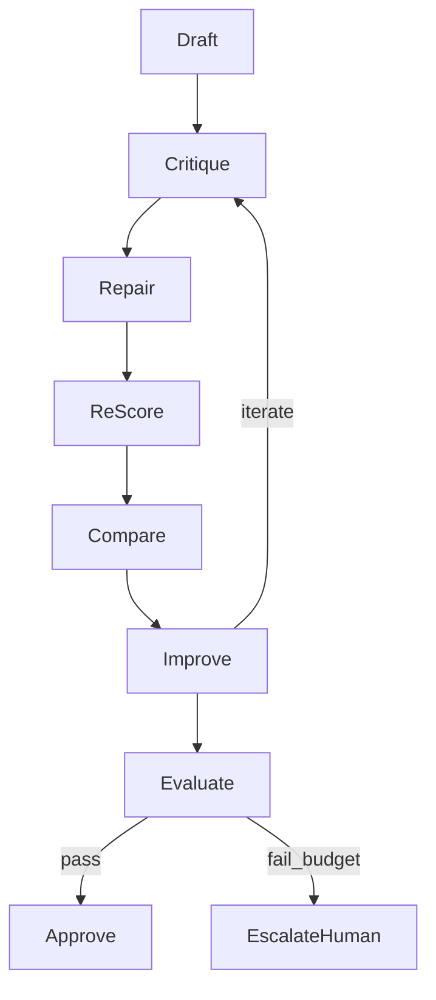

## Part VIII — Loop Engineering

> **BUILD FRAGMENT — NOT CANONICAL.** Do not publish, cite, or use as source of truth.
> Canonical handbook: [`ARCHITECTURE.md`](ARCHITECTURE.md) (Parts I–XX).
> CI guard: `scripts/check-fragment-citations.ps1`. Agents must not open `_part_*` as SoT.
> If this file diverges from ARCHITECTURE.md, ARCHITECTURE.md wins.

### VIII.1 Refinement Loop Mandate

MoniGarr shall not treat AI generation as one-shot for R1+ tasks. Tasks shall use a measured refinement loop:

```text
Draft → Critique → Repair → Re-score → Compare → Improve → Evaluate → Approve
```



### VIII.2 Loop Record Schema

Every iteration shall record:

| Field | Description |
|-------|-------------|
| prompt_id / version | Registry reference |
| response_ref | Artifact pointer |
| evaluation | Scores + judge ids |
| token_cost | In/out/total + USD estimate |
| runtime_ms | Wall time |
| quality_score | Aggregate gate score |
| iteration_index | 0..N |
| decision | continue / approve / escalate / abort |

### VIII.3 Stopping Criteria

Stop when thresholds are met, max iterations reached, budget exhausted, a safety tripwire fires, or a human aborts.

Details: [`../AI/LOOP_ENGINEERING.md`](../AI/LOOP_ENGINEERING.md)

---

## Part IX — Harness Engineering

### IX.1 Mandate

Every AI workflow shall have a test harness.

### IX.2 Harness Types

| Harness | Proves |
|---------|--------|
| Prompt Harness | Prompt versions behave |
| Tool Harness | Schemas, retries, breakers |
| RAG Harness | Retrieval quality + citations |
| Graph Harness | Path queries + invariants |
| Agent Harness | Team contracts + escalations |
| Evaluation Harness | Scorers themselves |
| Domain harnesses | **Example (CareerPilot):** Resume, Job Matching, Interview |

### IX.3 Harness Contents

Each harness shall include: synthetic data, real/anonymized data, golden examples, edge cases, failure scenarios, regression tests, and cost/latency budgets.

Details: [`../AI/HARNESS_ENGINEERING.md`](../AI/HARNESS_ENGINEERING.md)

---

## Part X — Golden Evaluation Sets

### X.1 Purpose

Golden sets are frozen benchmarks that model upgrades and prompt changes must pass.

### X.2 Sizing Guidance

Default pattern: **N ≥ 100** representative items per critical corpus where feasible; smaller sets require ADR justification.

**Example (CareerPilot)** corpora: 100 resumes, 100 job descriptions, 100 interview questions, 100 cover letters, 100 GitHub repositories, 100 portfolios, 100 salary datasets.

### X.3 Change Control

- Versioned datasets with manifests
- PII scrubbing and access control
- Separate train vs golden holdout
- Promotion blocked on golden regression beyond threshold

Details: [`../AI/GOLDEN_DATASETS.md`](../AI/GOLDEN_DATASETS.md)

---

## Part XI — Continuous Evaluation

### XI.1 Deployment Evaluation Dimensions

| Dimension | Gate type (typical) |
|-----------|---------------------|
| Accuracy | Blocking for core tasks |
| Grounding | Blocking for factual outputs |
| Hallucination rate | Blocking above threshold |
| Citation quality | Blocking/advisory by risk |
| Latency | Blocking vs SLO |
| Cost / token usage | Blocking vs budget |
| Business KPI | Advisory + product review |
| Human satisfaction | Sampled / advisory |

### XI.2 Pipeline

```text
CI → staging eval pack → production shadow/sample eval → dashboards → alerts → rollback hooks
```

Details: [`../AI/EVALS.md`](../AI/EVALS.md)

---

## Part XII — Prompt Engineering

### XII.1 Capabilities

Versioned Prompt Library; Prompt Reviews; Prompt Testing; Prompt Regression; Prompt Benchmarking; Prompt Scorecards.

### XII.2 Rules

1. Production prompts for R1+ shall be registry-versioned.
2. Changes require review and harness results.
3. Rollback by version pin.
4. Scorecards track quality, cost, latency, and safety.

Details: [`../AI/PROMPTS.md`](../AI/PROMPTS.md)

---

## Part XIII — Tool Engineering

Every tool shall include: Schema, Validation, Retries, Timeouts, Circuit Breakers, Observability, Metrics, Tests, Documentation, Examples, Version, Owner.

Side-effecting tools shall declare idempotency keys and audit events.

Details: [`../AI/TOOLS.md`](../AI/TOOLS.md)

---

## Part XIV — Engineering Standards

### XIV.1 Scope

Normative minimums live here; procedural depth in [`../Engineering/`](../Engineering/).

### XIV.2 Language and Framework Standards

| Area | Standard pointer |
|------|------------------|
| Python | [`../Engineering/CODING_STANDARDS.md`](../Engineering/CODING_STANDARDS.md) |
| TypeScript | same |
| FastAPI | same |
| React | same |
| Databases | migrations required; no prod hotfix DDL without review |
| APIs | versioned contracts; OpenAPI/AsyncAPI as applicable |
| Documentation | Part XVIII · DOCUMENTATION_STANDARDS |
| Git / Branch / Release | conventional commits; protected main; SemVer releases |
| File headers | [`../Templates/CODE_COMMENT_HEADER_TEMPLATE.md`](../Templates/CODE_COMMENT_HEADER_TEMPLATE.md) |

### XIV.3 Semantic Versioning

Public APIs, prompts, model routing configs, and MES itself use SemVer. Breaking changes require a major bump and migration notes.

---

## Part XV — Testing

### XV.1 Coverage Philosophy

MES sets a **100% coverage target** for critical deterministic surfaces and **evaluation coverage** for probabilistic surfaces.

| Surface | Target meaning |
|---------|----------------|
| Business logic / domain / services | Line+branch coverage target 100% on critical modules; enforce via CI thresholds agreed per repo |
| API | Contract tests + happy/sad paths |
| Graph / RAG / prompts / agents | Golden + harness coverage of critical behaviors |
| Evaluations | Scorer regression tests |
| Integration / contract | Boundary contracts |
| Performance / load / stress | SLO scenarios |
| Security | SAST/DAST/deps as applicable |
| Accessibility | WCAG target agreed per product |
| Snapshot / golden | Stable fixtures |

Mutation testing should be used on critical deterministic modules.

Details: [`../Engineering/TESTING.md`](../Engineering/TESTING.md)

---

## Part XVI — DevOps

### XVI.1 Tooling Baseline

GitHub Actions (CI/CD), Docker, Render (or equivalent), Terraform for infra-as-code where applicable, secrets managers (never plaintext in git), backups, monitoring, and OpenTelemetry tracing.

### XVI.2 Promotion Gates

```text
build → unit/contract → security scans → eval harness → staging deploy → staging evals → human approval (risk-based) → prod → smoke + continuous eval
```

Details: [`../Engineering/DEVOPS.md`](../Engineering/DEVOPS.md) · [`../Engineering/RELEASE_PROCESS.md`](../Engineering/RELEASE_PROCESS.md)

---

## Part XVII — Security

### XVII.1 Posture Language

MES documents security **posture and evidence requirements**. They do **not** by themselves constitute SOC 2, FedRAMP, or other certifications.

### XVII.2 Control Domains

OWASP ASVS-aligned practices; Zero Trust network/identity assumptions; encryption in transit/at rest; RBAC; audit logs; threat modeling; dependency scanning; secrets management; supply chain security (SBOM, pinned actions, least privilege).

Project instantiation: [`../Templates/SECURITY_REQUIREMENTS_TEMPLATE.md`](../Templates/SECURITY_REQUIREMENTS_TEMPLATE.md)  
Depth: [`../Engineering/SECURITY.md`](../Engineering/SECURITY.md)

---

## Part XVIII — Documentation

### XVIII.1 Mandatory Repository Documents

| Document | Purpose |
|----------|---------|
| README.md | Run/onboard |
| ARCHITECTURE.md | System design |
| PRD.md | Intent/scope |
| USERS.md | Personas/journeys |
| API.md | Contracts |
| DATA_MODEL.md | Entities/retention |
| DECISIONS.md / docs/ADRS | ADR index |
| CONTRIBUTING.md | Contribution rules |
| AI_GUIDELINES.md | AI bounds |
| CLAUDE.md (or equivalent) | Agent operating notes |
| SYSTEM_PROFILE.md | Runtime profile |
| RUNBOOK.md | Operations |
| ONBOARDING.md | Human+agent path |
| TESTING.md | Test/eval strategy |
| SECURITY.md | Controls/evidence |
| CHANGELOG.md | History |

Sync rule: behavior change and docs change travel together.

Details: [`../Engineering/DOCUMENTATION_STANDARDS.md`](../Engineering/DOCUMENTATION_STANDARDS.md)

---

## Part XIX — Engineering KPIs

| KPI | Intent |
|-----|--------|
| Coverage | Deterministic confidence |
| Mutation score | Test efficacy |
| Agent success rate | Team reliability |
| Prompt accuracy | Registry quality |
| Evaluation pass rate | Release readiness |
| Latency | User experience / SLO |
| MTTR | Operational excellence |
| Deployment frequency | Delivery health |
| Lead time | Flow |
| Defect escape rate | Quality |
| Hallucination rate | AI safety/quality |
| Business KPIs | Outcome alignment |

Review cadence: weekly ops, monthly engineering review, quarterly MES alignment.

---

## Part XX — M.O.M. + M.I.L.E. (Engineering Operating System)

### XX.1 Crown Jewel Statement

M.O.M. and M.I.L.E. are not marketing labels. They are the **engineering operating system** of MoniGarr.com LLC.

Together with this Architecture handbook and the Foundation statement in [`../SYSTEM_CONTEXT.md`](../SYSTEM_CONTEXT.md), they define how every repository is designed, built, evaluated, deployed, and maintained — whether the contributor is a senior architect, a junior engineer, or an AI coding agent.

### XX.2 M.O.M. as Operating System

M.O.M. provides:

| OS concern | M.O.M. mechanism |
|------------|------------------|
| Governance | Principles, accountability, prohibited AI authority |
| Decisions | ADRs ([`../Governance/ADR_GUIDE.md`](../Governance/ADR_GUIDE.md)) |
| Rituals | Architecture, security, eval, incident reviews |
| Documentation | Mandatory docs + sync rules |
| Quality gates | Definition of Done + release gates |
| Lifecycle | Discover…Improve loop |

Standing doc: [`../Governance/MOM.md`](../Governance/MOM.md)

### XX.3 M.I.L.E. as Operating System

M.I.L.E. provides:

| OS concern | M.I.L.E. mechanism |
|------------|--------------------|
| Orchestration | Agent teams + sub-agents |
| Evaluation-first | Golden sets + continuous eval |
| Retrieval | Hybrid RAG + provenance |
| Graphs | Explicit knowledge relationships |
| Loops | Measured refinement |
| Prompts | Versioned lifecycle |
| Tools | Productized capabilities |
| HITL | Risk-based approval checkpoints |
| Improvement | Telemetry → curated learning |

Standing doc: [`../Governance/MILE.md`](../Governance/MILE.md)

### XX.4 Inheritance Checklist (Every New Repository)

- [ ] README links to MES suite and declares version
- [ ] PRD + Architecture instantiated from Templates with MES Parts checklist
- [ ] MOM lifecycle stages represented in project process
- [ ] MILE platform components scoped (or N/A with ADR)
- [ ] Evals + harnesses exist before AI production traffic
- [ ] Security/privacy/verify artifacts as required by risk
- [ ] CONTRIBUTING + AI_GUIDELINES + agent contract present
- [ ] Observability and runbooks present before launch
- [ ] KPIs selected and dashboarded

### XX.5 Consistency Rule

If satellite docs (`AI/*`, `Engineering/*`) expand procedures, they shall not contradict this handbook. Conflicts resolve via [`../SYSTEM_CONTEXT.md`](../SYSTEM_CONTEXT.md) source-of-truth hierarchy.

### XX.6 Closing Position

Investing in MES rigor creates a reusable organizational asset: any engineer or AI agent can learn not only *what* to build, but *how* to build, test, document, evaluate, deploy, and maintain software to the same enterprise standard.

---

## Document Control

| Field | Value |
|-------|-------|
| Document title | MoniGarr Engineering Standards — Architecture Handbook |
| Version | 1.0.0 |
| Status | Active |
| Owner | MoniGarr Engineering |
| Organization | MoniGarr.com LLC |
| Approved for suite | MES v1.0 |
| Last updated | 2026-07-12 |
| Next review | 2026-10-12 or upon material MES change |

**Change process:** Significant changes require PR, ADR when normative meaning shifts, and CHANGELOG entry.
