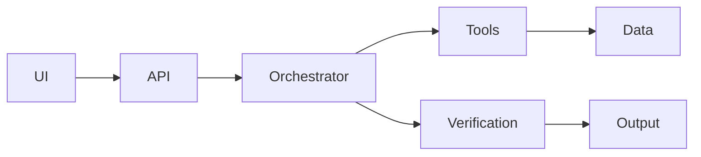

# {{PROJECT_NAME}} — ARCHITECTURE

**MES Version:** 1.1.1 · Shortform slide scaffold only — not a substitute for [`ARCHITECTURE_TEMPLATE.md`](ARCHITECTURE_TEMPLATE.md).

> ## 📋 How to use this template — read me first, then delete this box
> - **What it is:** the **short, one-slide-per-section** architecture scaffold. Each heading is meant to fit on a
>   single slide or screen. The panel-grade long-form template is
>   [`ARCHITECTURE_TEMPLATE.md`](ARCHITECTURE_TEMPLATE.md) in this folder.
> - **Who owns it:** the architect.
> - **When in the workflow:** Step 3 of 8 — see [README](../README.md) Recommended GreenField Factory Workflow.
>   Built on PreSearch, USERS, PRD, and Audit when those artifacts exist.
> - **Drive it with AI:** *"Fill this architecture from my PreSearch + Audit. Keep every section tight enough
>   for one slide. Label anything not yet built as a forward path — never claim unbuilt work."*
> - **Placeholder legend:** `{{FILL_ME}}` = your value · `💡` = guidance, delete it · `✍️` = example, replace it
> - **Done when:** no `{{...}}` tokens and no `💡` / `✍️` callouts remain.

---

## 0. Executive Summary (~500 words)
- **System design:** `{{the one-paragraph shape of the system}}`
- **Key tradeoffs:** `{{what you optimized for and what you gave up}}`
- **Trust model:** `{{who/what is trusted; the model is untrusted}}`

---

## 1. Architecture Position
1. **System authority:** `{{the application is the authority for access and data}}`
2. **AI role:** `{{an untrusted reasoning component over bounded data}}`
3. **Trust boundary:** `{{where trust starts and stops}}`
4. **Failure philosophy:** `{{fail by omission, never by fabrication}}`

---

## 2. Design Principles (M.O.M. / M.I.L.E.)
> 💡 See [README — M.O.M. + M.I.L.E.](../README.md#mom--mile). Keep the ones that apply to this system.

- Intelligence-led decisions
- Verification before output
- Bounded data access
- Observability-first
- Additive integration (respect brownfield)

---

## 3. System Overview
> 💡 Replace the nodes with your real components. This Mermaid diagram renders in most markdown viewers.

---

## 4. Components

| Component | Role |
| --- | --- |
| `{{Controller}}` | `{{request handling}}` |
| `{{Orchestrator}}` | `{{AI loop}}` |
| `{{Tools}}` | `{{bounded data retrieval}}` |
| `{{Verification}}` | `{{fact-checking against source}}` |

---

## 5. Request Flow
1. `{{user action}}`
2. `{{system processing}}`
3. `{{AI orchestration}}`
4. `{{verification}}`
5. `{{output}}`

---

## 6. Trust Boundaries

| Boundary | Allowed | Forbidden |
| --- | --- | --- |
| `{{UI ↔ App}}` | `{{request under existing session}}` | `{{direct data access}}` |
| `{{App ↔ Model}}` | `{{minimum-necessary structured data}}` | `{{raw DB browsing, arbitrary queries}}` |

---

## 7. Tool Layer

| Tool | Purpose | Constraints |
| --- | --- | --- |
| `{{get_x}}` | `{{...}}` | `{{bounded output, no caller-supplied id}}` |

---

## 8. AI Integration
- **Model:** `{{model id}}`
- **Input constraints:** `{{minimum-necessary, active context only}}`
- **Output contract:** `{{structured JSON with citations}}`
- **Token strategy:** `{{how you keep payloads small}}`

---

## 9. Verification System
- **Source attribution method:** `{{citations resolved against tool output}}`
- **Domain rules:** `{{safety constraints applied after verification}}`
- **Failure handling:** `{{drop unverifiable claims}}`

---

## 10. Observability
- **Logs:** `{{structured, redacted}}`
- **Metrics:** `{{latency, tokens, failures}}`
- **Cost tracking:** `{{per-request USD}}`

---

## 11. Failure Modes

| Failure | Behavior |
| --- | --- |
| `{{tool failure}}` | `{{partial output + note}}` |
| `{{model error}}` | `{{explicit error, no fabrication}}` |

---

## 12. Evaluation Strategy
- **What is tested:** `{{...}}`
- **Edge cases:** `{{malformed output, empty data, injection}}`
- **Pass/fail definition:** `{{...}}`

---

## 13. Deployment
- **Environment:** `{{local / staging / production}}`
- **CI/CD:** `{{...}}`
- **Secrets handling:** `{{server-side only}}`

---

## 14. Scale Considerations
- **Performance:** `{{...}}`
- **Cost:** `{{...}}`
- **Concurrency:** `{{...}}`

---

## 15. Known Limitations
- `{{explicit tradeoffs and what is intentionally constrained}}`

---

## 16. Forward Path
- `{{next capabilities}}`
- `{{scaling roadmap}}`

---

## 17. Document Control

| Field | Value |
| --- | --- |
| Owner | `{{OWNER}}` |
| Version | `{{VERSION}}` |
| Last updated | `{{YYYY-MM-DD}}` |
