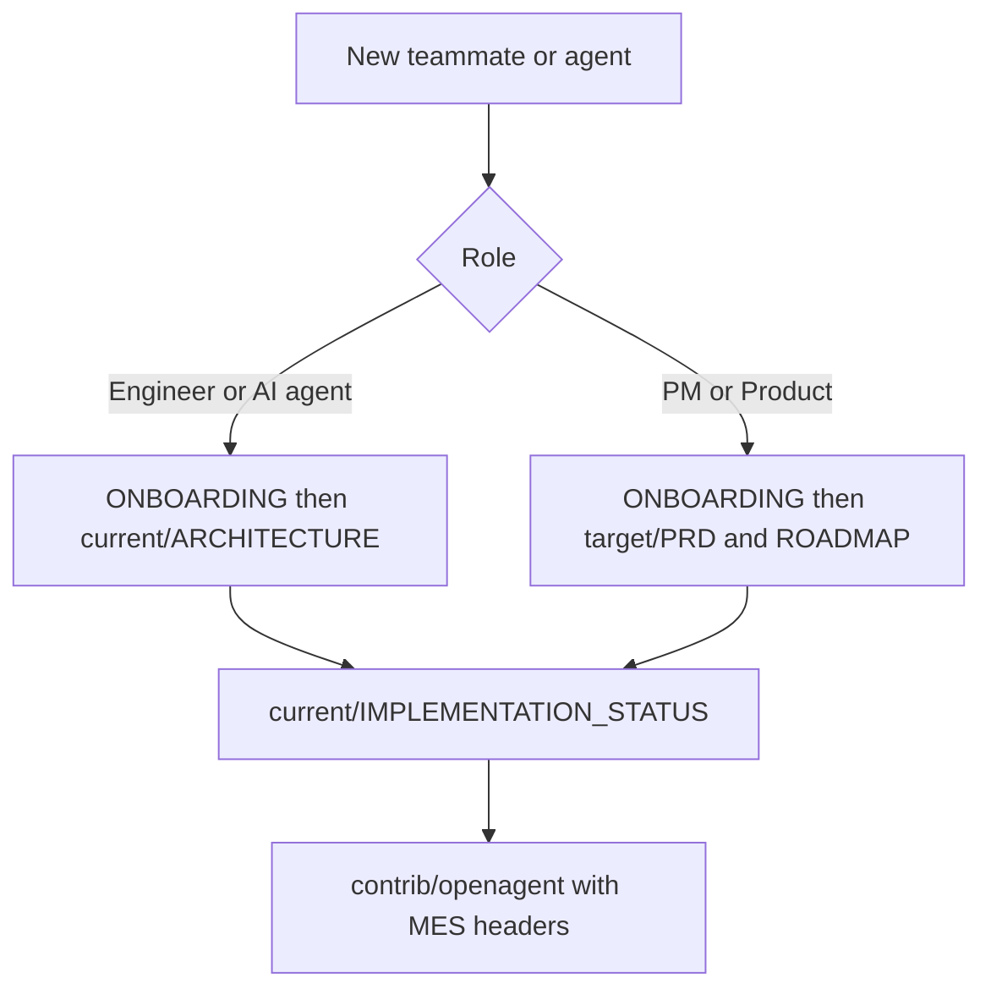

# Open-Agent Documentation Hub

**Product:** Open-Agent (VS Code fork AI-native contrib)
**Owner:** MoniGarr.com LLC
**Author:** Monica Peters \<monigarr@MoniGarr.com\>
**Status:** Active
**Canonical Path:** `docs/README.md`
**See Also:** [`ONBOARDING.md`](ONBOARDING.md) · [`../MoniGarr_Engineering_Standards/SYSTEM_CONTEXT.md`](../MoniGarr_Engineering_Standards/SYSTEM_CONTEXT.md)

---

## Truth model (non-negotiable)

| Question | Answer lives in |
|----------|-----------------|
| What exists **today**? | [`current/`](current/) — must match code under `src/vs/workbench/contrib/openagent/` |
| What are we **building toward**? | [`target/`](target/) — PRD, target architecture, roadmap |
| How do we measure progress? | [`current/IMPLEMENTATION_STATUS.md`](current/IMPLEMENTATION_STATUS.md) |

Do **not** mix aspirational architecture into `current/`. Do **not** claim a feature is shipped unless `IMPLEMENTATION_STATUS.md` says Implemented and the code evidence exists.

---

## Audience routes

| Role | Start here | Then read |
|------|------------|-----------|
| Software engineer | [`ONBOARDING.md`](ONBOARDING.md) | [`current/ARCHITECTURE.md`](current/ARCHITECTURE.md) → [`current/IMPLEMENTATION_STATUS.md`](current/IMPLEMENTATION_STATUS.md) → code headers |
| AI coding agent | [`ONBOARDING.md`](ONBOARDING.md) § AI agent | [`CONTRIBUTING.md`](CONTRIBUTING.md) → [`current/API.md`](current/API.md) → MES headers in `contrib/openagent/` |
| Project manager | [`ONBOARDING.md`](ONBOARDING.md) | [`target/PRD.md`](target/PRD.md) → [`target/ROADMAP.md`](target/ROADMAP.md) → status matrix |
| Product manager | [`ONBOARDING.md`](ONBOARDING.md) | [`target/PRD.md`](target/PRD.md) → [`current/FEATURES.md`](current/FEATURES.md) (as-built UX) |

---

## Document map

### Entry & governance

| Document | Purpose |
|----------|---------|
| [`ONBOARDING.md`](ONBOARDING.md) | Day-1 path for humans and agents |
| [`CONTRIBUTING.md`](CONTRIBUTING.md) | Fork-safe rules, MES headers, docs dual-update |
| [`AUTHOR_ORGANIZATION.md`](AUTHOR_ORGANIZATION.md) | Ownership and contacts |
| [`GLOSSARY.md`](GLOSSARY.md) | Open-Agent terms |
| [`ADR/`](ADR/) | Architecture Decision Records |

### Standards overlays (project → MES suite)

| Document | Purpose |
|----------|---------|
| [`ENGINEERING_STANDARDS.md`](ENGINEERING_STANDARDS.md) | Project engineering overlay → MES |
| [`AI_ENGINEERING_GUIDELINES.md`](AI_ENGINEERING_GUIDELINES.md) | AI bounds, risk class, HITL for Open-Agent |
| [`SECURITY.md`](SECURITY.md) | Threat surface, secrets, fail-closed |
| [`TESTING.md`](TESTING.md) | Test locations and how to run |
| [`VERIFY.md`](VERIFY.md) | Local verification checklist |
| [`RUNBOOK.md`](RUNBOOK.md) | Enablement, BYOK, common failures |

### As-built (`current/`)

| Document | Purpose |
|----------|---------|
| [`current/ARCHITECTURE.md`](current/ARCHITECTURE.md) | Containers, services, data flows as implemented |
| [`current/FEATURES.md`](current/FEATURES.md) | User/operator-facing as-built features |
| [`current/API.md`](current/API.md) | Gateway contracts, config keys, DI services |
| [`current/IMPLEMENTATION_STATUS.md`](current/IMPLEMENTATION_STATUS.md) | PRD pillar → status → files → gaps |

### Target (`target/`)

| Document | Purpose |
|----------|---------|
| [`target/PRD.md`](target/PRD.md) | Canonical product requirements |
| [`target/ARCHITECTURE.md`](target/ARCHITECTURE.md) | Target system architecture |
| [`target/ROADMAP.md`](target/ROADMAP.md) | Migration path from target → current (includes LM Studio & LM Link) |
| [`ROADMAP.md`](ROADMAP.md) | Pointer to canonical `target/ROADMAP.md` |

### Code-adjacent

| Artifact | Purpose |
|----------|---------|
| [`../src/vs/workbench/contrib/openagent/TELEMETRY.md`](../src/vs/workbench/contrib/openagent/TELEMETRY.md) | Local-only telemetry posture |
| [`../MoniGarr_Engineering_Standards/`](../MoniGarr_Engineering_Standards/) | Company MES suite (normative) |

---

## Source of truth rules

1. **Code wins for `current/`.** If docs and code disagree, fix docs or code in the same change set; do not leave silent drift.
2. **Root pointers.** Repository-root `PRD.md` and `ARCHITECTURE.md` point here; edit [`target/`](target/) only.
3. **MES suite is linked, not copied.** Project overlays cite MES; do not fork normative MES text into `docs/`.
4. **No certification claims.** MES documentation readiness is not SOC 2, FedRAMP, HIPAA, or ATO evidence.
