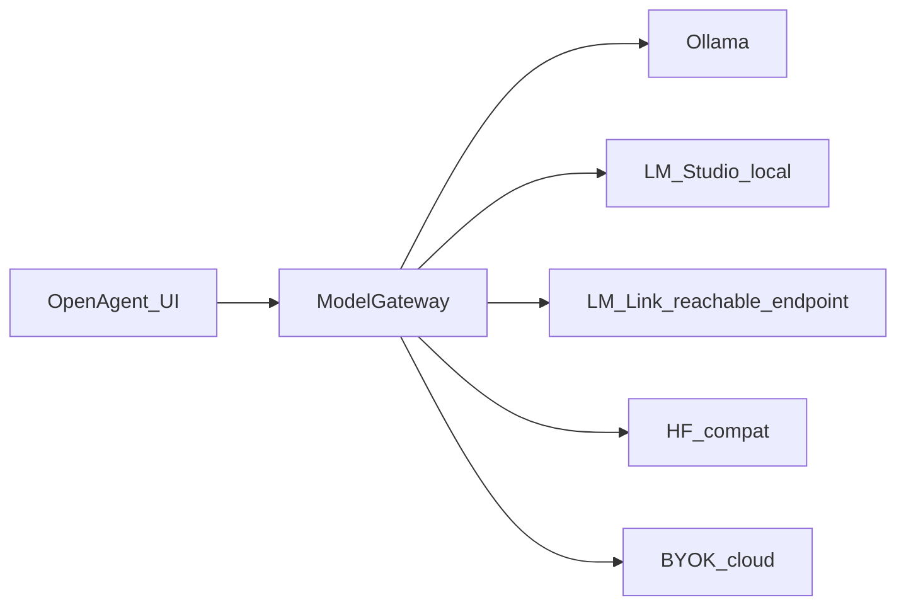

# Target System Architecture: Open-Agent (VS Code Fork)

**Status:** Target (aspirational architecture)
**Owner:** MoniGarr.com LLC
**Author:** Monica Peters \<monigarr@MoniGarr.com\>
**Canonical Path:** `docs/target/ARCHITECTURE.md`
**See Also:** [`PRD.md`](PRD.md) · [`ROADMAP.md`](ROADMAP.md) · [`../current/ARCHITECTURE.md`](../current/ARCHITECTURE.md)

> This describes the **intended** architecture. For as-built containers and services, see [`../current/ARCHITECTURE.md`](../current/ARCHITECTURE.md).

---

## 1. Monolith Injection Architecture

Open-Agent injects AI-native capability into a fork of `microsoft/vscode` without forking the entire editor surface. Custom logic lives under a bounded contrib domain and talks to core VS Code services through dependency injection.

```text
+-----------------------------------------------------------------------+
|                       Open-Agent (VS Code Core)                        |
|                                                                       |
|   +--------------------------+          +-------------------------+   |
|   | Workbench UI Component   |          | Native Text Editors     |   |
|   | (Custom Contrib Sidebar) |          | (Ghost Text / Diff View)|   |
|   +------------+-------------+          +------------+------------+   |
|                |                                     |                |
+----------------|-------------------------------------|----------------+
                 |                                     |
                 v                                     v
+-----------------------------------------------------------------------+
|                Custom Extension Host / Contribution Layer              |
|                     (/src/vs/workbench/contrib/)                      |
|                                                                       |
|   +---------------------------------------------------------------+   |
|   |                     Open-Agent Core Manager                   |   |
|   +-------------------------------+-------------------------------+   |
|                                   |                                   |
|               +-------------------+-------------------+               |
|               |                                       |               |
|               v                                       v               |
|   +-----------------------+               +-----------------------+   |
|   | Context & Index Engine|               |  Agent Loop Engine    |   |
|   | (LanceDB / Vector DB) |               |  (ReAct Framework)    |   |
|   +-----------+-----------+               +-----------+-----------+   |
|               |                                       |               |
+---------------|---------------------------------------|---------------+
                |                                       |
                +-------------------+-------------------+
                                    |
                                    v
+-----------------------------------------------------------------------+
|                    Unified AI Model Gateway API                       |
|          (/src/vs/workbench/contrib/openagent/browser/api/)           |
+-----------------------------------+-----------------------------------+
                                    |
    +-------------+-------------+-------------+-------------+-------------+
    |             |             |             |             |             |
    v             v             v             v             v             v
+--------+   +--------+   +--------+   +--------+   +--------+   +--------+
| Ollama |   | LM     |   | LM Link|   | Llama  |   | HF /   |   | OpenAI |
| Local  |   | Studio |   | remote |   | .cpp   |   | Kaggle |   | / BYOK |
|        |   | Local  |   | local  |   |        |   |        |   | Cloud  |
+--------+   +--------+   +--------+   +--------+   +--------+   +--------+
```

Gateway fan-out (logical):



## 2. Strategic Implementation Points inside VS Code

To build without bricking the core editor, agents and humans **shall** write only within these bounded integration targets.

### 2.1. UI & Sidebar Views

- **Target Folder:** `/src/vs/workbench/contrib/openagent/`
- **Mechanism:** Create a new VS Code contribution domain. Register an editor side panel view (`OpenAgentChatView`) utilizing the built-in `IViewDescriptorService`. This side panel interfaces directly with the orchestration subsystem.

### 2.2. Inline Completion (Ghost Text) Interception

- **Target Registry:** `src/vs/editor/contrib/inlineCompletions/` (consume public provider APIs; prefer registering from Open-Agent contrib rather than editing core)
- **Mechanism:** Implement an internal `InlineCompletionsProvider`. Rather than calling local snippet databases, it forwards the live text document context, active cursor position, and neighboring files to the local AI model gateway to render ghost text predictions.

### 2.3. Context, Embeddings & Vector Subsystem

- **Implementation:** Node-based system worker execution thread running in the VS Code back-end window process (`src/vs/platform/` or Open-Agent node layer).
- **Data Gathering:** Listens to workspace mutations using `IWorkspaceContextService`. When files modify, an asynchronous worker breaks the code down into functional blocks using standard syntax trees, generates vectors locally, and commits them to an embedded LanceDB database node.

### 2.4. File System Modification & Terminal Access (The Agent Core)

- **Toolbox Execution:** The autonomous Agent loop executes in the Workbench environment leveraging native service bindings:
  - `IFileService` to read, patch, and format workspace target documents.
  - `ITerminalService` to spin up background terminal processes, execute linting pipelines, and read standard out/error strings to guide debugging iterations.

### 2.5. Local LLM Access via LM Studio and LM Link

Open-Agent treats [LM Studio](https://lmstudio.ai/docs/app) and [LM Link](https://lmstudio.ai/link) as first-class **user-owned** inference backends behind the Unified AI Model Gateway.

- **LM Studio (local):** The user runs LM Studio and enables its OpenAI-compatible server (typically `http://127.0.0.1:1234/v1`). Open-Agent routes through `OpenAiCompatibleProvider` using the built-in `lmstudio` profile (`common/profiles.ts`). No LM Studio proprietary SDK is required in v1 — the OpenAI-compatible protocol is the integration surface.
- **LM Link (remote-local):** The user links devices inside LM Studio so models on a more powerful machine appear as reachable OpenAI-compatible endpoints over LM Link’s private mesh (E2E encrypted; Tailscale-backed per LM Studio’s product). Open-Agent continues to call a **single normalized gateway URL** (local loopback or mesh-reachable base URL). Open-Agent does **not** implement LM Link networking itself and does **not** host multi-tenant model inference.
- **Privacy:** Prompts leave the editor only for user-chosen endpoints. Document LM Link as private remote access to **user-owned** hardware — never as MoniGarr cloud LLM hosting.
- **Operator path:** See [`../RUNBOOK.md`](../RUNBOOK.md) for enabling LM Studio locally and pointing profiles at LM Link–reachable URLs when available.

## 3. Data Flow: The Autonomous Self-Correction Loop

1. **Initiation:** The user prompts the Composer Panel: *"Build an external API service file and run our local test runner suite to confirm it builds properly."*
2. **Execution Steps:**
   - **Step A:** The Agent utilizes `IFileService` to inject a new TypeScript file into the workspace.
   - **Step B:** The Agent queries `ITerminalService` to trigger `npm run test` inside the active workspace shell environment.
3. **The Observation Loop:** The backend intercepts terminal logs. If compilation returns an error code, the agent grabs the relevant terminal text buffer, parses out the trace lines, injects the original code blocks into the AI Model Gateway template, and writes a self-corrected fix back to disk via an automated git-diff view.

## 4. Fork-Safe Development Guardrails

- **Isolation Principle:** Never directly modify base logic inside core layouts like `src/vs/editor/common/` or `src/vs/workbench/browser/parts/editor/`. Instead, use the built-in Dependency Injection decorators (`@IFileService`, `@ITerminalService`) to tap into the capabilities you need.
- **Model Agnosticism:** The Gateway interface payload templates must normalize across providers so UI surfaces never call vendor SDKs directly.
- **Evidence:** See [`../ADR/ADR-0001-openagent-contrib-isolation.md`](../ADR/ADR-0001-openagent-contrib-isolation.md).
